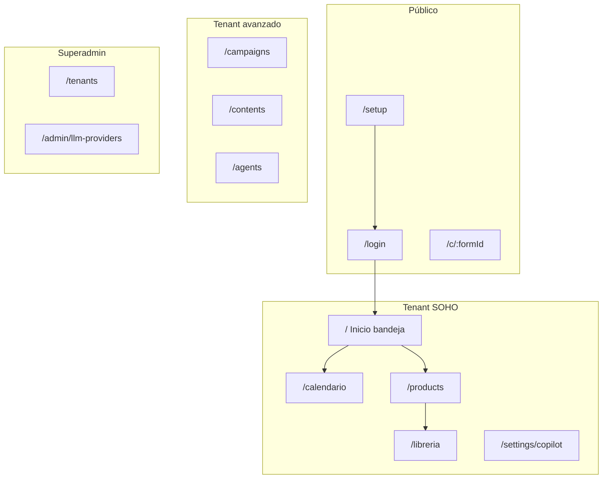

# Ayuda — Mkt Agency OS

Documentación de usuario y operativa generada a partir del código en `apps/backend` y `apps/web`. Orientada a dueños de negocio, agencias pequeñas y operadores de plataforma.

## Perfiles de uso

| Perfil | Descripción | Punto de entrada |
|--------|-------------|------------------|
| **SOHO (copiloto)** | Publica manualmente en redes; revisa y aprueba contenido generado por IA | [Copiloto y bandeja](./copiloto-bandeja/README.md) |
| **Agencia Growth** | Campañas, estrategia comercial, pauta manual, métricas avanzadas | [Campañas y contenido](./campanas-contenido/README.md) |
| **Superadmin** | Gestiona tenants, LLM, paquetes e impersonación | [Primeros pasos](./primeros-pasos/README.md) · [Impersonación](./impersonacion/README.md) |

## Índice de guías

### Arranque y plataforma

| Guía | Contenido |
|------|-----------|
| [Primeros pasos / setup](./primeros-pasos/README.md) | Bootstrap superadmin, login, tenants, onboarding de empresa |
| [Impersonación tenant](./impersonacion/README.md) | Entrar como tenant desde consola superadmin |

### Operación diaria (SOHO)

| Guía | Contenido |
|------|-----------|
| [Copiloto y bandeja de publicación](./copiloto-bandeja/README.md) | Inicio (`/`), aprobar, copiar/pegar, preparar semana, purge |
| [Publicación manual vs n8n](./publicacion-n8n/README.md) | Webhook por producto, botón en arte, callback |
| [Calendario](./calendario/README.md) | Vista semanal SOHO (`/calendario`) y calendario editorial avanzado |
| [Productos y onboarding](./productos/README.md) | Catálogo, wizard, media kit, activación de agentes |

### Marketing y contenido

| Guía | Contenido |
|------|-----------|
| [Campañas y contenido](./campanas-contenido/README.md) | Campañas orgánicas/pagadas, editor de contenidos |
| [Librería y media kit](./libreria/README.md) | Assets, carpetas, integración con Community Manager |
| [Agentes IA](./agentes/README.md) | Brand Analyst, Competitor Intel, CM, Image Generator |

### Captación y relaciones

| Guía | Contenido |
|------|-----------|
| [CRM, leads y formularios](./crm-leads-formularios/README.md) | Pipeline, captura pública, atribución desde posts |

### Configuración

| Guía | Contenido |
|------|-----------|
| [Ajustes e integraciones](./ajustes-integraciones/README.md) | Copiloto, dominios, competidores, LLM (superadmin) |

### Referencia

| Documento | Contenido |
|-----------|-----------|
| [Guía operativa / troubleshooting](./operativa/README.md) | Variables de entorno, migraciones, reset de contenidos, errores comunes |
| [Glosario](./glosario.md) | Términos del producto |

## Mapa de rutas principales

## Documentación técnica relacionada

- Spec-kit: `specs/001-mkt-agency-os/`
- SDD espejo: `docs/sdd/`
- Integración n8n (workflow JSON): [`docs/integrations/n8n/`](../integrations/n8n/README.md)
- Deploy Dokploy: [`infra/dokploy/README.md`](../../infra/dokploy/README.md)

## Cobertura y límites conocidos

Funcionalidades **documentadas** según código en main. Fuera de alcance o parcialmente implementado:

| Área | Estado |
|------|--------|
| OAuth Meta / publicación nativa sin n8n | No implementado — usar n8n o copiar/pegar manual |
| Pauta automatizada (Meta/Google Ads API) | Stub — solo intenciones manuales en Growth con presupuesto |
| Inbox social — ingesta Meta real | Manual + webhook genérico; sin OAuth Meta |
| Propuestas Hermes | Módulo presente; integración webhook opcional (`HERMES_WEBHOOK_URL`) |
| Dominios whitelabel SSL | Verificación DNS; aprovisionamiento SSL stub en dev |

Actualizado: agosto 2026.
