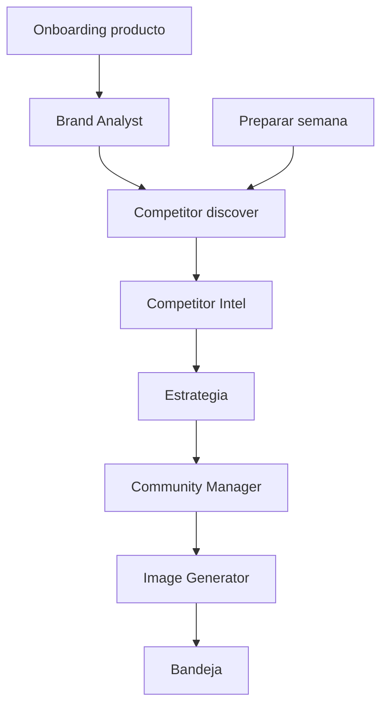

# Agentes IA

## Qué es

Conjunto de **agentes de inteligencia artificial** que analizan marca, competencia y generan contenido visual y textual. Incluye agentes de tenant (`/agents`) y capa de agencia (`/agency/*`) según perfil operativo.

## Para qué sirve

Automatizar trabajo de agencia que un SOHO no haría solo: brief de marca, inteligencia competitiva, copy semanal, imágenes/videos y (en Growth) estrategia comercial y planes creativos.

## Perfiles operativos

| Subperfil | Usuario típico | Agentes activos |
|-----------|----------------|-----------------|
| `soho` | Publica manual en redes | Strategist lite, Analytics lite, Creative full |
| `growth_organic` | Campañas sin pauta | + Strategist standard |
| `growth_paid` | Con presupuesto ads | Todos incl. Media Buyer (stub) |

Configuración: `PATCH /tenant/operating-profile` — UI en **Ajustes** (`OperatingProfileCard`).

## Cómo usarlo

### Hub de agentes

**Ruta:** `/agents` — accesible en **SOHO** (menú Copiloto → Agentes IA) y en Growth (Crear con IA).

Catálogo con estado por agente: **Ver historial**, **Continuar** o **Iniciar** (`useAgentHubStats`).

### Brand Analyst (entrevista de marca)

| Ruta | Función |
|------|---------|
| `/agents/brand-interview` | Historial + nuevo |
| `/agents/brand-interview/:id` | Resultado / Brand Brief |

- Onboarding inline con URL → inferencia.
- Si producto ya onboarded, muestra Brand Brief.
- Se dispara automáticamente al completar onboarding de producto.
- Salida: `brandBriefMarkdown` en entrevista.

### Competitor Intel

**Ruta:** `/agents/competitor-intel`

- Reportes de análisis competitivo.
- Búsqueda IA si no hay competidores registrados.
- Esperado en pipeline **Preparar mi semana** y onboarding.

Competidores registrados en `/settings/competitors` o vía descubrimiento:

- `POST /competitors/discover` → job async (Tavily + LLM)
- `POST /competitors/bulk`

Requisito: Tavily configurado en superadmin (`/admin/integrations`).

### Community Manager

**Ruta:** `/community` (avanzado) — preferencias también en `/settings/copilot`

- `POST /community-manager/generate` — genera copy por plataforma.
- Usa estrategia, media kit y CM virtual para TikTok.
- Historial: `GET /community-manager/batches`.

En SOHO, la generación ocurre vía **copiloto** (Preparar semana), no desde esta pantalla.

### Image Generator

| Ruta | Función |
|------|---------|
| `/agents/image-generator` | Galería + formulario |
| `/agents/image-generator/:id` | Detalle, regenerar, video MP4, carrusel |

- Destino por red (Instagram, TikTok, etc.) — no píxeles manuales.
- Prompt con video/GIF/reel enruta a Video API (`video_generation` LLM task).
- Regeneración async con polling.

### Actividad de agentes (SOHO + Growth)

**Ruta:** `/agency/activity`

- Log de eventos inter-agente (`GET /agency/events`).
- Filtrable por producto.
- Cada evento muestra enlace contextual al resultado (bandeja, resumen, leads, estrategia…).

### Estrategia y planes (Growth)

| Ruta | Función | Guard |
|------|---------|-------|
| `/agency/strategy` | Planes estratégicos | SOHO redirige |
| `/agency/media-intents` | Intenciones de pauta manual | Requiere `growth_paid` |
| `/strategy` | Ajustes de estrategia legacy | SOHO redirige |

API planes: `GET/POST /agency/plans`, `POST /agency/plans/:id/approve`.

### Analytics lite

- `GET /agency/performance` — resumen leads
- `GET /agency/anomalies` — alertas semanales
- `GET /agency/attribution` — first/last touch

Cron `weekly-balance` (lunes 07:00): informes y balance semanal Growth.

### Pipeline automático (referencia)

## Qué pasa si...

| Situación | Comportamiento |
|-----------|----------------|
| Agente falla | Revisar `/admin/llm-settings` y logs; estado `failed` en historial |
| Competitor Intel timeout | Pipeline continúa; análisis puede quedar incompleto |
| SOHO no ve /agents | Usa Inicio + Actividad agentes; activa vista avanzada |
| Media Buyer | Stub — registra intenciones, sin API Meta/Google |
| Entrevista en `failed` legacy | Backend reconcilia al listar si hay `brandBriefMarkdown` |

## Relacionado con

- [Copiloto y bandeja](../copiloto-bandeja/README.md)
- [Productos](../productos/README.md)
- [Ajustes e integraciones](../ajustes-integraciones/README.md) — LLM, Tavily, perfil operativo
- [Primeros pasos](../primeros-pasos/README.md) — configurar LLM
