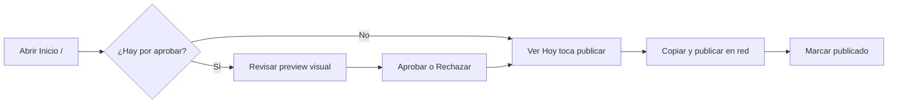

# Copiloto SOHO y bandeja de publicación

## Qué es

La **bandeja de publicación** es la pantalla principal del tenant en `/`. En modo **copiloto SOHO** (predeterminado), el usuario revisa contenido generado por IA, lo aprueba y lo publica manualmente (copiar/pegar) o vía n8n.

## Para qué sirve

Centraliza el flujo diario del dueño de negocio: ver qué publicar hoy, aprobar la semana, gestionar rechazos y recibir recordatorios — sin navegar por módulos de agencia.

## Modos de navegación

| Modo | Cómo activarlo | Menú |
|------|----------------|------|
| **Copiloto (default)** | Sidebar → no activar vista avanzada | Inicio, Calendario, Actividad, Inbox social, Leads, Librería, Mi producto, Ajustes |
| **Vista completa (avanzado)** | Ajustes o toggle «Ver todas las herramientas» | 5 grupos: Hoy, Mi negocio, Crear con IA, Herramientas, Configuración |

En modo copiloto, rutas legacy como `/contents`, `/calendar`, `/community`, `/strategy` y `/dashboard` **redirigen a `/`**.

Persistencia del modo avanzado: `localStorage` clave `mkt-advanced-nav`.

## Cómo usarlo

### Secciones de la bandeja

| Sección | Contenido | Acción típica |
|---------|-----------|---------------|
| **Por aprobar** | Posts generados pendientes de revisión | Aprobar / Rechazar / Regenerar |
| **Listas para publicar** | Aprobados, pendientes de publicación | Copiar y publicar / n8n / Marcar publicado |
| **Hoy toca publicar** | Programados para la fecha actual | Publicar primero |
| **Próximas** | Fechas futuras | Planificar |
| **Rechazadas** | Piezas descartadas | Regenerar otro formato / Archivar |

### Flujo diario recomendado

1. Abre **Inicio** (`/`).
2. Selecciona **producto activo** (selector superior) si tienes varios.
3. Revisa el **panel del copiloto** (`CopilotStatusPanel`): estado de competidores, análisis y bandeja.
4. Si no hay contenido, pulsa **Preparar mi semana** (dispara orquestación completa).
5. Aprueba posts con preview de imagen/video/carrusel.
6. En aprobados: **Copiar y publicar** o **Publicar con n8n** (si está configurado).
7. Marca como publicado cuando esté en la red.

### Preparar mi semana

**Botón:** panel copiloto en Inicio  
**API:** `POST /publication-inbox/prepare-week` → responde `202` + `jobId`

Pipeline ejecutado:

1. Descubre competidores si hay menos de 2
2. Competitor Intel (espera hasta ~120 s)
3. Orquestación semanal (métricas → estrategia → CM → imágenes)
4. Notificación `week_ready`

Consulta progreso: `GET /publication-inbox/prepare-week/jobs/:jobId`

También corre automáticamente **lunes 06:00** (cron `agency-weekly-run`).

### Acciones por arte

| Acción | Cuándo |
|--------|--------|
| **Aprobar** | Pieza en por aprobar |
| **Rechazar** | Diálogo de seguimiento: otro formato o archivar |
| **Regenerar** | Cambiar copy/visual con feedback opcional |
| **Copiar y publicar** | Pieza aprobada — copia texto + enlace captura con UTM |
| **Publicar con n8n** | Pieza aprobada + webhook configurado en producto |
| **Marcar publicado** | Tras publicar manualmente o callback n8n |

Barra de publicación por arte: `InboxArtPublishBar` bajo el mockup visual.

### Kit Copiar y Llevar

Panel multi-día para exportar varios posts aprobados de una vez (`InboxKitPanel`).

### Selección múltiple y limpieza

- **Aprobar seleccionados** — bulk approve
- **Eliminar seleccionados** — bulk delete
- **Vaciar bandeja** (icono papelera) — diálogo purge con alcances:

| Alcance (`scope`) | Efecto |
|-------------------|--------|
| `all` | Todo el inbox del producto |
| `pending` | Solo por aprobar |
| `ready` | Solo listas para publicar |
| `rejected` | Solo rechazadas |
| `upcoming` | Solo próximas |

API: `POST /publication-inbox/purge` con `{ scope, productId? }`.

### Notificaciones

Campana en bandeja. Tipos:

- `week_ready` — semana preparada
- `approval_reminder` — pendientes de aprobar (09:00 y 23:00 UTC)
- `publish_reminder` — hoy toca publicar
- `onboarding_complete` — producto listo

### Calendario SOHO

**Ruta:** `/calendario` — vista mensual con detalle por día (`SohoCalendarDayPanel`). Mismos artes que la bandeja, organizados por fecha programada.

### CM virtual (TikTok talking-head)

En producto / panel copiloto: biblioteca de **presentadoras virtuales** (`CmCharacterSetupPanel`). Retrato IA o desde librería; vista previa lip-sync para marcar `ready`.

## Qué pasa si...

| Situación | Comportamiento |
|-----------|----------------|
| Bandeja vacía tras onboarding | Espera notificación o pulsa Preparar mi semana |
| Rechazo un post | Va a Rechazadas; puedes regenerar u archivar (`dismiss`) |
| Purge borró aprobados | Irreversible — incluye contenidos con firma |
| No veo menú de campañas | Modo copiloto activo — activa vista avanzada |
| Auto-dispatch n8n | Si `publishWebhookAutoDispatch` y fecha = hoy, envía al aprobar |

## Relacionado con

- [Publicación manual vs n8n](../publicacion-n8n/README.md)
- [Productos](../productos/README.md)
- [Calendario](../calendario/README.md)
- [Agentes](../agentes/README.md)
- [Guía operativa](../operativa/README.md) — reset de contenidos
