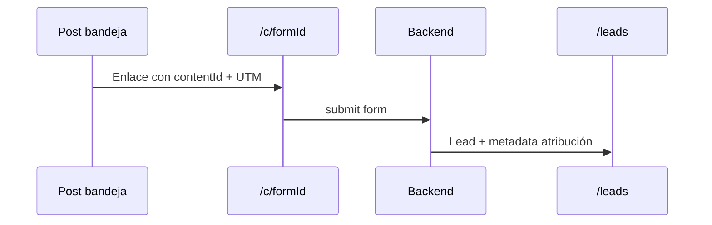

# CRM, leads y formularios de captura

## Qué es

Conjunto de herramientas para **captar prospectos** (formularios embebibles y página pública), gestionarlos en un **pipeline Kanban** y atribuir leads a productos y posts de la bandeja.

## Para qué sirve

Cierra el ciclo marketing → ventas: un post SOHO puede incluir enlace de captura con UTM; el lead aparece en `/leads` vinculado al producto y al contenido origen.

## Cómo usarlo

### Pipeline de leads

**Ruta:** `/leads` (menú SOHO: **Leads**)

- Kanban por etapas del pipeline.
- Panel de detalle al seleccionar lead.
- **Agregar lead** manual.
- Origen típico: formularios, inbox social o alta manual.

**API:**

| Método | Ruta |
|--------|------|
| GET/POST | `/api/v1/leads` |
| PATCH | `/api/v1/leads/:id`, `/leads/:id/stage` |
| DELETE | `/api/v1/leads/:id` (409 si hay propuestas firmadas) |
| GET | `/api/v1/leads/:id/interactions` |

Scoring IA: recalcula al añadir interacciones (`AddInteractionHandler`).

### Formularios embebidos

**Ruta:** `/forms` (vista avanzada — Herramientas)

1. Crear formulario con campos JSON (contrato **DynamicForm** Kreo).
2. Asignar **producto** — el snippet hereda `productId`.
3. Copiar **snippet JS** (`GET /forms/:id/snippet`).
4. Incrustar en web del cliente.

**Captura SOHO simplificada:**

- `GET /forms/capture?productId=` — crea o reutiliza formulario activo del producto.
- La bandeja genera URLs `/c/:formId?utm_*&contentId=…` al copiar enlace de captura.

### Página pública de captura

**Ruta:** `/c/:formId` (sin autenticación)

- Renderiza campos del formulario.
- Lee UTM y `contentId` de query (`parseCaptureAttributionFromSearch`).
- Envía a `POST /api/v1/forms/:id/submit` (público).
- Crea o actualiza lead por email (sin duplicar).

Metadata del lead guarda UTM para atribución first/last touch (`GET /agency/attribution` en Growth).

### Inbox social → CRM

**Ruta:** `/social/inbox`

- Ingesta **manual** de comentarios/DMs (sin OAuth Meta).
- Clasificación de intención.
- Puente a CRM para convertir interacción en lead.

**Webhook automático (tenant):**

- `GET /tenant/webhook-info` — URL + secret para Make/Zapier/n8n.
- `POST /api/v1/social-inbox/webhook/:tenantId` con header `X-Webhook-Secret`.

Guía en pantalla: `SocialInboxGuide`.

### Atribución post → lead

## Qué pasa si...

| Situación | Comportamiento |
|-----------|----------------|
| Mismo email envía dos veces | Actualiza lead existente |
| Formulario sin producto | Lead sin `productId` |
| Borrar lead con propuesta firmada | Error 409 |
| Snippet no carga | Verificar `API_PUBLIC_URL` en backend |
| SOHO no ve Formularios | Está en menú avanzado; captura vía bandeja + `/c/` |

## Relacionado con

- [Copiloto y bandeja](../copiloto-bandeja/README.md) — enlaces de captura
- [Productos](../productos/README.md) — producto en formulario
- [Agentes](../agentes/README.md) — Analytics lite, atribución Growth
- [Ajustes](../ajustes-integraciones/README.md) — dominio público
