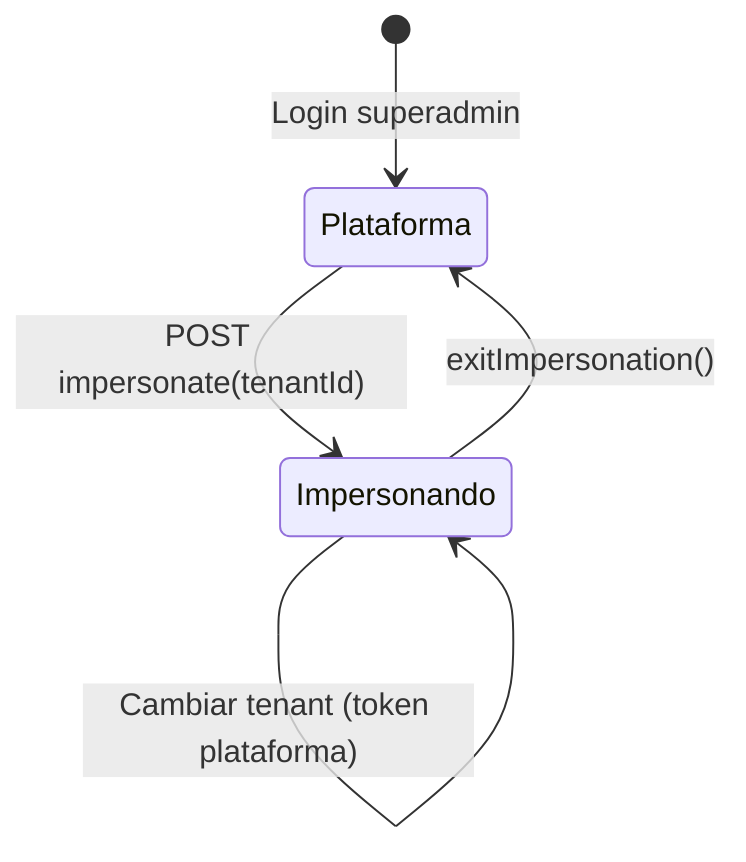

# Impersonación de tenant (superadmin)

## Qué es

Mecanismo para que un **superadmin** opere la aplicación **como si fuera un tenant**, usando un usuario proxy del cliente, sin conocer sus credenciales.

Patrón **Kreo Eventos**: entrada solo por `tenantId`, sesión de plataforma guardada aparte, salida local sin API.

## Para qué sirve

- Soporte y configuración inicial del cliente.
- Probar bandeja, productos y agentes con datos reales del tenant.
- Validar LLM e integraciones en contexto tenant.

## Cómo usarlo

### Requisitos

- Usuario con `isSuperadmin: true` y JWT de plataforma (`tenantId: null`).
- Tenant con owner/admin activo **o** superadmin asignado como **administrador de plataforma** (`platformAdminIds` al editar tenant).

### Entrar como tenant

**Opción A — Listado de tenants (`/tenants`)**

1. Busca el tenant.
2. Pulsa **Impersonar** en la fila.

**Opción B — Selector en header**

- **`TenantImpersonationSelect`** — visible si superadmin y **no** impersonando.
- Elige tenant de la lista.

**Backend:** `POST /platform/tenants/:id/impersonate` o `POST /superadmin/impersonate` con `{ tenantId }`.

Respuesta: JWT impersonado donde:

| Claim | Valor |
|-------|-------|
| `sub` | Usuario proxy del tenant (owner > admin > primer activo) |
| `email` | Email del superadmin |
| `impersonating` | `true` |
| `superadminId` | ID superadmin |
| `tenantId` | Tenant objetivo |

### Durante la impersonación

- Navegas como tenant: bandeja `/`, productos, ajustes, etc.
- **`ImpersonationSwitcher`** en header — cambiar tenant o volver a consola.
- Sesión de plataforma guardada en `localStorage` (`{app}_impersonation`).
- APIs de plataforma (listar tenants, re-impersonar) usan `apiFetchAsPlatform()` con token guardado.

### Salir a consola superadmin

1. Selector header → **Consola superadmin** (`CONSOLE_VALUE = '__console__'`).
2. Restaura JWT de plataforma desde `localStorage` — **sin** llamar DELETE impersonate.
3. Redirige a `/tenants` o inicio superadmin.

### Cambiar de tenant impersonado

Re-impersonar con **token de plataforma**, no con JWT del tenant actual.

## Qué pasa si...

| Situación | Comportamiento |
|-----------|----------------|
| Tenant sin owner/admin | Impersonación falla salvo `platformAdminIds` |
| 401 en impersonación | Frontend llama `exitImpersonation()`, no refresh del proxy |
| Superadmin nativo en ruta tenant | `TenantGuard` bloquea sin `impersonating: true` |
| Listar tenants con JWT impersonado | Falla `SuperadminGuard` — usar token plataforma |
| Audit | Inicio de impersonación registrado en audit log |

## Anti-patrones (no existen en UI)

- Modal para elegir usuario del tenant
- Banner amarillo como única salida
- Salida obligatoria vía API que emite nuevo JWT superadmin

## Relacionado con

- [Primeros pasos](../primeros-pasos/README.md) — crear tenant y asignar platform admin
- [Ajustes e integraciones](../ajustes-integraciones/README.md) — probar LLM como tenant
- Skill interna: `.cursor/skills/platform-impersonation/SKILL.md`
