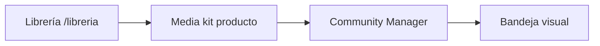

# Librería de assets y media kit

## Qué es

La **librería multimedia** (`/libreria`) centraliza imágenes, videos, PDFs y audio del tenant. El **media kit** de cada producto enlaza assets concretos para que el Community Manager los use al generar posts.

## Para qué sirve

- Organizar capturas de producto por dispositivo (PC, iPad, iOS).
- Alimentar composiciones visuales del CM con fotos reales antes que IA genérica.
- Enlazar material de eventos, demos y branding al producto activo.

## Cómo usarlo

### Librería (`/libreria`)

**Acceso:**

- Modo copiloto: menú **Librería**, tarjeta en bandeja, enlace desde setup CM
- Modo avanzado: Marketing → **Librería**

> ⚠️ Usa `/libreria`, no `/assets` — la ruta `/assets` redirige por conflicto con chunks de Vite en nginx.

**Funciones principales:**

| Función | Descripción |
|---------|-------------|
| Carpetas anidadas | Selector desplegable + diálogo **Organizar** (árbol) |
| Filtros | Todas, Sin carpeta, carpeta concreta |
| Subida | Barra superior fija al scroll |
| Vista grid/tabla | Preferencia en `localStorage`; móvil solo grid |
| Multi-selección | Mover / Eliminar en lote |
| Vista previa | Click en miniatura → diálogo ampliado |

**Convención de carpetas para CM:**

Nombra carpetas `PC`, `iPad` o `iOS` para que el copiloto infiera tipo de captura al generar posts (TikTok/Instagram → móvil).

**API:** `/api/v1/assets`, `/api/v1/asset-folders`, tags.

Almacenamiento: S3-compatible (MinIO local / DO Spaces prod) vía variables `S3_*`.

### Media kit del producto

**Ruta:** `/products/:id/media-kit`

1. Sube archivos directo al kit (`POST .../media-kit/upload` con `role`, `label`).
2. O **Desde librería** — enlaza asset existente (`POST .../media-kit/link`).
3. Roles típicos: `product-screenshot`, `event-photo`, demo, etc.

Quitar ítem del kit **no borra** el asset de la librería.

### Integración con Community Manager

Prioridad de composición visual (`ContentVisualComposerService`):

1. Assets del media kit por rol
2. Generación IA (imagen/video según formato)

Para posts TikTok **talking-head**, el CM elige presentadora virtual del producto (ver [Copiloto](../copiloto-bandeja/README.md)).

## Qué pasa si...

| Situación | Comportamiento |
|-----------|----------------|
| CM genera imagen genérica | Producto sin ítems en media kit |
| Video IA en posts | Deshabilitado; futuro reel con FFmpeg |
| Lip-sync CM no funciona en local | Replicate necesita URL pública (`API_PUBLIC_URL` + túnel) |
| Borrar carpeta con assets | Diálogo de confirmación |
| Storage lleno | Revisar MinIO/S3 y variables en [operativa](../operativa/README.md) |

## Relacionado con

- [Productos](../productos/README.md)
- [Copiloto y bandeja](../copiloto-bandeja/README.md)
- [Agentes](../agentes/README.md) — Image Generator también guarda en librería
