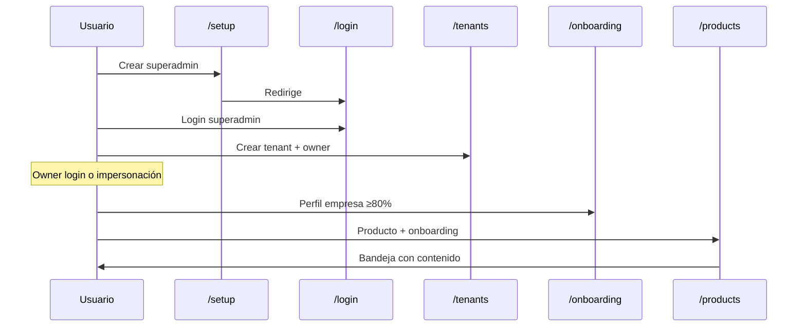

# Primeros pasos — setup y bootstrap

## Qué es

El flujo de **instalación inicial** de Mkt Agency OS: crear el primer superadmin de plataforma, iniciar sesión, dar de alta tenants (clientes) y completar el perfil de empresa del tenant.

## Para qué sirve

Permite poner en marcha una instancia nueva (local, Dokploy o Docker) sin usuarios preconfigurados. El superadmin gestiona la plataforma; cada tenant es un cliente con su propio catálogo de productos, bandeja y agentes IA.

## Cómo usarlo

### 1. Bootstrap del superadmin

**Ruta:** `/setup` (solo accesible si no existe superadmin)

1. Abre la URL de tu despliegue + `/setup`.
2. Completa **nombre**, **email** y **contraseña** (mínimo 12 caracteres).
3. Pulsa **Crear superadmin**.
4. Serás redirigido a `/login`.

> ⚠️ **Importante:** Si ya hay un superadmin, `/setup` redirige automáticamente al login. El endpoint `POST /api/v1/setup/init` responde **409** si intentas crear otro.

**API equivalente:**

| Método | Ruta | Descripción |
|--------|------|-------------|
| GET | `/api/v1/setup/status` | `{ isConfigured: boolean }` |
| POST | `/api/v1/setup/init` | Crea superadmin (público, una sola vez) |

### 2. Iniciar sesión

**Ruta:** `/login`

- El superadmin entra con email y contraseña.
- Tras login, el JWT de plataforma tiene `tenantId: null` → consola superadmin (Tenants, LLM, etc.).
- Los usuarios de tenant reciben JWT con `tenantId` → bandeja en `/`.

### 3. Configurar LLM (superadmin, obligatorio para IA)

Antes de que los agentes funcionen, configura proveedores en:

| Ruta | Función |
|------|---------|
| `/admin/llm-providers` | URL, API key y modelos por proveedor |
| `/admin/llm-settings` | Modelo principal y fallback por tarea (Brand Analyst, CM, etc.) |
| `/admin/integrations` | Tavily Search (descubrimiento de competidores) |

Sin esto, las tareas IA fallarán o usarán stubs según la tarea.

### 4. Crear un tenant (cliente)

**Ruta:** `/tenants` (solo superadmin)

1. **Nuevo tenant** → modal con nombre, slug, plan, paquete y usuario owner.
2. Opcional: marcar **Asignarme como administrador de plataforma** para poder impersonar aunque no haya owner activo.
3. El owner recibe credenciales y accede a la bandeja del tenant.

### 5. Onboarding de empresa (tenant)

**Ruta:** `/onboarding` (usuarios con tenant)

Wizard de 8 pasos sobre el perfil de la empresa:

1. Carga secciones desde `GET /company-profile`.
2. Cada paso guarda con `PATCH /company-profile/sections/:key`.
3. Botón **Sugerir con IA** en campos compatibles.
4. Al alcanzar ≥80% de completitud, el perfil pasa a `completed`.

Este perfil alimenta Brand Analyst, descubrimiento de competidores y estrategia.

### 6. Primer producto (recomendado)

Tras el perfil de empresa, crea un producto en [`/products`](../productos/README.md) y completa su onboarding. Eso activa el pipeline de agentes y llena la bandeja.

## Qué pasa si...

| Situación | Comportamiento |
|-----------|----------------|
| Olvidé la contraseña del superadmin | No hay flujo self-service en UI; reset manual en BD o nuevo deploy |
| `/setup` no carga | Verifica que la API responda y que no exista superadmin |
| El tenant no ve agentes IA | Revisa LLM en superadmin e impersona para probar |
| Onboarding empresa incompleto | Competitor discovery puede omitirse; Brand Analyst sigue limitado |
| Quiero probar como tenant sin owner | Impersona desde `/tenants` — ver [Impersonación](../impersonacion/README.md) |

## Relacionado con

- [Impersonación tenant](../impersonacion/README.md)
- [Productos y onboarding](../productos/README.md)
- [Ajustes e integraciones](../ajustes-integraciones/README.md) — LLM y Tavily
- [Guía operativa](../operativa/README.md) — variables de entorno y deploy
