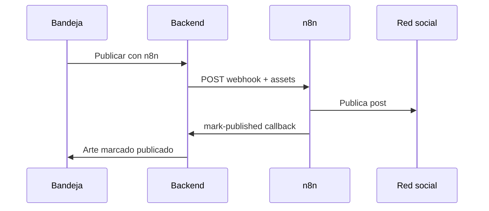

# Publicación manual vs n8n

## Qué es

Dos formas de **llevar un arte aprobado de la bandeja a una red social**:

1. **Manual** — copiar texto (y descargar imagen) y pegar en Instagram, LinkedIn, etc.
2. **Automática vía n8n** — webhook por producto que dispara un workflow externo y cierra el ciclo con callback.

## Para qué sirve

El perfil SOHO publica manualmente por defecto. n8n conecta la bandeja con APIs de Meta, LinkedIn u otras redes sin implementar OAuth nativo en Mkt Agency.

## Cómo usarlo

### Flujo manual (sin configuración)

1. Aprueba el arte en **Inicio** (`/`).
2. Pulsa **Copiar y publicar** en la tarjeta o barra del arte.
3. Pega en la red correspondiente.
4. Pulsa **Marcar publicado** para quitarlo de «Listas para publicar».

También puedes usar el enlace de **captura con UTM** generado para atribuir leads al post (`contentId` en query).

### Configurar n8n (por producto)

**Ruta:** `/products/:id` → sección `#publicacion-n8n` o **Integración n8n** desde `/products`

| Campo | Descripción |
|-------|-------------|
| Activar webhook | `publishWebhookEnabled` |
| URL del webhook | Production URL de n8n (nodo Webhook) |
| Secret | Compartido con n8n (`X-Webhook-Secret`) |
| Auto-dispatch al aprobar | Envía si la fecha programada es **hoy** |
| Webhooks por plataforma | Override de URL por red (`instagram`, `linkedin`, etc.) |
| Credenciales por plataforma | IDs opcionales (`pageId`, `accountId`) para el payload |

**API:**

- `GET/PATCH /api/v1/products/:id/publish-integration`

### Importar workflow de ejemplo

1. n8n → Import → [`docs/integrations/n8n/mkt-agency-publish-instagram-linkedin.json`](../../integrations/n8n/mkt-agency-publish-instagram-linkedin.json)
2. Copia **Production URL** del nodo Webhook.
3. Pégala en el producto y activa el secret.
4. Variables en n8n:

| Variable | Uso |
|----------|-----|
| `MKT_AGENCY_WEBHOOK_SECRET` | Header al llamar callback |
| `META_ACCESS_TOKEN` | Instagram / Facebook |
| `META_IG_USER_ID` | Fallback Instagram Business |
| `LINKEDIN_ACCESS_TOKEN` | LinkedIn |
| `LINKEDIN_AUTHOR_URN` | Autor del post |

5. Activa el workflow en n8n.

### Publicar un arte con n8n

1. Configura el producto (pasos anteriores).
2. Aprueba el arte en bandeja.
3. Bajo el mockup visual → **Publicar este arte con n8n** (o **Publicar con n8n** en acciones rápidas).

**API:** `POST /publication-inbox/publish/:contentId`

Si el producto no tiene webhook activo, verás enlace **Activar n8n en el producto**.

### Payload enviado a n8n

```json
{
  "event": "content.manual_publish",
  "tenantId": "uuid",
  "productId": "uuid",
  "contentId": "uuid",
  "platform": "instagram",
  "copy": "Texto del post",
  "scheduledDate": "2026-07-08",
  "visualFormat": "image",
  "assets": [{ "url": "https://… firmada 1h …" }],
  "callbackUrl": "https://api…/publication-inbox/webhook/{tenantId}/mark-published",
  "credentials": { "pageId": "…" }
}
```

Header: `X-Webhook-Secret`.

### Callback (cerrar ciclo)

Tras publicar en la red, n8n debe llamar:

```http
POST {callbackUrl}
X-Webhook-Secret: {secret}
Content-Type: application/json

{
  "productId": "uuid",
  "contentId": "uuid",
  "externalPostId": "opcional"
}
```

El contenido recibe `published_at` y sale de «Listas para publicar».

Alternativa manual: **Marcar publicado** o `POST /contents/:id/mark-published`.



## Qué pasa si...

| Situación | Comportamiento |
|-----------|----------------|
| n8n no responde | Toast de error; arte sigue en listas para publicar |
| Callback falla (secret incorrecto) | 401; arte no se marca publicado |
| URL de asset expirada (1 h) | n8n debe descargar pronto; regenerar si falla |
| Una URL por red | Usa `publishWebhooksByPlatform` en metadata |
| Auto-dispatch no dispara | Fecha programada debe ser hoy y opción activa |

## Relacionado con

- [Copiloto y bandeja](../copiloto-bandeja/README.md)
- [Productos](../productos/README.md)
- [Workflow n8n técnico](../../integrations/n8n/README.md)
- [Ajustes](../ajustes-integraciones/README.md) — `API_PUBLIC_URL` en producción
