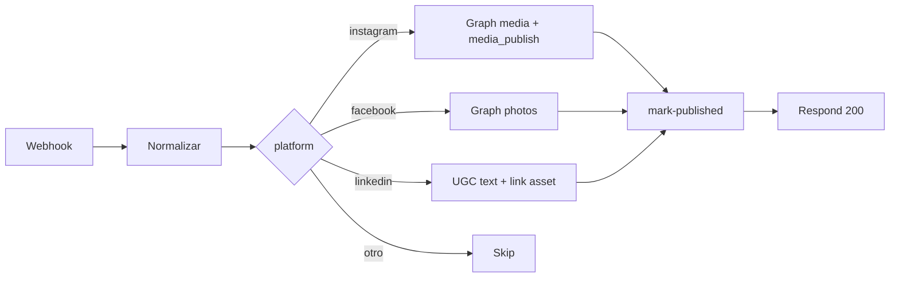

# Integración n8n — publicación social

Workflows de ejemplo para conectar la bandeja de Mkt Agency con n8n y publicar en redes.

## Workflow incluido

| Archivo | Descripción |
|---------|-------------|
| [`mkt-agency-publish-instagram-linkedin.json`](./mkt-agency-publish-instagram-linkedin.json) | Un solo grafo: Webhook → switch por `platform` → Instagram / Facebook / LinkedIn → callback `mark-published` |

## Importar en n8n

1. n8n → **Workflows** → **Import from file** → selecciona el JSON.
2. Abre el nodo **Webhook Mkt Agency** y copia la **Production URL** (path: `mkt-agency-publish`).
3. En Mkt Agency: **Producto → Publicación automática (n8n)** → pega la URL, activa el webhook y copia el **secret**.
4. Configura variables de entorno en n8n (Settings → Variables o `.env` del contenedor):

| Variable | Uso |
|----------|-----|
| `MKT_AGENCY_WEBHOOK_SECRET` | Header `X-Webhook-Secret` al llamar `callbackUrl` |
| `META_ACCESS_TOKEN` | Graph API — Instagram y Facebook |
| `META_IG_USER_ID` | ID Instagram Business (fallback si el producto no envía `credentials.pageId`) |
| `LINKEDIN_ACCESS_TOKEN` | OAuth LinkedIn |
| `LINKEDIN_AUTHOR_URN` | Autor del post, ej. `urn:li:organization:123456` |

5. Activa el workflow en n8n.

## Payload de entrada (desde Mkt Agency)

El backend envía `POST` con header `X-Webhook-Secret` y body JSON:

```json
{
  "event": "content.manual_publish",
  "tenantId": "uuid",
  "productId": "uuid",
  "productName": "Mi producto",
  "contentId": "uuid",
  "platform": "instagram",
  "title": "Título interno",
  "copy": "Texto publicable del post",
  "scheduledDate": "2026-07-08",
  "visualFormat": "image",
  "versionId": "uuid",
  "assets": [
    {
      "assetId": "uuid",
      "url": "https://… URL firmada S3 (1 h) …",
      "mimeType": "image/jpeg",
      "fileName": "post.jpg",
      "expiresIn": 3600
    }
  ],
  "callbackUrl": "https://api…/api/v1/publication-inbox/webhook/{tenantId}/mark-published",
  "credentials": {
    "pageId": "178414…",
    "accountId": "123456"
  }
}
```

`credentials` es opcional; puedes guardar IDs por producto en la UI o usar solo variables de entorno en n8n.

## Callback (cerrar ciclo en bandeja)

Tras publicar, el workflow llama:

```http
POST {callbackUrl}
X-Webhook-Secret: {MKT_AGENCY_WEBHOOK_SECRET}
Content-Type: application/json

{
  "productId": "uuid",
  "contentId": "uuid",
  "externalPostId": "id-en-la-red-opcional"
}
```

El contenido sale de «Listas para publicar» (`published_at`).

## Ramas del grafo



### Instagram

Usa Graph API: crear contenedor de media con `image_url` + `caption`, luego `media_publish`. Requiere cuenta Instagram Business vinculada a Facebook Page.

### Facebook

Publica foto en la Page con `POST /{page-id}/photos`.

### LinkedIn (ejemplo simplificado)

Publica post de texto con la URL del asset al final del copy. Para **imagen nativa** en el feed hace falta el flujo registerUpload → PUT → UGC con `shareMediaCategory: IMAGE` (ver sticky note en el workflow).

## Probar sin Mkt Agency

El JSON incluye **pin data** en el nodo Webhook. Ejecuta el workflow en modo test con datos fijos y revisa cada rama antes de conectar producción.

## Un flujo vs uno por plataforma

- **Un flujo (recomendado):** enruta con `platform` — menos duplicación, un solo secret/callback.
- **Un flujo por red:** en el producto usa `publishWebhooksByPlatform` en metadata (API) con URLs distintas por `instagram`, `linkedin`, etc.

## Referencias en el repo

- Backend: `apps/backend/src/modules/product/product-publish-webhook.service.ts`
- UI producto: `apps/web/src/components/products/ProductPublishIntegrationPanel.tsx`
- Bandeja: botón «Publicar con n8n» en `InboxQuickPublishActions.tsx`
