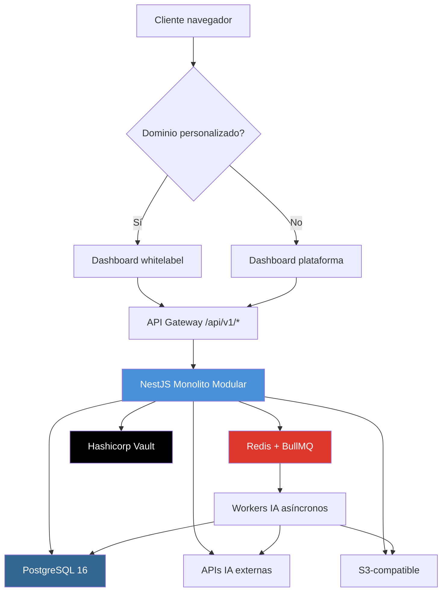
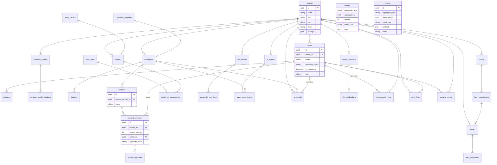
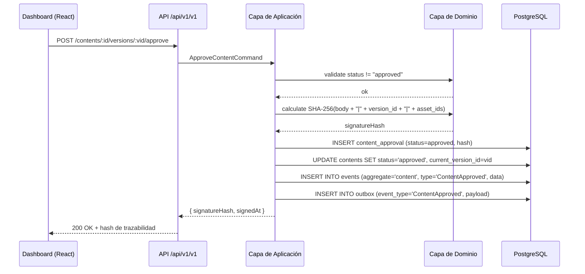
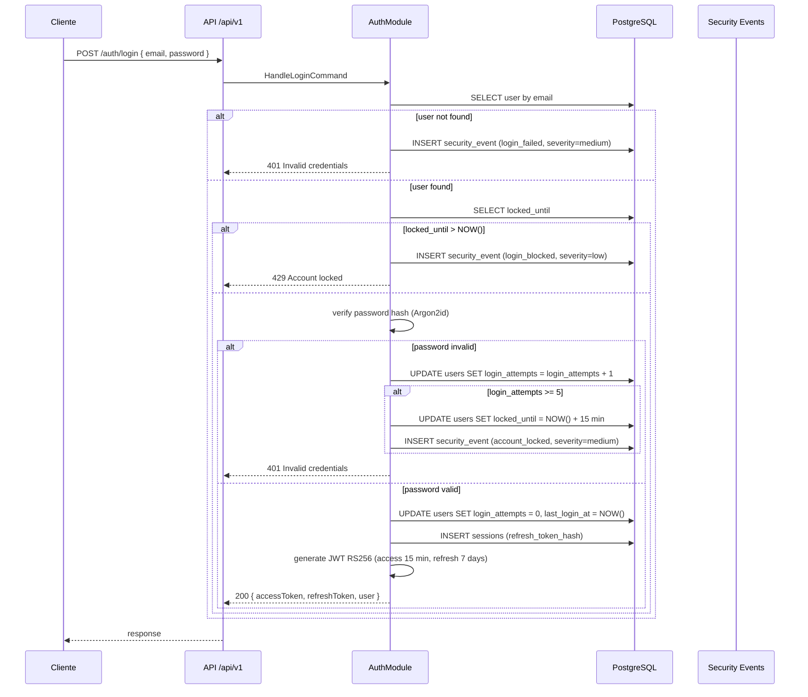
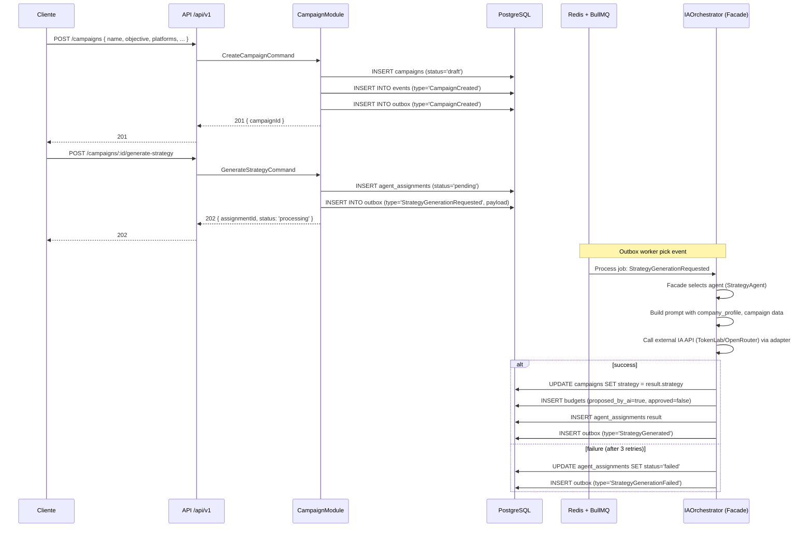

# AgenteIA — Documento de Arquitectura

## 1. Contexto y alcance

**AgenteIA** es una plataforma SaaS que democratiza el marketing digital profesional para pequeñas empresas y profesionales SOHO. Su propuesta de valor central es un modelo híbrido donde la inteligencia artificial genera estrategias, borradores y optimizaciones, pero el cliente mantiene el control absoluto mediante un tablero de aprobación digital con firma SHA-256 (Kill Switch). Nada se publica ni se entrega sin autorización explícita del dueño del negocio.

**Audiencia del documento:** Desarrolladores fullstack con experiencia en NestJS, React, PostgreSQL y patrones de arquitectura hexagonal, CQRS y Event Sourcing.

**Alcance MVP documentado:** Creación de campañas multicanal con IA, Calendario Editorial Dinámico con aprobación digital, gestión de contenido con versionado inmutable, CRM con captura de leads y scoring IA, onboarding progresivo, librería de activos multimedia, administración multi-tenant y superadmin, dominio personalizado, propuestas comerciales IA, informes y monitoreo de competencia.

**Fuera de alcance:** Publicación automática en redes sociales, facturación, atención al cliente humana, contabilidad, diferenciación de roles tenant (futuro), entrenamiento de modelos con datos de clientes sin consentimiento.

---

## 2. Vista de módulos / capas

La arquitectura sigue **Arquitectura Hexagonal (Ports & Adapters)** combinada con **Monolito Modular**. Cada módulo de negocio es un contexto delimitado con su propio dominio, aplicación e infraestructura, pero todos se despliegan como una única unidad.

### 2.1 Capas arquitectónicas

| Capa                | Responsabilidad                                                                                                                                                                                                                                                   | Dependencias        |
| :------------------ | :---------------------------------------------------------------------------------------------------------------------------------------------------------------------------------------------------------------------------------------------------------------- | :------------------ |
| **Dominio**         | Entidades puras, Value Objects, reglas de negocio, eventos de dominio. Sin imports externos.                                                                                                                                                                      | Ninguna             |
| **Aplicación**      | Casos de uso (Commands / Queries), puertos de entrada (interfaces de servicio) y puertos de salida (interfaces de repositorio, API externas, notificaciones). Implementa CQRS mediante CommandBus y QueryBus.                                                     | Dominio             |
| **Infraestructura** | Adaptadores concretos: TypeORM, PostgreSQL, Redis, BullMQ, S3, APIs de IA (TokenLab, OpenRouter, Replicate, ElevenLabs), Hashicorp Vault. Implementa los puertos definidos en aplicación. Incluye workers de outbox, pipelines de leads, y anonimizador de datos. | Aplicación, Dominio |

### 2.2 Módulos del Monolito Modular

```
agenteia-api/
├── modules/
│   ├── auth/                # Autenticación, JWT RS256, refresh tokens, setup
│   ├── tenant/              # Gestión multi-tenant, suscripciones, planes
│   ├── company-profile/     # Onboarding progresivo, perfil de empresa
│   ├── campaign/            # Campañas, plantillas, presupuestos, estrategias
│   ├── content/             # Contenido, versionado, aprobaciones (Kill Switch)
│   ├── calendar/            # Calendario Editorial Dinámico
│   ├── crm/                 # Leads, pipeline, scoring IA, interacciones
│   ├── forms/               # Formularios embebidos, snippets JS, captura pública
│   ├── assets/              # Librería multimedia, carpetas, etiquetas, S3
│   ├── proposals/           # Propuestas comerciales generadas por IA
│   ├── ai-agents/           # Orquestación de agentes IA (Facade + Command)
│   ├── competitors/         # Monitoreo de competencia y menciones
│   ├── domains/             # Dominios personalizados (CNAME, SSL)
│   ├── local-pages/         # Páginas locales SEO
│   ├── reports/             # Informes y KPIs generados por IA
│   ├── admin/               # Superadmin, impersonalización, auditoría
│   └── security/            # Eventos de seguridad, logs de auditoría
└── shared/                  # Kernel compartido (value objects, utilidades, outbox worker)

```
### 2.3 Patrones estructurales y de comportamiento

| Patrón                 | Aplicación en AgenteIA                                                                                                                                                                                                                                                                                                  |
| :--------------------- | :---------------------------------------------------------------------------------------------------------------------------------------------------------------------------------------------------------------------------------------------------------------------------------------------------------------------- |
| **CQRS**               | Separación de modelos de lectura (`CalendarQuery`, `LeadPipelineQuery`) y escritura (`CreateCampaignCommand`, `ApproveContentCommand`). Cada comando es manejado por un CommandHandler que valida reglas de negocio en la capa de dominio.                                                                              |
| **Event Sourcing**     | Todos los cambios de estado sobre entidades (campañas, contenidos, leads) se persisten como eventos inmutables en la tabla `events` (append-only). El estado actual se reconstruye aplicando la secuencia de eventos.                                                                                                   |
| **Outbox Pattern**     | Los eventos de dominio se escriben en la tabla `outbox` dentro de la misma transacción que la escritura de negocio. Un worker independiente lee la outbox y publica los eventos en Redis/BullMQ para procesamiento asíncrono (generación IA, notificaciones, actualización de scores). Garantiza publicación confiable. |
| **Command**            | Cada mutación del sistema se encapsula como un objeto `Command` (ej. `ApproveContentCommand`, `CreateLeadCommand`). Permite encolamiento, logging, y transaccionalidad.                                                                                                                                                 |
| **Facade**             | El módulo `ai-agents` expone una fachada (`IAOrchestratorService`) que recibe comandos de generación y los delega al agente correspondiente. Los comandos se encolan en BullMQ.                                                                                                                                         |
| **State**              | Entidades como `campaigns`, `contents` y `leads` tienen un ciclo de vida con estados y transiciones definidos en el dominio. Ej: `campaign.status: draft → scheduled → active → paused → completed`.                                                                                                                    |
| **Strategy**           | Algoritmos intercambiables: scoring de leads (según origen, interacciones, datos demográficos), anonimización de PII (según tipo de campo), y selección de proveedor IA (fallback entre TokenLab, OpenRouter, Replicate).                                                                                               |
| **Repository**         | Interfaz de persistencia abstracta (puerto de salida). Implementaciones concretas en infraestructura (TypeORM + PostgreSQL). Todas las queries filtran por `tenant_id`.                                                                                                                                                 |
| **Adapter**            | Adaptadores para APIs externas (TokenLab, OpenRouter, Replicate, ElevenLabs), S3, DNS (verificación de registros), y Vault. Cada adaptador implementa un puerto definido en la capa de aplicación.                                                                                                                      |
| **Observer / Pub-Sub** | El outbox worker actúa como observador: cuando se publica un evento (ej. `ContentApproved`), los suscriptores reaccionan (actualizar calendario, liberar kit de descarga, enviar notificación).                                                                                                                         |

### 2.4 Diagrama de contexto del sistema



---

## 3. Modelo y persistencia

### 3.1 Esquema de base de datos (PostgreSQL 16)

El modelo completo consta de **36 tablas** definidas en el MDD §3. A continuación se listan las entidades principales agrupadas por dominio. Todas las tablas multi-tenant incluyen `tenant_id UUID NOT NULL REFERENCES tenants(id) ON DELETE CASCADE` y se indexa. Los IDs son UUID v4. Columnas de auditoría `created_at` y `updated_at` con `TIMESTAMPTZ DEFAULT NOW()`.

**Raíz del sistema:**
- `tenants` — Empresas/clientes del SaaS. Almacena `plan`, `status`, `settings`, `max_users`, `max_assets_size`.
- `users` — Usuarios del sistema. `is_superadmin` (boolean), `role` (owner/manager/viewer), `password_hash` (Argon2id). Superadmin no tiene `tenant_id`.
- `sessions` — Refresh tokens (hash SHA-256), expiración.

**Onboarding y perfil:**
- `company_profiles` — Perfil de empresa con `completion_percentage`, `status`.
- `company_profile_sections` — Secciones individuales del cuestionario progresivo.

**Campañas y contenido:**
- `campaign_templates` — Plantillas predefinidas con configuración de agentes.
- `campaigns` — Campañas con `status`, `strategy`, `total_budget`.
- `budgets` — Presupuestos por plataforma, con `proposed_by_ai` y `approved`.
- `audiences` — Audiencias objetivo con criterios.
- `contents` — Piezas de contenido, referencian `current_version_id` (FK circular resuelta con ALTER TABLE).
- `content_versions` — Versiones inmutables de contenido. Incluye `signature_hash`, `signed_at`, `reason`, `change_summary`. FK a `contents` y `author_id`.
- `content_approvals` — Aprobaciones con `signature_hash`, `status`, `feedback`.

**CRM y formularios:**
- `forms` — Formularios embebidos con configuración de campos y snippet JS.
- `form_submissions` — Envíos con datos, FK a lead (opcional).
- `leads` — Leads con `score` (0-100), `stage` (prospect/contacted/qualified/converted/lost), metadata.
- `lead_interactions` — Historial append-only de interacciones.

**Librería multimedia:**
- `asset_folders` — Estructura jerárquica con `parent_id` (autoreferencia).
- `asset_tags` — Etiquetas por tenant.
- `assets` — Activos con `file_key` (S3), `file_size`, `reference_count`, `is_in_use`.
- `asset_tag_assignments` — Relación N:M.

**Agentes IA:**
- `ai_agents` — Configuración de agentes (nombre, rol, modelo).
- `agent_assignments` — Asignaciones a campañas con `task_type`, `status`, `result`.

**Propuestas, reportes, competencia:**
- `proposals` — Propuestas comerciales con `signature_hash`.
- `reports` — Reportes generados por IA.
- `competitors`, `competitor_mentions` — Monitoreo.

**Dominios y SEO local:**
- `custom_domains`, `dns_verifications` — Verificación CNAME y SSL.
- `local_pages` — Páginas SEO local.

**Auditoría y seguridad:**
- `impersonation_logs` — Acciones de superadmin al impersonar.
- `audit_logs` — Logs append-only de operaciones.
- `security_events` — Eventos críticos (login fallido, bloqueo, robo de token).

**Event Sourcing y Outbox:**
- `events` — Append-only, almacena eventos de agregados con `aggregate_type`, `aggregate_id`, `version`, `event_type`, `data`.
- `outbox` — Mensajes pendientes de publicación con `status` (pending/processed/failed).

### 3.2 Índices principales

- `campaigns(tenant_id, status)`
- `leads(tenant_id, stage)`
- `content_versions(content_id, version_number DESC)`
- `audit_logs(tenant_id, created_at DESC)`
- `security_events(severity, created_at DESC)`
- `outbox(status, created_at)`
- `events(aggregate_type, aggregate_id, version)` (UNIQUE)

### 3.3 Reglas de inmutabilidad

| Tabla               | Comportamiento                                                      |
| :------------------ | :------------------------------------------------------------------ |
| `events`            | Append-only. Nunca se actualizan ni eliminan registros.             |
| `content_versions`  | Una vez creada, nunca se modifica. Solo se añaden nuevas versiones. |
| `lead_interactions` | Append-only.                                                        |
| `audit_logs`        | Append-only.                                                        |
| `security_events`   | Append-only.                                                        |
| `outbox`            | Solo transición de estado (pending → processed, o → failed).        |

### 3.4 Relaciones clave (diagrama ER)



---

## 4. APIs y contratos

Todas las rutas usan el prefijo `/api/v1/`. La autenticación es mediante JWT (Bearer token) excepto donde se indique "No". Se implementan aproximadamente 110 endpoints REST que exponen las capacidades del sistema.

Los contratos completos con request/response se definen en el MDD §4 y el Blueprint §3. A continuación se resumen los grupos de endpoints por módulo:

| Módulo                 | Endpoints principales                                                      | Patrón                         |
| :--------------------- | :------------------------------------------------------------------------- | :----------------------------- |
| **Health / Setup**     | `GET /health`, `GET /setup/status`, `POST /setup/init`                     | Sin auth; bootstrap            |
| **Auth**               | `POST /login`, `POST /refresh`, `POST /logout`, `GET /jwks`                | Sin auth (login), JWT (logout) |
| **Users**              | `GET /users/me`, `PATCH /users/me`                                         | JWT                            |
| **Tenants**            | CRUD `/tenants` (superadmin)                                               | JWT+SA                         |
| **Superadmin**         | `POST /impersonate`, `DELETE /impersonate`                                 | JWT+SA                         |
| **Company Profile**    | CRUD `/company-profile`, secciones, sugerencia IA                          | JWT                            |
| **Campaign Templates** | CRUD `/campaign-templates`                                                 | JWT                            |
| **Campaigns**          | CRUD `/campaigns`, generar estrategia, presupuestos                        | JWT                            |
| **Calendar**           | `GET /calendar`, `GET /calendar/:date`                                     | JWT                            |
| **Contents**           | CRUD `/contents`, versionado, aprobación/rechazo, revertir                 | JWT                            |
| **Ads / Posts**        | CRUD `/ads`, `/posts`, marcar listo                                        | JWT                            |
| **Leads**              | CRUD `/leads`, cambiar etapa, interacciones                                | JWT                            |
| **Forms**              | CRUD `/forms`, snippet, submit público (sin auth)                          | JWT (excepto submit)           |
| **Assets**             | CRUD `/assets` (upload con multipart), folders, tags, download URL firmada | JWT                            |
| **Competitors**        | CRUD `/competitors`, menciones                                             | JWT                            |
| **AI Agents**          | Listar, actualizar configuración (superadmin)                              | JWT, JWT+SA                    |
| **Agent Assignments**  | Listar asignaciones                                                        | JWT                            |
| **Proposals**          | CRUD `/proposals`, firmar, rechazar                                        | JWT                            |
| **Reports**            | CRUD `/reports`, solicitar generación                                      | JWT                            |
| **Domains**            | CRUD `/domains`, verificar DNS                                             | JWT                            |
| **Local Pages**        | CRUD `/local-pages`                                                        | JWT                            |
| **Audit / Security**   | `GET /audit-logs`, `GET /security-events` (superadmin)                     | JWT+SA                         |
| **Admin**              | `POST /admin/sessions/invalidate`                                          | JWT+SA                         |
**Patrón de diseño de API:**
- Los comandos de escritura (mutaciones) se implementan como recursos REST que reciben un payload y devuelven el recurso modificado (creado/actualizado). Internalmente el controlador delega en un `CommandHandler` del módulo correspondiente.
- Las consultas (lecturas) se resuelven mediante `QueryBus` o directamente desde el controlador usando servicios de lectura optimizados. Ej: `GET /calendar` usa un query específico que reconstruye el estado desde los eventos.
- La aprobación de contenido (`POST /contents/:id/versions/:vid/approve`) ejecuta un comando que valida reglas de negocio (estado, permisos) y persiste en la misma transacción: la versión, la aprobación y el evento de dominio en la tabla `events` y el mensaje en `outbox`.
- Los endpoints que requieren procesamiento IA asíncrono (ej. `POST /campaigns/:id/generate-strategy`) responden `202 Accepted` con un `assignmentId`. El resultado se entrega mediante polling a `GET /agent-assignments/:id`.

---

## 5. Flujos relevantes

### 5.1 Flujo de aprobación digital (Kill Switch)



```

**Validaciones ejecutadas en el dominio:**
- La versión no debe estar ya aprobada (409 si lo está).
- El usuario debe ser owner del tenant (o superadmin impersonando).
- El contenido no debe pertenecer a una campaña finalizada (solo se permite reversión).
- El hash se recalcula del lado del servidor para garantizar integridad.

### 5.2 Flujo de login con bloqueo por intentos fallidos



### 5.3 Flujo de creación de campaña con generación asíncrona de estrategia IA



---

## 6. Seguridad, observabilidad e infra

### 6.1 Seguridad

| Aspecto                     | Implementación                                                                                                                                                                         |
| :-------------------------- | :------------------------------------------------------------------------------------------------------------------------------------------------------------------------------------- |
| **Autenticación**           | JWT RS256 con expiración de 15 minutos (access token) y refresh token rotado de 7 días (hash SHA-256 en `sessions`). Contraseñas con Argon2id (cost=auto, memory=64MB, parallelism=4). |
| **Autorización**            | RBAC con roles `owner`, `manager`, `viewer`. Superadmin no tiene tenant. Middleware NestJS extrae `tenant_id` del JWT y lo inyecta en el contexto.                                     |
| **Firma digital**           | SHA-256 sobre `(body + "                                                                                                                                                               |
| **Protección multi-tenant** | `tenant_id` en todas las tablas sensibles. Filtrado obligatorio en repositorios. Impersonalización auditada con token temporal de 1 hora.                                              |
| **Rate limiting**           | 100 req/min público, 1000 req/min autenticado, 20 req/min IA (Redis). Respuesta 429 con `Retry-After`.                                                                                 |
| **Protección de datos**     | Anonimización de PII antes de enviar a APIs externas (Strategy). URLs firmadas S3 expiran en 1 hora. Secretos en Hashicorp Vault.                                                      |
| **Protección de marcas**    | Prompts de IA restringen mención de marcas registradas. Lista configurable por tenant.                                                                                                 |
| **Comunicaciones**          | TLS 1.3, HSTS max-age 1 año, mTLS entre worker y base de datos (cluster).                                                                                                              |

### 6.2 Observabilidad

| Componente                   | Herramienta                 | Propósito                                                                     |
| :--------------------------- | :-------------------------- | :---------------------------------------------------------------------------- |
| **Métricas**                 | Prometheus + Grafana        | CPU, memoria, latencia de endpoints, tasa de errores, tamaño de colas BullMQ  |
| **Logs**                     | Loki + estructurados (JSON) | Logs de aplicación, auditoría (`audit_logs`, `security_events`)               |
| **Trazabilidad distribuida** | OpenTelemetry (opcional)    | Seguimiento de peticiones a través de módulos y workers                       |
| **Alertas**                  | Alertmanager + Slack        | Eventos de seguridad críticos, caída de servicios externos, umbrales de error |

### 6.3 Infraestructura y despliegue

| Capa               | Tecnología                          | Notas                                                                                                                                       |
| :----------------- | :---------------------------------- | :------------------------------------------------------------------------------------------------------------------------------------------ |
| **Orquestación**   | Docker Compose + Dokploy            | Contenedores gestionados con `docker-compose.yml`; mínimo 2 réplicas, autoescalado al 70% de CPU                                            |
| **Base de datos**  | PostgreSQL 16 + Patroni             | Replicación asíncrona, failover automático                                                                                                  |
| **Caché/Colas**    | Redis 7 cluster                     | Persistencia RDB, colas BullMQ con backoff                                                                                                  |
| **Almacenamiento** | S3-compatible (DigitalOcean Spaces) | URLs firmadas, expiración 1 hora                                                                                                            |
| **CI/CD**          | GitHub Actions                      | Lint, tests unitarios (≥80% coverage), tests de integración, build Docker multi-etapa, rolling update con healthcheck y rollback automático |
| **Secretos**       | Hashicorp Vault                     | Inyectados como variables de entorno en tiempo de ejecución                                                                                 |
**Variables de entorno clave:** `PORT`, `DB_HOST/DB_PORT/DB_USER/DB_PASSWORD/DB_NAME`, `NODE_ENV`, `JWT_PRIVATE_KEY/JWT_PUBLIC_KEY/JWT_EXPIRES_IN/REFRESH_EXPIRES_IN`, `REDIS_URL`, `S3_ENDPOINT/S3_ACCESS_KEY/S3_SECRET_KEY/S3_BUCKET/S3_REGION`, `TOKENLAB_API_KEY/OPENROUTER_API_KEY/REPLICATE_API_KEY/ELEVENLABS_API_KEY`, `CORS_ORIGINS`, `LOG_LEVEL`, `SENTRY_DSN` (opcional).

---

## 7. Evolución o riesgos (propuesta)

*Las siguientes mejoras no forman parte del MVP actual y se marcan como propuestas para futuras iteraciones:*

- **Publicación automática en redes sociales:** Integración directa con APIs de Meta, LinkedIn, TikTok para publicar contenido aprobado sin descarga manual. Requeriría adaptadores adicionales en infraestructura y workers de publicación.
- **MFA para roles privilegiados:** Implementar autenticación de dos factores (TOTP/HOTP) para superadmin y owners, con registro en auditoría.
- **Diferenciación de permisos tenant:** Ampliar RBAC dentro del tenant para roles más granulares (colaborador, revisor, editor) que puedan aprobar contenido sin ser owner.
- **Cacheo de consultas recurrentes:** Implementar caché Redis para endpoints de lectura (calendario, pipeline de leads) con invalidación por evento para reducir carga en PostgreSQL.
- **Modo offline para workers:** Almacenamiento local en los workers de IA para operar durante caídas de red de la base de datos, usando un buffer local que se sincroniza al restablecer conexión.
- **Entrenamiento de modelos con datos anonimizados:** Si se obtiene consentimiento explícito, permitir que el tenant opte por que sus datos (anonimizados) se usen para fine-tuning de modelos, mejorando calidad de generación.

---

## Registro de cambios del documento

| Versión | Fecha     | Descripción del cambio                                                                          |
| :------ | :-------- | :---------------------------------------------------------------------------------------------- |
| 1.0     | Mayo 2025 | Creación inicial del Documento de Arquitectura para AgenteIA basado en el MDD v1.0 y Blueprint. |
---FIN_DOCUMENTO---