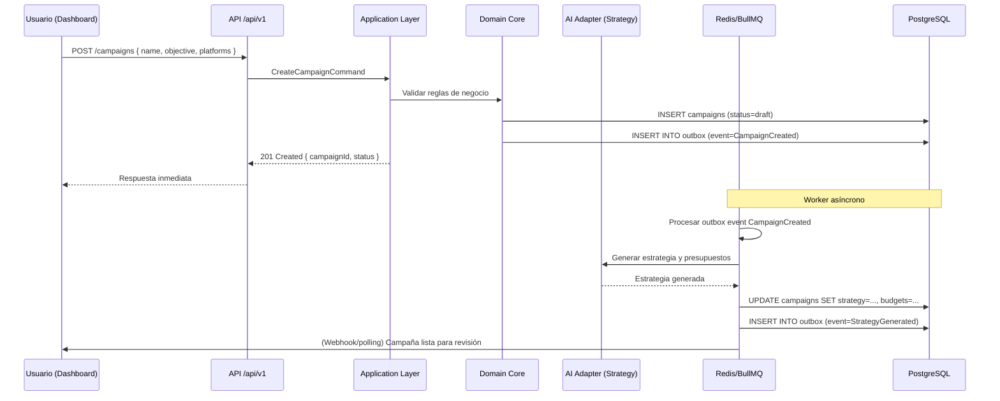
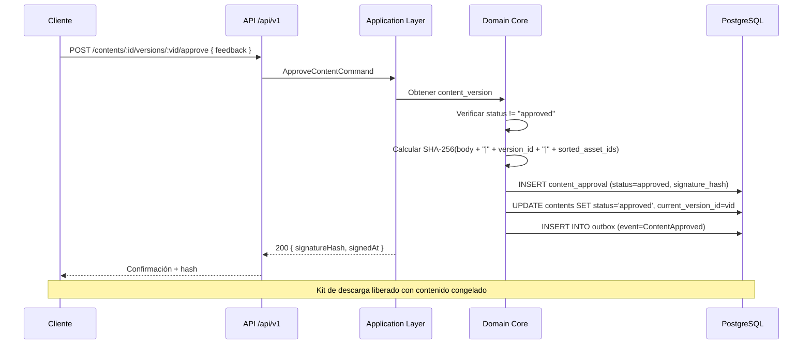
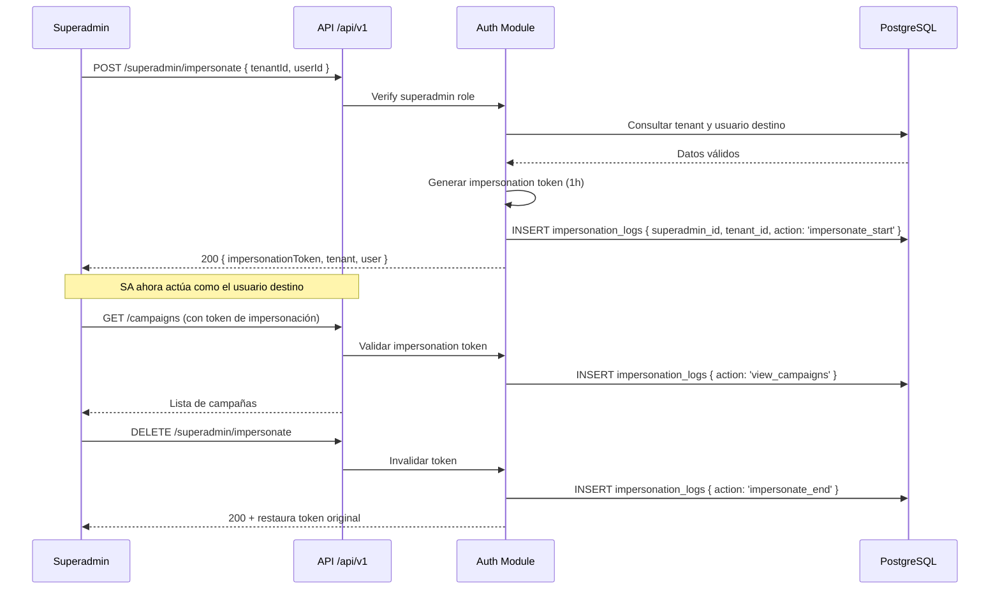
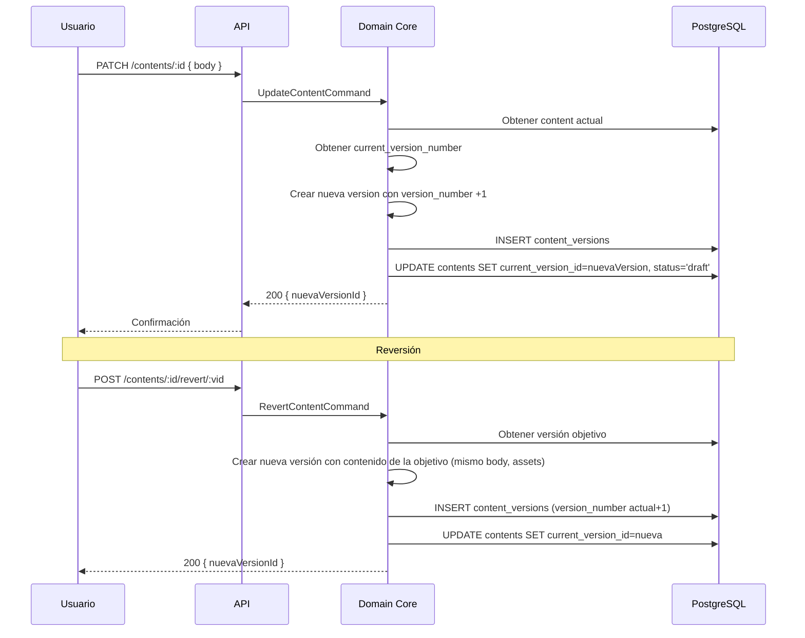
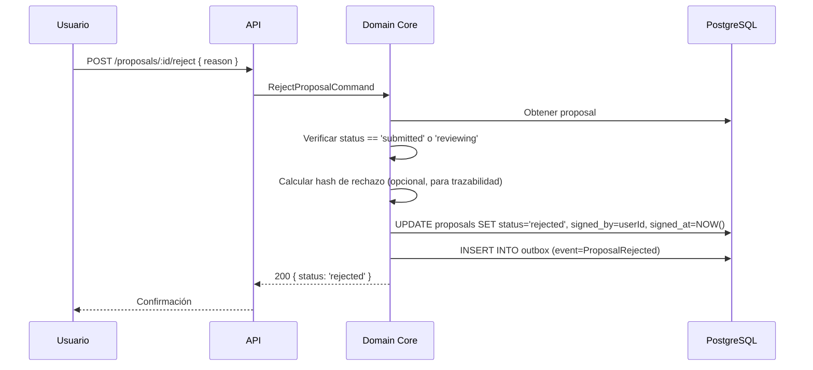

# Casos de Uso y Flujos de Lógica — AgenteIA

## 1. Diagramas de Secuencia y Flowchart

### 1.1 Flujo de Autenticación con Bloqueo por Intentos Fallidos

**Diagrama flowchart:**

```mermaid
flowchart TD
    A[POST /auth/login] --> B{Usuario existe?}
    B -->|No| C[Registrar security_event: login_failed]
    C --> D[401 Invalid credentials]
    B -->|Sí| E{Cuenta bloqueada?}
    E -->|Sí| F[429 Account locked + security_event]
    E -->|No| G{Password válida?}
    G -->|No| H[Incrementar login_attempts]
    H --> I{attempts >= 5?}
    I -->|Sí| J[Bloquear 15 min + security_event: account_locked]
    I -->|No| D
    G -->|Sí| K[Reset login_attempts=0, emitir JWT + refresh]
    K --> L[200 OK + tokens]

**Reglas de validación:**
```

- Password mínimo 8 caracteres, al menos una mayúscula, un número y un carácter especial.
- Email debe coincidir con formato estándar y dominio permitido (sin restricción de dominio en MVP).

**Errores:**
- 401 si credenciales inválidas.
- 429 si cuenta bloqueada, con header `Retry-After: 900`.

**Casos borde:**
- Si el usuario no existe, se registra evento de seguridad pero no se revela existencia (respuesta genérica 401).
- Si la cuenta ya está bloqueada, se rechaza incluso con contraseña correcta.

### 1.2 Flujo de Refresh Token con Rotación y Detección de Robomermaid
sequenceDiagram
    participant C as Cliente
    participant API as API Gateway
    participant Auth as Auth Module
    participant DB as PostgreSQL
    participant Sec as Security Events

C->>API: POST /auth/refresh { refreshToken }
    API->>Auth: Handle RefreshCommand
    Auth->>DB: Buscar sesión por refresh_token_hash
    DB-->>Auth: Sesión encontrada (válida)
    Auth->>Auth: Verificar expires_at > NOW()
    Auth->>DB: Eliminar sesión anterior (invalidation)
    Auth->>DB: INSERT nueva sesión con nuevo hash
    Auth->>C: 200 OK { accessToken, newRefreshToken }
- Note over Auth,DB: Rotación completada
C-->>API: (ataque) Reutiliza refreshToken anterior
    API->>Auth: Handle RefreshCommand (mismo token)
    Auth->>DB: Buscar sesión - no encontrada (ya eliminada)
    Auth->>Sec: INSERT security_event (severity=critical, event_type=token_reuse)
    Auth->>DB: DELETE ALL sessions WHERE user_id = ?
    Auth->>C: 409 Conflict + "All sessions invalidated"
```

```

**Reglas de validación:**
- Refresh token debe tener formato JWT válido (no expirado globalmente).
- Hash SHA-256 del token recibido debe coincidir con almacenado.

**Errores:**
- 401 si token expirado o hash no coincide.
- 409 si se detecta reutilización, con invalidación total de sesiones.

**Casos borde:**
- Concurrencia: dos solicitudes simultáneas con el mismo refresh token. La primera invalida, la segunda detecta reuso.
- Token corrupto: validación JWT falla → 401 sin escalating.

### 1.3 Creación de Campaña Multicanal con Generación IA



```

**Reglas de validación:**
- Nombre de campaña obligatorio, máximo 255 caracteres.
- Al menos una plataforma seleccionada (red social, anuncio, etc.).
- Presupuesto total debe ser >= suma de presupuestos diarios * días.

**Errores:**
- 400 si validación de campos falla.
- 202 con estado "processing" mientras IA trabaja; el frontend debe polling cada 5s.
- Timeout de IA (120s) → worker reintenta 3 veces con backoff (1s,4s,16s) o falla y alerta.

**Casos borde:**
- El usuario cierra sesión mientras la IA procesa: la campaña se crea en background, al reconectar puede ver el resultado.
- Plantilla modificada después de crear campaña: la campaña conserva snapshot original.

### 1.4 Aprobación de Contenido con Kill Switch (Firma Digital)



**Reglas de validación:**
- Versión no debe estar ya aprobada (409 si lo está).
- Usuario debe ser owner del tenant o superadmin impersonando.
- Si campaña está en estado "completed" (finalizada), solo se permite reversión, no nueva aprobación.
- Feedback opcional, máximo 1000 caracteres.

**Errores:**
- 409 si ya aprobado.
- 403 si no tiene permisos sobre ese tenant.
- 404 si versión no existe.

**Casos borde:**
- Caída de BD durante la transacción: operación atómica; si falla, no hay cambio y cliente recibe 503.
- Intento de aprobar contenido con assets eliminados: validación previa en dominio verifica que todos los asset_ids existan y `is_in_use=true`.

### 1.5 Captura de Lead desde Formulario Embebido con Scoring IA

```mermaid
flowchart TD
    A[Visitante completa formulario] --> B[POST /forms/:id/submit]
    B --> C{Formulario activo?}
    C -->|No| D[404 Form not found]
    C -->|Sí| E[Validar campos requeridos]
    E --> F{Email ya existe en leads?}
    F -->|Sí| G[Actualizar lead existente + nueva interacción]
    F -->|No| H["Crear nuevo lead (stage=prospect)"]
    G --> I
    H --> I[Calcular score IA inicial]
    I --> J[INSERT lead + lead_interaction + outbox]
    J --> K[201 Submission created]
    K --> L[Workler asíncrono: scoring detallado]
    L --> M[UPDATE leads.score]

**Reglas de validación:**
```

- Email obligatorio, formato válido.
- Otros campos según configuración del formulario (pueden ser opcionales).
- El formulario debe pertenecer a un tenant activo.

**Errores:**
- 400 si campos requeridos faltan.
- 404 si form_id no existe o está inactivo.
- 413 si payload excede 10KB.

**Casos borde:**
- El mismo email se envía dos veces: se actualiza lead existente, no se duplica.
- Visitante incluye PII en campos no configurados: el adaptador de anonimización filtra antes de enviar a IA de scoring.

### 1.6 Onboarding Progresivo (Guardar Estado en Múltiples Sesiones)mermaid
flowchart TD
    A[Nuevo tenant inicia onboarding] --> B[PATCH /company-profile/sections/:key]
    B --> C[Guardar sección en company_profile_sections]
    C --> D[Calcular completion_percentage]
    D --> E{percentage >= 80%?}
    E -->|No| F[Actualizar perfil status='pending']
    E -->|Sí| G[Actualizar perfil status='completed']
    G --> H[Disparar evento ProfileCompleted]
    H --> I[Agentes IA lo usan inmediatamente]
    F --> J[Esperar próxima sesión]
    J --> K[Usuario retoma cuestionario]
    K --> B

**Reglas de validación:**
- Cada sección tiene un section_key único y datos JSONB.
- Las secciones obligatorias son: company_name, industry, website, brand_voice, target_audience_desc.
- completion_percentage = (obligatorias completadas / 5) * 100.
- No puede exceder 100%.

**Errores:**
- 400 si section_key inválido.
- 409 si el perfil ya está completado.

**Casos borde:**
- El usuario completa todas las secciones en una sola sesión: status salta a 'completed' inmediatamente.
- El usuario abandona el cuestionario y vuelve semanas después: se conserva progreso.
- Superadmin impersona y completa secciones: queda registrado en impersonation_logs.

### 1.7 Impersonalización de Superadmin Auditada



**Reglas de validación:**
- Solo superadmin puede impersonar.
- No se permite impersonar a otro superadmin.
- El token de impersonación expira en 3600 segundos.

**Errores:**
- 403 si el usuario no es superadmin.
- 404 si tenant o userId no existen.
- 409 si ya está impersonando (no se permite anidar).

**Casos borde:**
- El superadmin cierra sesión mientras impersona: el token se invalida automáticamente.
- Dos superadmins impersonan el mismo tenant: ambos tokens son independientes, logs registran diferentes superadmin_id.

### 1.8 Versionado Inmutable y Reversión



**Reglas de validación:**
- Solo se puede modificar contenido si no está aprobado (si está aprobado, al modificar se crea nueva versión y status pasa a 'in_changes').
- Al revertir, se crea una nueva versión; la versión objetivo no se modifica.
- No se permite revertir a una versión que ya no existe (eliminada físicamente, aunque eso no debería ocurrir porque content_versions es inmutable).

**Errores:**
- 404 si content_id o version_id no existen.
- 409 si se intenta modificar contenido aprobado sin crear nueva versión (en realidad el endpoint PATCH ya lo maneja automáticamente).

**Casos borde:**
- Revertir a una versión que tenía assets ahora eliminados: se permite, pero los assets referenciados podrían no estar disponibles. El sistema marca la versión como "parcial" y notifica.
- El contenido tiene 100 versiones: se listan todas con paginación.

### 1.9 Protección contra Eliminación de Activos en Uso

```mermaid
flowchart TD
    A[DELETE /assets/:id] --> B{Obtener asset}
    B --> C{asset.is_in_use == true?}
    C -->|Sí| D[409 Conflict: Asset is in use]
    C -->|No| E{reference_count > 0?}
    E -->|Sí| D
    E -->|No| F[Eliminar asset de S3 y BD]
    F --> G[200 OK]

**Reglas de validación:**
```

- `is_in_use` se actualiza cuando el asset se referencia en un contenido aprobado (incrementa reference_count y set is_in_use=true).
- `reference_count` se decrementa cuando se elimina una versión que lo referencia (solo si la versión no está aprobada).

**Errores:**
- 409 con mensaje "Asset is referenced in approved content versions. Archive or replace references first."
- 404 si asset no existe.

**Casos borde:**
- Asset referenciado en múltiples versiones aprobadas: reference_count > 1, no se permite eliminar.
- Se elimina la última versión que referencia al asset: reference_count llega a 0, is_in_use pasa a false automáticamente (worker escucha evento de eliminación de versión).

### 1.10 Flujo de Error: Timeout en API de IA Externamermaid
sequenceDiagram
    participant Worker as BullMQ Worker
    participant Adapt as AI Adapter
    participant Circuit as Circuit Breaker
    participant Queue as Retry Queue

### Worker->>Adapt: Llamar API IA (estrategia)
- Adapt->>Circuit: Verificar estado
- Circuit-->>Adapt: Closed
- Adapt->>API: POST /generate-strategy (timeout 30s)
- API-->>Adapt: Timeout (no respuesta en 30s)
- Adapt->>Worker: Error: timeout
- Worker->>Queue: Reintentar con backoff (1s)
- Note over Worker,Queue: 2do intento: 4s, 3er intento: 16s
- Queue-->>Worker: Reintento 2: again timeout
- Worker->>Queue: Reintento 3
- Queue-->>Worker: Reintento 3: again timeout
- Worker->>Circuit: Registrar fallo (3 de 5)
- Worker->>DB: UPDATE agent_assignments SET status='failed', result={error}
- Worker->>DB: INSERT INTO outbox (event=TaskFailed)

```

**Reglas de validación:**
- Timeout de conexión: 5s; read timeout: 30s normal, 120s para generación IA.
- Reintentos: máximo 3 con backoff exponencial (1s, 4s, 16s).
- Circuit breaker: tras 5 fallos consecutivos, abre 60s; luego half-open.

**Errores:**
- El worker no bloquea al usuario; la campaña queda en estado 'processing' hasta que se complete o falle.
- Si todos los reintentos fallan, se genera un evento de alerta para operadores (severity=high).

**Casos borde:**
- La API externa responde con error 429 (rate limit): el adaptador debe esperar el header Retry-After y reintentar después.
- Fallo parcial: la IA genera estrategia pero no presupuestos; se persiste lo que se pudo y se reintenta solo la parte faltante.

### 1.11 Rechazo de Propuesta Comercial con Motivo



```

**Reglas de validación:**
- Motivo de rechazo obligatorio, máximo 500 caracteres.
- No se puede rechazar una propuesta ya aceptada o ya rechazada.
- Solo el owner del tenant puede rechazar.

**Errores:**
- 409 si la propuesta ya fue aceptada o rechazada.
- 403 si no es el owner.
- 404 si no existe.

**Casos borde:**
- El usuario rechaza y luego cambia de opinión: debe solicitar una nueva propuesta (POST /proposals de nuevo).
- Rechazo con motivo genérico: se almacena en proposals.updated_at, pero no hay penalización.

```
## 2. Reglas de Validación

A continuación se consolidan las reglas de validación aplicables a través de todos los flujos, organizadas por ámbito:

| Ámbito        | Campo                 | Regla                                                                               |
| :------------ | :-------------------- | :---------------------------------------------------------------------------------- |
| Autenticación | password              | Mínimo 8 caracteres, 1 mayúscula, 1 número, 1 especial.                             |
| Autenticación | email                 | Formato email estándar, máximo 255 caracteres.                                      |
| Autenticación | login_attempts        | Se bloquea la cuenta tras 5 intentos fallidos consecutivos durante 15 minutos.      |
| Contenido     | body                  | No vacío, máximo 10,000 caracteres en MVP (configurable por tenant).                |
| Contenido     | version               | Una vez aprobada, no se puede modificar; requiere nueva versión.                    |
| Asset         | file_size             | Máximo 10 MB por archivo en plan starter, 50 MB en profesional.                     |
| Asset         | is_in_use             | No se permite eliminar si es true o reference_count > 0.                            |
| Campaña       | name                  | Obligatorio, máximo 255 caracteres.                                                 |
| Campaña       | platforms             | Al menos una plataforma seleccionada.                                               |
| Lead          | email                 | Obligatorio, formato válido; si ya existe, se actualiza.                            |
| Formulario    | snippet_js            | Se valida que no contenga scripts maliciosos (sanitización en backend).             |
| Propuesta     | reason (rechazo)      | Obligatorio si se rechaza, máximo 500 caracteres.                                   |
| Onboarding    | completion_percentage | Se calcula como (obligatorias completadas / total obligatorias) * 100, rango 0-100. |
| Superadmin    | tenant_id             | Debe ser null; constraint CHECK en BD.                                              |

## 3. Flujos de Error y Reintentos

### 3.1 Estrategia General de Reintentos

| Componente               | Timeout                | Reintentos      | Backoff     | Circuit Breaker                  |
| :----------------------- | :--------------------- | :-------------- | :---------- | :------------------------------- |
| BD PostgreSQL            | 5s conexión, 30s query | 3 (1s, 4s, 16s) | Exponencial | No aplica (failover automático)  |
| Redis                    | 2s                     | 3               | Lineal 1s   | No aplica                        |
| APIs externas de IA      | 5s conn, 120s read     | 3 (1s, 4s, 16s) | Exponencial | 5 fallos consecutivos → open 60s |
| S3 (DigitalOcean Spaces) | 10s                    | 2 (2s, 8s)      | Exponencial | No aplica                        |

### 3.2 Errores HTTP Estandarizados

| Código | Causa                     | Respuesta del sistema                                                         | Acción del cliente                   |
| :----- | :------------------------ | :---------------------------------------------------------------------------- | :----------------------------------- |
| 400    | Validación de payload     | `{ error: string, code: 'VALIDATION_ERROR', details?: {} }`                   | Corregir campos.                     |
| 401    | Token expirado o inválido | `{ error: 'Unauthorized', code: 'TOKEN_EXPIRED' }`                            | Refrescar token o redirigir a login. |
| 403    | Rol insuficiente          | `{ error: 'Forbidden', code: 'INSUFFICIENT_PERMISSIONS' }`                    | Contactar administrador.             |
| 404    | Recurso no encontrado     | `{ error: 'Not found', code: 'RESOURCE_NOT_FOUND' }`                          | Verificar ID.                        |
| 409    | Conflicto de estado       | `{ error: string, code: 'ALREADY_APPROVED'                                    | 'ASSET_IN_USE'                       |
| 429    | Rate limit superado       | `{ error: 'Too many requests', code: 'RATE_LIMITED' }` + header `Retry-After` | Esperar segundos indicados.          |
| 500    | Error interno no esperado | `{ error: 'Internal server error', code: 'INTERNAL_ERROR' }`                  | Reintentar con backoff.              |
| 503    | Servicio no disponible    | `{ error: 'Service unavailable', code: 'SERVICE_UNAVAILABLE' }` + healthcheck | Reintentar con backoff.              |

### 3.3 Flujo de Error: Caída de BD durante Transacción de Aprobación

1. Cliente envía `POST /approve`.
2. Backend inicia transacción.
3. Fallo de conexión a BD al insertar content_approval.
4. La transacción se revierte automáticamente (Rollback).
5. Backend captura excepción y responde 503.
6. Cliente debe reintentar la aprobación (operación idempotente, pues la versión no cambió).
7. Si el reintento también falla, se registra security_event y se alerta al operador.

## 4. Casos de Borde

### 4.1 Doble clic en aprobación
El frontend debe deshabilitar el botón después del primer clic y mostrar estado "aprobando". El backend maneja idempotencia: si recibe dos solicitudes idénticas, la segunda detecta que ya hay una content_approval para esa versión y responde 409 sin duplicar.

### 4.2 Sesión expirada durante redacción de feedback largo
El frontend (TanStack Query) debe refrescar el token automáticamente antes de enviar la aprobación. Si el refresh falla (refresh token también expirado), se guarda el estado local (Zustand) y se redirige al login preservando el formulario.

### 4.3 Eliminación de tenant con datos asociados
El endpoint `DELETE /tenants/:id` marca el tenant como `status='deleted'` y programa un worker que elimina físicamente los datos después de 30 días (soft delete). Durante ese período, los datos no son accesibles pero pueden restaurarse.

### 4.4 Superadmin elimina el último superadmin
El comando `DeleteUserCommand` verifica: si el usuario a eliminar es superadmin y is_superadmin = true, cuenta cuántos superadmins activos existen. Si es el último, responde 409.

### 4.5 Importación de datos duplicados al crear lead
El endpoint de formulario verifica duplicados por email dentro del mismo tenant. Si el email ya existe, actualiza campos no críticos y añade una interacción "duplicate_submission" en lugar de crear un nuevo lead.

### 4.6 Timezone inconsistente en calendario editorial
Todos los timestamps se almacenan en UTC. El frontend convierte a la zona horaria del tenant (configurable en settings del tenant). Los slots del calendario se muestran en la zona del usuario.

## 5. Cumplimiento con el MDD

| Elemento del MDD                                                               | Implementación en Flujos                                                                                                                                                     |
| :----------------------------------------------------------------------------- | :--------------------------------------------------------------------------------------------------------------------------------------------------------------------------- |
| **Arquitectura Hexagonal (Ports & Adapters)**                                  | Todos los adaptadores externos (IA, S3, DNS) están aislados; los flujos usan puertos definidos en la capa de aplicación (ej. `AIServicePort` para generación de estrategia). |
| **Monolito Modular**                                                           | Módulos separados (auth, campaign, content, crm, etc.) con sus propios Command/Query handlers y repositorios.                                                                |
| **CQRS**                                                                       | Comandos para mutaciones (CreateCampaignCommand, ApproveContentCommand) y Queries para lecturas (GetCalendarQuery, GetLeadPipelineQuery).                                    |
| **Adapter**                                                                    | Adaptador para APIs de IA (TokenLab, OpenRouter) que implementa `AIServicePort`; adaptador para S3 que implementa `StoragePort`.                                             |
| **Facade**                                                                     | Fachada en `CalendarModule` que coordina queries de contenido, campañas y eventos para exponer el Detalle del Día.                                                           |
| **Command**                                                                    | Todos los flujos de escritura (login, crear campaña, aprobar contenido, etc.) usan CommandBus.                                                                               |
| **Observer / Pub-Sub**                                                         | El Outbox Pattern publica eventos a Redis/BullMQ; workers actúan como observers para notificaciones, scoring IA, actualización de calendario.                                |
| **State**                                                                      | Contenido pasa por estados: draft → in_changes → approved (con firma); campaña: draft → processing → ready → active → paused → completed.                                    |
| **Strategy**                                                                   | Estrategia de generación de contenido intercambiable (IA vs manual); estrategia de scoring de leads.                                                                         |
| **Repository**                                                                 | Repositorios TypeORM para cada entidad, con filtrado obligatorio por tenant_id.                                                                                              |
| **Outbox Pattern**                                                             | Cada comando de escritura inserta en tabla `outbox` dentro de la misma transacción; un worker lee y publica eventos.                                                         |
| **Event Sourcing**                                                             | La tabla `events` almacena cada cambio como evento inmutable (aggregate_type, aggregate_id, version, event_type, data).                                                      |
| **Kill Switch**                                                                | Flujo 1.4 asegura que ningún contenido se libera sin firma SHA-256.                                                                                                          |
| **Inmutabilidad post-firma**                                                   | Una vez aprobado, cualquier modificación crea nueva versión; la firma anterior queda en historial pero inválida.                                                             |
| **Aislamiento multi-tenant**                                                   | Todas las queries filtran por tenant_id extraído del JWT; el superadmin solo accede por impersonalización.                                                                   |
| **Seguridad:** Login con bloqueo, rotación de refresh token, detección de robo | Flujos 1.1 y 1.2 implementan estas reglas.                                                                                                                                   |
| **Onboarding progresivo**                                                      | Flujo 1.6: guarda estado en sesiones, activa perfil al 80%.                                                                                                                  |
| **Protección de activos en uso**                                               | Flujo 1.9: impide eliminación si reference_count > 0.                                                                                                                        |

## 6. Registro de cambios del documento

| Versión | Fecha     | Descripción del cambio                                                                                                                                                                                          |
| :------ | :-------- | :-------------------------------------------------------------------------------------------------------------------------------------------------------------------------------------------------------------- |
| 1.0     | Mayo 2026 | Creación inicial del documento de Casos de Uso y Flujos de Lógica para AgenteIA. Cubre 11 flujos críticos con diagramas Mermaid, reglas de validación, flujos de error, casos de borde y alineación con el MDD. |

## Registro de cambios del documento

| Versión | Fecha | Descripción del cambio |
| --- | --- | --- |
| 1.0 | Junio 2026 | Creación inicial de Flujos de lógica |