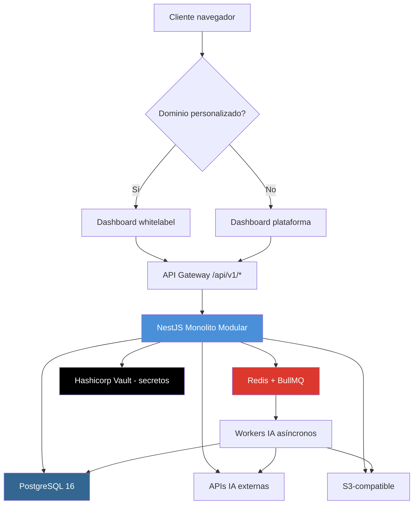
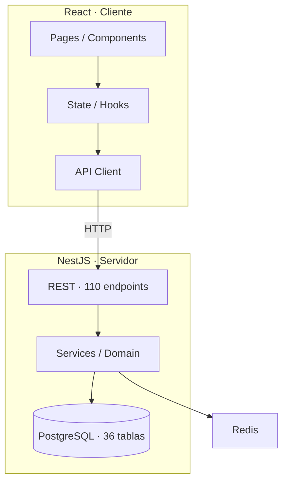
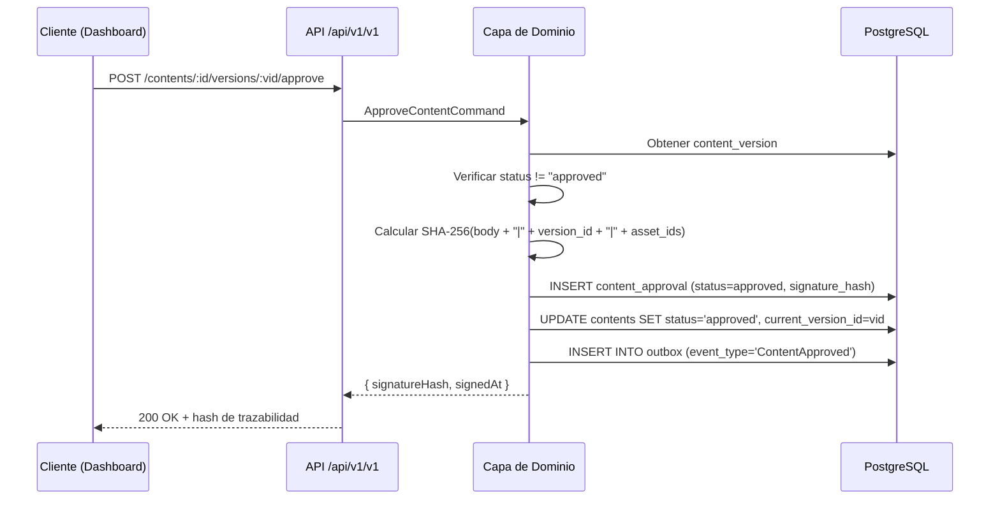
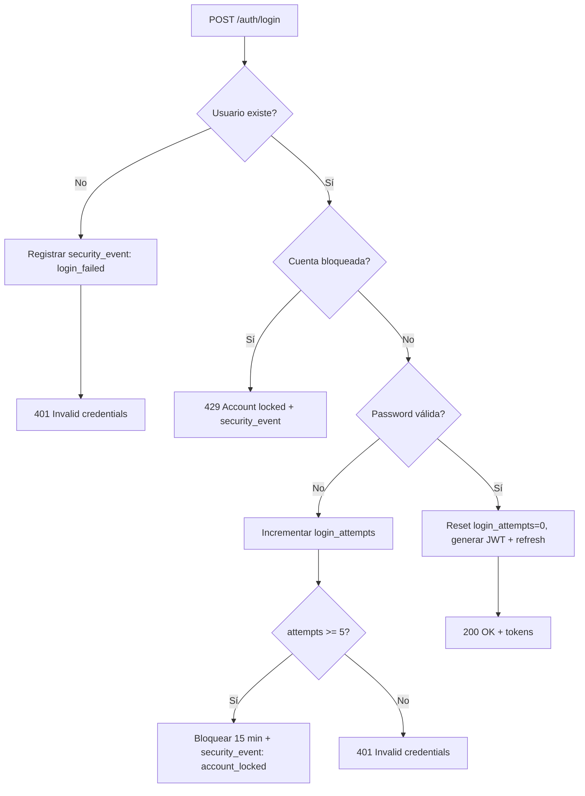

# Master Design Document

---

## [ARQUITECTURA - SECCIÓN INMUTABLE] CONFIGURACIÓN DE PATRONES DE DESARROLLO

> ### 🚨 NOTA DE SISTEMA PARA AGENTES DE IA (PROHIBIDO ELIMINAR O MODIFICAR)
> Esta sección contiene las decisiones de diseño arquitectónico globales del proyecto. 
> ANTES de generar cualquier documento posterior (Spec, Arq, API, Flujos, Tasks, Infra), DEBES leer obligatoriamente las opciones marcadas con [X] en este Wizard. Toda especificación, contrato, diagrama o tarea técnica generada debe alinearse estrictamente con los patrones activados.

### Patrones activos (SSOT)

*Selección vigente del proyecto. Para cambiarla usa «Editar patrones (SSOT)» en el Workshop.*

#### 🏛️ 1. PATRONES DE ARQUITECTURA GLOBAL Y DISTRIBUIDA
- [X] **Arquitectura Hexagonal (Ports & Adapters):** Aísla la lógica de negocio central de agentes externos, bases de datos o frameworks mediante interfaces. *(Afecta a: Arq, MDD, Flujos, Tasks)*
- [X] **Monolito Modular:** Mantiene una única unidad de despliegue pero con una separación estricta y lógica de módulos de negocio independientes. *(Afecta a: Arq, MDD)*
- [X] **CQRS (Command Query Responsibility Segregation):** Separa los modelos y caminos de ejecución para operaciones de lectura y de escritura. *(Afecta a: Arq, API, Flujos, Tasks)*

#### 🔌 3. PATRONES DE DISEÑO: ESTRUCTURALES (GoF)
- [X] **Adapter:** Permite que interfaces incompatibles trabajen juntas, traduciendo las peticiones de un cliente a un formato comprensible. *(Afecta a: API, Flujos, Tasks)*
- [X] **Facade (Fachada):** Proporciona una interfaz unificada y simplificada para un conjunto de interfaces en un subsistema complejo. *(Afecta a: API, MDD, Tasks)*

#### 🧠 4. PATRONES DE DISEÑO: COMPORTAMIENTO (GoF)
- [X] **Command:** Encapsula una petición como un objeto, permitiendo parametrizar a los clientes con diferentes peticiones, hacer colas y operaciones reversibles. *(Afecta a: MDD, Flujos, Tasks)*
- [X] **Observer / Pub-Sub:** Establece una relación de dependencia de uno a muchos para que los cambios en un objeto notifiquen automáticamente a los demás. *(Afecta a: Flujos, Tasks)*
- [X] **State:** Permite que un objeto modifique su comportamiento cada vez que cambia su estado interno, pareciendo cambiar de clase. *(Afecta a: Spec, Casos, Flujos, Tasks)*
- [X] **Strategy:** Define una familia de algoritmos, encapsula cada uno y los hace intercambiables dinámicamente en tiempo de ejecución. *(Afecta a: Spec, MDD, Tasks)*

#### 💾 5. PATRONES DE PERSISTENCIA Y MANEJO DE DATOS
- [X] **Repository:** Media entre el dominio y las capas de mapeo de datos mediante una interfaz de estilo colección abstracta. *(Afecta a: MDD, Tasks)*

#### 🛡️ 6. PATRONES DE INTEGRACIÓN, GESTIÓN DE APIs Y RESILIENCIA
- [X] **Outbox Pattern:** Garantiza la publicación confiable de eventos asíncronos guardándolos primero en la base de datos local antes de enviarlos al Message Broker. *(Afecta a: Flujos, Tasks)*
- [X] **Event Sourcing:** Almacena el estado de una entidad como una secuencia cronológica de eventos inmutables en lugar del estado actual puro. *(Afecta a: Arq, Flujos, Infra)*

---

## 1. Contexto y alcance

### Propósito

**AgenteIA** es una plataforma SaaS que democratiza el acceso a marketing digital profesional para pequeñas empresas y profesionales SOHO (Small Office Home Office) mediante un modelo híbrido de inteligencia artificial agéntica y control total del cliente. La IA realiza el trabajo pesado de análisis, generación de borradores y optimización, mientras el cliente mantiene el control absoluto a través de un tablero de aprobación digital. **Nada se publica ni se entrega sin la autorización explícita del dueño del negocio.**

### Problema de negocio

Las PYMES/SOHO enfrentan:
- Altos costos de agencias tradicionales (5.000-15.000 USD/mes), lo que les impide acceder a servicios profesionales.
- Falta de control sobre el contenido publicado, con riesgo de daño a la marca.
- Procesos opacos: el cliente no ve cómo se genera ni aprueba el contenido.
- Tiempo perdido en coordinación manual; el dueño termina haciéndolo todo.

### Audiencia objetivo

- **Dueño de PYME / SOHO (cliente final):** Define objetivos, completa onboarding, revisa propuestas, aprueba/rechaza contenido, monitorea resultados. Accede vía dashboard con dominio personalizado.
- **Administrador de tenant (dueño empresa):** Contrata el servicio, gestiona campañas, leads, formularios, librería de activos, aprobaciones.
- **Usuario de tenant (miembro del equipo):** Colabora en campañas, sube activos, revisa contenido. Inicialmente con los mismos permisos que el administrador.
- **Superadmin (plataforma):** Gestiona el ecosistema multi-tenant, crea/elimina tenants, configura planes, impersona para soporte con auditoría.

### Objetivos comerciales y KPIs

| Objetivo                      | KPI                                   | Meta               | Horizonte  |
| :---------------------------- | :------------------------------------ | :----------------- | :--------- |
| Democratizar acceso           | Clientes activos (tenants)            | 500 en 12 meses    | Anual      |
| Reducir tiempo de lanzamiento | Días a primera pieza aprobada         | ≤ 5 días hábiles   | Trimestral |
| Control del cliente           | % contenido aprobado digitalmente     | 100% (obligatorio) | Continuo   |
| Eficiencia operativa          | Tiempo semanal en aprobaciones        | ≤ 2 horas/semana   | Mensual    |
| Trazabilidad                  | % piezas con firma digital registrada | 100%               | Continuo   |

### Fronteras del sistema

**Dentro del alcance (MVP):**
- Creación de campañas multicanal con IA (estrategia, presupuesto, contenido).
- Calendario Editorial Dinámico con aprobación digital y firma SHA-256.
- Gestión de contenido con versionado inmutable y reversión.
- CRM con captura de leads (formularios embebidos) y scoring IA.
- Onboarding progresivo asistido por IA (cuestionario seccional).
- Librería de activos multimedia por tenant (subida, organización, duplicación).
- Administración multi-tenant y superadmin (creación, suspensión, impersonalización).
- Dominio personalizado (CNAME) con verificación DNS y SSL automático.
- Propuestas comerciales generadas por IA.
- Informes y monitoreo de competencia.

**Fuera de alcance (futuras fases o no incluido):**
- Publicación automática en redes sociales (se entrega kit de descarga manual).
- Facturación y cobranzas (gestionado externamente).
- Atención al cliente humana (soporte técnico básico puede escalar).
- Contabilidad financiera del cliente o de la agencia.
- Gestión de recursos humanos.
- Diferenciación de permisos entre administrador y usuario de tenant (futura versión).
- Entrenamiento de modelos de IA con datos de clientes sin consentimiento.

### Reglas de negoción clave

1. **IA como generador, cliente como aprobador final:** Todo contenido generado por IA se presenta directamente al cliente en el tablero de aprobación. No se requiere revisión humana obligatoria.
2. **Kill Switch obligatorio:** Ningún contenido se entrega o activa sin la aprobación explícita del cliente mediante firma digital.
3. **Inmutabilidad post-firma:** Al firmar, el texto y los IDs de assets quedan congelados. Cualquier modificación requiere nueva versión y nueva firma.
4. **Protección de marcas:** Los agentes de IA tienen prohibido mencionar marcas registradas competidoras o imitar estilos protegidos.
5. **Privacidad de datos:** Los datos de campañas son privados y no se usan para entrenar modelos sin consentimiento. PII no se envía a APIs externas sin necesidad.
6. **Superadmin mínimo:** No se permite eliminar el último superadmin del sistema.

### Criterios de aceptación (UAT)

1. **Creación de campaña multicanal completa:** Un usuario tenant puede iniciar una campaña desde una plantilla o desde cero, la IA genera estrategia y presupuesto, y el cliente puede aprobar o rechazar en el Detalle del Día con firma digital.
2. **Flujo de aprobación en Calendario Editorial:** Cada contenido programado se muestra en el calendario con estado correcto; al aprobar, el slot se actualiza a verde con hash SHA-256 visible, y el kit de descarga se libera con contenido congelado.
3. **CRM captura lead desde formulario embebido:** Un visitante llena un formulario generado por la plataforma; el lead aparece en el pipeline con score IA y etapa inicial.
4. **Onboarding progresivo guarda estado:** Un nuevo tenant puede completar el cuestionario en varias sesiones; al alcanzar el 80% de obligatorias, el Perfil de Empresa se activa y los agentes lo usan inmediatamente.
5. **Impersonalización de superadmin auditada:** El superadmin puede impersonar un tenant, ver campañas y assets, y cualquier modificación queda registrada en logs con timestamp y acción.
6. **Versionado inmutable y reversión:** Se crea una nueva versión cada vez que se modifica un contenido; el historial muestra todas las versiones y el cliente puede revertir a una anterior sin pérdida de datos.

### Riesgos principales

1. **Dependencia de APIs externas de IA (TokenLab, OpenRouter, Replicate, ElevenLabs):** Pueden experimentar caídas o cambios en precios. Mitigación: colas de reintentos con backoff exponencial, fallback a modelos locales o proveedores alternativos, y monitoreo de disponibilidad.
2. **Cumplimiento de privacidad (PII en APIs externas):** Envío accidental de datos personales a proveedores puede violar regulaciones. Mitigación: anonimizar campos antes de enviar, usar políticas contractuales de no retención, y tener un filtro de datos en el adaptador.
3. **Aceptación del flujo de aprobación por parte del cliente:** Curva de aprendizaje puede generar resistencia. Mitigación: onboarding guiado con tips, UX simplificada, y recordatorios automáticos.
4. **Seguridad multi-tenant (aislamiento de datos):** Fuga de datos entre tenants por error de implementación. Mitigación: esquema de base de datos con tenant_id en todas las tablas sensibles, cifrado en reposo, y pruebas de penetración periódicas.

### Audiencia técnica

Desarrolladores fullstack con experiencia en NestJS (Node.js), PostgreSQL, React. Conocimiento de arquitectura hexagonal, CQRS, Event Sourcing, y patrones GoF (Command, State, Strategy). Familiaridad con APIs REST y OpenAPI 3.0.

### Declaración de independencia

AgenteIA es la raíz de la arquitectura; no depende de otros sistemas internos de la organización. Todas las integraciones externas (APIs de IA, almacenamiento S3, DNS) se implementan como adaptadores en la capa de infraestructura, siguiendo el patrón hexagonal. Cualquier cambio en proveedores externos no afecta la lógica de negocio central.

---
## 2. Arquitectura y Stack

### 2.1 Stack Tecnológico

| Capa | Tecnología | Versión | Justificación |
| :--- | :--- | :--- | :--- |
| **Backend** | Node.js / NestJS | 20 LTS / v10 | Framework estructurado con soporte nativo para decoradores, inyección de dependencias, módulos y programación reactiva. Ideal para Monolito Modular y Hexagonal. |
| **Frontend** | React / Vite / Tailwind CSS / Shadcn/ui | 18 / 5 / 3.4 | Ecosistema maduro para dashboards SPA con tipado fuerte (TypeScript) y componentes reutilizables. |
| **Base de datos** | PostgreSQL | 16 | SQL relacional con JSONB para datos semiestructurados, soporte de índices parciales, particionado y buen rendimiento multi-tenant. |
| **Caché / Colas** | Redis + BullMQ | 7 | Colas de trabajo para procesamiento asíncrono de IA, manejo de reintentos con backoff exponencial y caché de sesiones. |
| **Almacenamiento objetos** | S3-compatible (DigitalOcean Spaces) | — | URLs firmadas para assets multimedia, durabilidad y escalabilidad sin gestión de servidores. |
| **Infraestructura** | Docker Compose + Dokploy | — | Contenedores para desarrollo local reproducible; Dokploy gestiona servicios con `docker-compose.yml` en producción con orquestación ligera y autoescalado. |

### 2.2 Patrón Arquitectónico

**Arquitectura Hexagonal (Ports & Adapters)** con **Monolito Modular**.

- **Capa de Dominio (core):** Entidades puras, Value Objects, reglas de negocio. Sin dependencias externas.
- **Capa de Aplicación:** Casos de uso (Commands/Queries), puertos de salida (interfaces de repositorios, APIs externas).
- **Capa de Infraestructura:** Adaptadores concretos (PostgreSQL, Redis, S3, APIs de IA, DNS). Implementa los puertos definidos en aplicación.

**Módulos de negocio (Monolito Modular):**

```
agenteia-api/
├── modules/
│   ├── auth/           # Autenticación, sesiones, JWT, JWKS
│   ├── tenant/         # Gestión multi-tenant, superadmin
│   ├── company-profile # Onboarding, perfil de empresa
│   ├── campaign/       # Campañas, presupuestos, plantillas
│   ├── content/        # Contenido, versionado, aprobaciones
│   ├── calendar/       # Calendario Editorial Dinámico
│   ├── crm/            # Leads, pipeline, scoring IA
│   ├── forms/          # Formularios embebidos, captura leads
│   ├── assets/         # Librería multimedia, S3
│   ├── proposals/      # Propuestas comerciales IA
│   ├── ai-agents/      # Orquestación de agentes de IA
│   ├── competitors/    # Monitoreo de competencia
│   ├── domains/        # Dominios personalizados (CNAME)
│   ├── reports/        # Informes y KPIs
│   └── security/       # Auditoría, eventos de seguridad, logs
└── shared/             # Kernel compartido (value objects, utilidades)
```

### 2.3 CQRS + Event Sourcing + Outbox

- **Commands:** Cada mutación es un comando manejado por un CommandBus. Ej: `CreateCampaignCommand`, `ApproveContentCommand`.
- **Queries:** Las lecturas se resuelven con QueryBus. Ej: `GetCalendarQuery`, `GetLeadPipelineQuery`.
- **Event Sourcing:** Cada cambio de estado se persiste como un evento inmutable en `events` (tabla de append-only). El estado actual se reconstruye aplicando eventos.
- **Outbox Pattern:** Los eventos de dominio se escriben primero en la tabla `outbox` (misma transacción que la escritura de negocio). Un worker posterior los publica en Redis/BullMQ para procesamiento asíncrono (generación IA, notificaciones, etc.).

### 2.4 Frontend

- **Framework:** React 18 con TypeScript, Vite 5 como bundler.
- **Routing:** React Router v6 (lazy loading por módulo).
- **Estado del servidor:** TanStack Query (React Query) para caché y sincronización de datos remotos.
- **Estado global:** Zustand (sesión, UI state). Los tokens JWT solo se mantienen en memoria, nunca en localStorage.
- **UI:** Shadcn/ui + Tailwind CSS 3.4 (componentes accesibles y personalizables por tenant).
- **Calendario Editorial:** @fullcalendar/react con personalización de slots y colores de estado (verde=aprobado, amarillo=borrador, rojo=bloqueado).
- **Kanban Boards:** Para visualización de campañas y propuestas como tableros de estado.
- **Vistas de detalle:** Detalle del Día con preview limpio de contenido y acciones de aprobación/rechazo.

### 2.5 Componentes del Sistema (diagrama)



---
### Diagrama de componentes propuesto



_Propuesta derivada de §2–§4: capas inferidas del stack, entidades SQL y contratos API documentados (determinista, sin servicios inventados)._

---
## 3. Modelo de Datos> **Nota del arquitecto:** Todas las tablas multi-tenant incluyen `tenant_id` como FK. Los IDs son `UUID` generados con `gen_random_uuid()`. Las columnas de auditoría `created_at` y `updated_at` son `TIMESTAMPTZ` con default `NOW()`. Se indexa `tenant_id` en todas las tablas que lo contienen. Los campos `jwt_token` o tokens de acceso **nunca** se persisten en base de datos (ver §6 Seguridad).
>
> **Corrección aplicada:** El orden de creación de tablas y las FK circulares se han resuelto con `ALTER TABLE ADD CONSTRAINT` para garantizar DDL ejecutable sin dependencias circulares.

### 3.1 Esquema PostgreSQL

```sql
-- ============================================================
-- Tablas raíz (sin dependencias externas)
-- ============================================================
CREATE TABLE tenants (
  id UUID PRIMARY KEY DEFAULT gen_random_uuid(),
  name VARCHAR(255) NOT NULL,
  slug VARCHAR(100) UNIQUE NOT NULL,
  plan VARCHAR(50) NOT NULL DEFAULT 'starter',
  status VARCHAR(50) NOT NULL DEFAULT 'active',
  settings JSONB NOT NULL DEFAULT '{}',
  max_users INTEGER NOT NULL DEFAULT 5,
  max_assets_size BIGINT NOT NULL DEFAULT 1073741824,
  created_at TIMESTAMPTZ NOT NULL DEFAULT NOW(),
  updated_at TIMESTAMPTZ NOT NULL DEFAULT NOW()
);
CREATE TABLE users (
  id UUID PRIMARY KEY DEFAULT gen_random_uuid(),
  tenant_id UUID REFERENCES tenants(id) ON DELETE CASCADE,
  email VARCHAR(255) UNIQUE NOT NULL,
  password_hash VARCHAR(255) NOT NULL,
  name VARCHAR(255) NOT NULL,
  is_superadmin BOOLEAN NOT NULL DEFAULT FALSE,
  role VARCHAR(50) NOT NULL DEFAULT 'owner',
  status VARCHAR(50) NOT NULL DEFAULT 'active',
  last_login_at TIMESTAMPTZ,
  login_attempts INTEGER NOT NULL DEFAULT 0,
  locked_until TIMESTAMPTZ,
  created_at TIMESTAMPTZ NOT NULL DEFAULT NOW(),
  updated_at TIMESTAMPTZ NOT NULL DEFAULT NOW(),
  CONSTRAINT chk_superadmin_tenant CHECK (
    (is_superadmin = TRUE AND tenant_id IS NULL)
  OR (is_superadmin = FALSE AND tenant_id IS NOT NULL)
  )
);
CREATE TABLE sessions (
  id UUID PRIMARY KEY DEFAULT gen_random_uuid(),
  user_id UUID NOT NULL REFERENCES users(id) ON DELETE CASCADE,
  refresh_token_hash VARCHAR(255) NOT NULL,
  expires_at TIMESTAMPTZ NOT NULL,
  created_at TIMESTAMPTZ NOT NULL DEFAULT NOW()
);
-- ============================================================
-- Perfil de empresa (onboarding progresivo)
-- ============================================================
CREATE TABLE company_profiles (
  id UUID PRIMARY KEY DEFAULT gen_random_uuid(),
  tenant_id UUID NOT NULL REFERENCES tenants(id) ON DELETE CASCADE,
  company_name VARCHAR(255),
  industry VARCHAR(255),
  website VARCHAR(500),
  brand_voice TEXT,
  target_audience_desc TEXT,
  competitors TEXT,
  objectives JSONB DEFAULT '[]',
  visual_preferences JSONB DEFAULT '{}',
  completion_percentage INTEGER NOT NULL DEFAULT 0,
  status VARCHAR(50) NOT NULL DEFAULT 'pending',
  created_at TIMESTAMPTZ NOT NULL DEFAULT NOW(),
  updated_at TIMESTAMPTZ NOT NULL DEFAULT NOW(),
  CONSTRAINT chk_completion CHECK (completion_percentage BETWEEN 0 AND 100)
);
CREATE TABLE company_profile_sections (
  id UUID PRIMARY KEY DEFAULT gen_random_uuid(),
  profile_id UUID NOT NULL REFERENCES company_profiles(id) ON DELETE CASCADE,
  section_key VARCHAR(100) NOT NULL,
  data JSONB NOT NULL DEFAULT '{}',
  is_completed BOOLEAN NOT NULL DEFAULT FALSE,
  created_at TIMESTAMPTZ NOT NULL DEFAULT NOW(),
  updated_at TIMESTAMPTZ NOT NULL DEFAULT NOW()
);
-- ============================================================
-- Campañas y plantillas
-- ============================================================
CREATE TABLE campaign_templates (
  id UUID PRIMARY KEY DEFAULT gen_random_uuid(),
  tenant_id UUID REFERENCES tenants(id) ON DELETE CASCADE,
  name VARCHAR(255) NOT NULL,
  description TEXT,
  objective VARCHAR(255),
  platforms JSONB NOT NULL DEFAULT '[]',
  budget_distribution JSONB NOT NULL DEFAULT '{}',
  agent_config JSONB NOT NULL DEFAULT '{}',
  is_predefined BOOLEAN NOT NULL DEFAULT FALSE,
  created_at TIMESTAMPTZ NOT NULL DEFAULT NOW(),
  updated_at TIMESTAMPTZ NOT NULL DEFAULT NOW()
);
CREATE TABLE campaigns (
  id UUID PRIMARY KEY DEFAULT gen_random_uuid(),
  tenant_id UUID NOT NULL REFERENCES tenants(id) ON DELETE CASCADE,
  template_id UUID REFERENCES campaign_templates(id) ON DELETE SET NULL,
  name VARCHAR(255) NOT NULL,
  objective VARCHAR(500),
  status VARCHAR(50) NOT NULL DEFAULT 'draft',
  total_budget DECIMAL(12,2),
  platforms JSONB NOT NULL DEFAULT '[]',
  strategy JSONB DEFAULT '{}',
  created_at TIMESTAMPTZ NOT NULL DEFAULT NOW(),
  updated_at TIMESTAMPTZ NOT NULL DEFAULT NOW()
);
CREATE TABLE budgets (
  id UUID PRIMARY KEY DEFAULT gen_random_uuid(),
  campaign_id UUID NOT NULL REFERENCES campaigns(id) ON DELETE CASCADE,
  platform VARCHAR(100) NOT NULL,
  daily_budget DECIMAL(10,2) NOT NULL,
  total_budget DECIMAL(12,2) NOT NULL,
  proposed_by_ai BOOLEAN NOT NULL DEFAULT FALSE,
  approved BOOLEAN NOT NULL DEFAULT FALSE,
  created_at TIMESTAMPTZ NOT NULL DEFAULT NOW(),
  updated_at TIMESTAMPTZ NOT NULL DEFAULT NOW()
);
CREATE TABLE audiences (
  id UUID PRIMARY KEY DEFAULT gen_random_uuid(),
  tenant_id UUID NOT NULL REFERENCES tenants(id) ON DELETE CASCADE,
  name VARCHAR(255) NOT NULL,
  description TEXT,
  criteria JSONB NOT NULL DEFAULT '{}',
  is_active BOOLEAN NOT NULL DEFAULT TRUE,
  is_immutable BOOLEAN NOT NULL DEFAULT FALSE,
  created_at TIMESTAMPTZ NOT NULL DEFAULT NOW(),
  updated_at TIMESTAMPTZ NOT NULL DEFAULT NOW()
);
-- ============================================================
-- Contenido y versionado (FK circular resuelta con ALTER TABLE)
-- NOTA: contents se crea SIN current_version_id, luego se añade
-- ============================================================
CREATE TABLE contents (
  id UUID PRIMARY KEY DEFAULT gen_random_uuid(),
  tenant_id UUID NOT NULL REFERENCES tenants(id) ON DELETE CASCADE,
  campaign_id UUID REFERENCES campaigns(id) ON DELETE SET NULL,
  title VARCHAR(500) NOT NULL,
  type VARCHAR(50) NOT NULL,
  status VARCHAR(50) NOT NULL DEFAULT 'draft',
  created_at TIMESTAMPTZ NOT NULL DEFAULT NOW(),
  updated_at TIMESTAMPTZ NOT NULL DEFAULT NOW()
);
CREATE TABLE content_versions (
  id UUID PRIMARY KEY DEFAULT gen_random_uuid(),
  content_id UUID NOT NULL REFERENCES contents(id) ON DELETE CASCADE,
  version_number INTEGER NOT NULL,
  author_id UUID NOT NULL REFERENCES users(id),
  title VARCHAR(500) NOT NULL,
  body TEXT NOT NULL,
  assets JSONB NOT NULL DEFAULT '[]',
  reason VARCHAR(500),
  change_summary TEXT,
  signature_hash VARCHAR(128),
  signed_at TIMESTAMPTZ,
  created_at TIMESTAMPTZ NOT NULL DEFAULT NOW(),
  UNIQUE(content_id, version_number)
);
-- FK circular: contents.current_version_id -> content_versions
  ALTER TABLE contents ADD COLUMN current_version_id UUID REFERENCES content_versions(id) ON DELETE SET NULL;
CREATE TABLE content_approvals (
  id UUID PRIMARY KEY DEFAULT gen_random_uuid(),
  content_version_id UUID NOT NULL REFERENCES content_versions(id) ON DELETE CASCADE,
  approved_by UUID NOT NULL REFERENCES users(id),
  signature_hash VARCHAR(128) NOT NULL,
  status VARCHAR(50) NOT NULL,
  feedback TEXT,
  created_at TIMESTAMPTZ NOT NULL DEFAULT NOW()
);
-- ============================================================
-- Anuncios y posts
-- ============================================================
CREATE TABLE ads (
  id UUID PRIMARY KEY DEFAULT gen_random_uuid(),
  tenant_id UUID NOT NULL REFERENCES tenants(id) ON DELETE CASCADE,
  campaign_id UUID NOT NULL REFERENCES campaigns(id) ON DELETE CASCADE,
  content_version_id UUID NOT NULL REFERENCES content_versions(id),
  platform VARCHAR(100) NOT NULL,
  status VARCHAR(50) NOT NULL DEFAULT 'draft',
  budget_id UUID REFERENCES budgets(id),
  created_at TIMESTAMPTZ NOT NULL DEFAULT NOW(),
  updated_at TIMESTAMPTZ NOT NULL DEFAULT NOW()
);
CREATE TABLE posts (
  id UUID PRIMARY KEY DEFAULT gen_random_uuid(),
  tenant_id UUID NOT NULL REFERENCES tenants(id) ON DELETE CASCADE,
  campaign_id UUID NOT NULL REFERENCES campaigns(id) ON DELETE CASCADE,
  content_version_id UUID NOT NULL REFERENCES content_versions(id),
  platform VARCHAR(100) NOT NULL,
  status VARCHAR(50) NOT NULL DEFAULT 'draft',
  created_at TIMESTAMPTZ NOT NULL DEFAULT NOW(),
  updated_at TIMESTAMPTZ NOT NULL DEFAULT NOW()
);
-- ============================================================
-- CRM: Formularios, leads, interacciones
-- ============================================================
CREATE TABLE forms (
  id UUID PRIMARY KEY DEFAULT gen_random_uuid(),
  tenant_id UUID NOT NULL REFERENCES tenants(id) ON DELETE CASCADE,
  name VARCHAR(255) NOT NULL,
  fields JSONB NOT NULL DEFAULT '[]',
  style JSONB DEFAULT '{}',
  snippet_js TEXT,
  is_active BOOLEAN NOT NULL DEFAULT TRUE,
  created_at TIMESTAMPTZ NOT NULL DEFAULT NOW(),
  updated_at TIMESTAMPTZ NOT NULL DEFAULT NOW()
);
CREATE TABLE form_submissions (
  id UUID PRIMARY KEY DEFAULT gen_random_uuid(),
  form_id UUID NOT NULL REFERENCES forms(id) ON DELETE CASCADE,
  lead_id UUID REFERENCES leads(id) ON DELETE SET NULL,
  data JSONB NOT NULL DEFAULT '{}',
  created_at TIMESTAMPTZ NOT NULL DEFAULT NOW()
);
CREATE TABLE leads (
  id UUID PRIMARY KEY DEFAULT gen_random_uuid(),
  tenant_id UUID NOT NULL REFERENCES tenants(id) ON DELETE CASCADE,
  form_submission_id UUID REFERENCES form_submissions(id) ON DELETE SET NULL,
  email VARCHAR(255) NOT NULL,
  name VARCHAR(255),
  phone VARCHAR(50),
  company VARCHAR(255),
  score INTEGER NOT NULL DEFAULT 0,
  stage VARCHAR(50) NOT NULL DEFAULT 'prospect',
  metadata JSONB DEFAULT '{}',
  created_at TIMESTAMPTZ NOT NULL DEFAULT NOW(),
  updated_at TIMESTAMPTZ NOT NULL DEFAULT NOW()
);
-- FK añadida después de crear leads
  ALTER TABLE form_submissions ADD CONSTRAINT fk_form_submissions_lead
  FOREIGN KEY (lead_id) REFERENCES leads(id) ON DELETE SET NULL;
CREATE TABLE lead_interactions (
  id UUID PRIMARY KEY DEFAULT gen_random_uuid(),
  lead_id UUID NOT NULL REFERENCES leads(id) ON DELETE CASCADE,
  type VARCHAR(100) NOT NULL,
  description TEXT,
  metadata JSONB DEFAULT '{}',
  created_at TIMESTAMPTZ NOT NULL DEFAULT NOW()
);
-- ============================================================
-- Librería de activos multimedia
-- ============================================================
CREATE TABLE asset_folders (
  id UUID PRIMARY KEY DEFAULT gen_random_uuid(),
  tenant_id UUID NOT NULL REFERENCES tenants(id) ON DELETE CASCADE,
  parent_id UUID REFERENCES asset_folders(id) ON DELETE CASCADE,
  name VARCHAR(255) NOT NULL,
  created_at TIMESTAMPTZ NOT NULL DEFAULT NOW(),
  updated_at TIMESTAMPTZ NOT NULL DEFAULT NOW()
);
CREATE TABLE asset_tags (
  id UUID PRIMARY KEY DEFAULT gen_random_uuid(),
  tenant_id UUID NOT NULL REFERENCES tenants(id) ON DELETE CASCADE,
  name VARCHAR(100) NOT NULL,
  created_at TIMESTAMPTZ NOT NULL DEFAULT NOW()
);
CREATE TABLE assets (
  id UUID PRIMARY KEY DEFAULT gen_random_uuid(),
  tenant_id UUID NOT NULL REFERENCES tenants(id) ON DELETE CASCADE,
  folder_id UUID REFERENCES asset_folders(id) ON DELETE SET NULL,
  name VARCHAR(255) NOT NULL,
  type VARCHAR(50) NOT NULL,
  mime_type VARCHAR(100),
  file_key VARCHAR(500) NOT NULL,
  file_size BIGINT NOT NULL,
  url VARCHAR(1000),
  metadata JSONB DEFAULT '{}',
  reference_count INTEGER NOT NULL DEFAULT 0,
  is_in_use BOOLEAN NOT NULL DEFAULT FALSE,
  created_at TIMESTAMPTZ NOT NULL DEFAULT NOW(),
  updated_at TIMESTAMPTZ NOT NULL DEFAULT NOW()
);
CREATE TABLE asset_tag_assignments (
  asset_id UUID NOT NULL REFERENCES assets(id) ON DELETE CASCADE,
  tag_id UUID NOT NULL REFERENCES asset_tags(id) ON DELETE CASCADE,
  PRIMARY KEY (asset_id, tag_id)
);
-- ============================================================
-- Competidores y menciones
-- ============================================================
CREATE TABLE competitors (
  id UUID PRIMARY KEY DEFAULT gen_random_uuid(),
  tenant_id UUID NOT NULL REFERENCES tenants(id) ON DELETE CASCADE,
  name VARCHAR(255) NOT NULL,
  website VARCHAR(500),
  industry VARCHAR(255),
  created_at TIMESTAMPTZ NOT NULL DEFAULT NOW(),
  updated_at TIMESTAMPTZ NOT NULL DEFAULT NOW()
);
CREATE TABLE competitor_mentions (
  id UUID PRIMARY KEY DEFAULT gen_random_uuid(),
  competitor_id UUID NOT NULL REFERENCES competitors(id) ON DELETE CASCADE,
  source VARCHAR(255),
  content TEXT,
  sentiment VARCHAR(50),
  mentioned_at TIMESTAMPTZ,
  created_at TIMESTAMPTZ NOT NULL DEFAULT NOW()
);
-- ============================================================
-- Agentes IA y asignaciones
-- ============================================================
CREATE TABLE ai_agents (
  id UUID PRIMARY KEY DEFAULT gen_random_uuid(),
  tenant_id UUID REFERENCES tenants(id) ON DELETE CASCADE,
  name VARCHAR(255) NOT NULL,
  role VARCHAR(100) NOT NULL,
  status VARCHAR(50) NOT NULL DEFAULT 'active',
  model_config JSONB NOT NULL DEFAULT '{}',
  created_at TIMESTAMPTZ NOT NULL DEFAULT NOW(),
  updated_at TIMESTAMPTZ NOT NULL DEFAULT NOW()
);
CREATE TABLE agent_assignments (
  id UUID PRIMARY KEY DEFAULT gen_random_uuid(),
  agent_id UUID NOT NULL REFERENCES ai_agents(id) ON DELETE CASCADE,
  campaign_id UUID REFERENCES campaigns(id) ON DELETE SET NULL,
  task_type VARCHAR(100) NOT NULL,
  status VARCHAR(50) NOT NULL DEFAULT 'pending',
  result JSONB DEFAULT '{}',
  created_at TIMESTAMPTZ NOT NULL DEFAULT NOW(),
  updated_at TIMESTAMPTZ NOT NULL DEFAULT NOW()
);
-- ============================================================
-- Propuestas comerciales
-- ============================================================
CREATE TABLE proposals (
  id UUID PRIMARY KEY DEFAULT gen_random_uuid(),
  tenant_id UUID NOT NULL REFERENCES tenants(id) ON DELETE CASCADE,
  campaign_id UUID REFERENCES campaigns(id) ON DELETE SET NULL,
  title VARCHAR(500) NOT NULL,
  content JSONB NOT NULL DEFAULT '{}',
  status VARCHAR(50) NOT NULL DEFAULT 'draft',
  signature_hash VARCHAR(128),
  signed_by UUID REFERENCES users(id),
  signed_at TIMESTAMPTZ,
  created_at TIMESTAMPTZ NOT NULL DEFAULT NOW(),
  updated_at TIMESTAMPTZ NOT NULL DEFAULT NOW()
);
-- ============================================================
-- Reportes
-- ============================================================
CREATE TABLE reports (
  id UUID PRIMARY KEY DEFAULT gen_random_uuid(),
  tenant_id UUID NOT NULL REFERENCES tenants(id) ON DELETE CASCADE,
  type VARCHAR(100) NOT NULL,
  config JSONB DEFAULT '{}',
  data JSONB DEFAULT '{}',
  generated_by UUID REFERENCES ai_agents(id),
  status VARCHAR(50) NOT NULL DEFAULT 'draft',
  created_at TIMESTAMPTZ NOT NULL DEFAULT NOW(),
  updated_at TIMESTAMPTZ NOT NULL DEFAULT NOW()
);
-- ============================================================
-- Dominios personalizados (whitelabel)
-- ============================================================
CREATE TABLE custom_domains (
  id UUID PRIMARY KEY DEFAULT gen_random_uuid(),
  tenant_id UUID NOT NULL REFERENCES tenants(id) ON DELETE CASCADE,
  domain VARCHAR(255) UNIQUE NOT NULL,
  cname_value VARCHAR(500),
  verification_token VARCHAR(255),
  verification_status VARCHAR(50) NOT NULL DEFAULT 'pending',
  ssl_status VARCHAR(50) NOT NULL DEFAULT 'pending',
  is_active BOOLEAN NOT NULL DEFAULT FALSE,
  created_at TIMESTAMPTZ NOT NULL DEFAULT NOW(),
  updated_at TIMESTAMPTZ NOT NULL DEFAULT NOW()
);
CREATE TABLE dns_verifications (
  id UUID PRIMARY KEY DEFAULT gen_random_uuid(),
  domain_id UUID NOT NULL REFERENCES custom_domains(id) ON DELETE CASCADE,
  verification_type VARCHAR(50) NOT NULL DEFAULT 'cname',
  token VARCHAR(255) NOT NULL,
  status VARCHAR(50) NOT NULL DEFAULT 'pending',
  verified_at TIMESTAMPTZ,
  created_at TIMESTAMPTZ NOT NULL DEFAULT NOW()
);
CREATE TABLE local_pages (
  id UUID PRIMARY KEY DEFAULT gen_random_uuid(),
  tenant_id UUID NOT NULL REFERENCES tenants(id) ON DELETE CASCADE,
  city VARCHAR(255) NOT NULL,
  slug VARCHAR(255) NOT NULL,
  title VARCHAR(500) NOT NULL,
  content JSONB DEFAULT '{}',
  seo_data JSONB DEFAULT '{}',
  is_active BOOLEAN NOT NULL DEFAULT TRUE,
  created_at TIMESTAMPTZ NOT NULL DEFAULT NOW(),
  updated_at TIMESTAMPTZ NOT NULL DEFAULT NOW(),
  UNIQUE(tenant_id, slug)
);
-- ============================================================
-- Auditoría, seguridad y eventos
-- ============================================================
CREATE TABLE impersonation_logs (
  id UUID PRIMARY KEY DEFAULT gen_random_uuid(),
  superadmin_id UUID NOT NULL REFERENCES users(id),
  tenant_id UUID NOT NULL REFERENCES tenants(id),
  action VARCHAR(255) NOT NULL,
  metadata JSONB DEFAULT '{}',
  created_at TIMESTAMPTZ NOT NULL DEFAULT NOW()
);
CREATE TABLE audit_logs (
  id UUID PRIMARY KEY DEFAULT gen_random_uuid(),
  tenant_id UUID REFERENCES tenants(id) ON DELETE SET NULL,
  user_id UUID REFERENCES users(id) ON DELETE SET NULL,
  action VARCHAR(255) NOT NULL,
  resource_type VARCHAR(100),
  resource_id UUID,
  details JSONB DEFAULT '{}',
  ip_address VARCHAR(45),
  created_at TIMESTAMPTZ NOT NULL DEFAULT NOW()
);
CREATE TABLE security_events (
  id UUID PRIMARY KEY DEFAULT gen_random_uuid(),
  event_type VARCHAR(100) NOT NULL,
  severity VARCHAR(20) NOT NULL DEFAULT 'medium',
  user_id UUID REFERENCES users(id) ON DELETE SET NULL,
  tenant_id UUID REFERENCES tenants(id) ON DELETE SET NULL,
  metadata JSONB DEFAULT '{}',
  ip_address VARCHAR(45),
  created_at TIMESTAMPTZ NOT NULL DEFAULT NOW()
);
-- ============================================================
-- Event Sourcing y Outbox
-- ============================================================
CREATE TABLE outbox (
  id UUID PRIMARY KEY DEFAULT gen_random_uuid(),
  aggregate_type VARCHAR(100) NOT NULL,
  aggregate_id UUID NOT NULL,
  event_type VARCHAR(255) NOT NULL,
  payload JSONB NOT NULL,
  status VARCHAR(50) NOT NULL DEFAULT 'pending',
  created_at TIMESTAMPTZ NOT NULL DEFAULT NOW(),
  processed_at TIMESTAMPTZ
);
CREATE TABLE events (
  id BIGSERIAL PRIMARY KEY,
  aggregate_type VARCHAR(100) NOT NULL,
  aggregate_id UUID NOT NULL,
  version INTEGER NOT NULL,
  event_type VARCHAR(255) NOT NULL,
  data JSONB NOT NULL,
  metadata JSONB DEFAULT '{}',
  created_at TIMESTAMPTZ NOT NULL DEFAULT NOW(),
  UNIQUE(aggregate_type, aggregate_id, version)
);
-- ============================================================
-- Índices
-- ============================================================
  CREATE INDEX idx_sessions_user_id ON sessions(user_id);
  CREATE INDEX idx_sessions_expires_at ON sessions(expires_at);
  CREATE INDEX idx_company_profile_sections_profile ON company_profile_sections(profile_id);
  CREATE INDEX idx_campaigns_tenant_status ON campaigns(tenant_id, status);
  CREATE INDEX idx_content_versions_content ON content_versions(content_id,
  version_number DESC
);
  CREATE INDEX idx_leads_tenant_stage ON leads(tenant_id, stage);
  CREATE INDEX idx_audit_logs_tenant_created ON audit_logs(tenant_id,
  created_at DESC
);
  CREATE INDEX idx_audit_logs_user ON audit_logs(user_id);
  CREATE INDEX idx_security_events_severity ON security_events(severity,
  created_at DESC
);
  CREATE INDEX idx_security_events_user ON security_events(user_id);
  CREATE INDEX idx_outbox_status ON outbox(status, created_at);
  CREATE INDEX idx_events_aggregate ON events(aggregate_type, aggregate_id, version);

```

### 3.2 TechnicalMetadata

```
---
project: AgenteIA
version: "1.0.0"
database: PostgreSQL 16
multi_tenant: true
tenant_id_column: tenant_id
soft_delete: false
audit: true (audit_logs table)
event_sourcing: true (events table, append-only)
outbox: true (outbox table)
high_security:
  - users.password_hash (Argon2id)
  - sessions.refresh_token_hash (SHA-256)
  - content_approvals.signature_hash
  - proposals.signature_hash
  - security_events
  - impersonation_logs
immutable_tables:
  - events (append-only)
  - content_versions (once created, never updated)
  - lead_interactions (append-only)
  - audit_logs (append-only)
  - security_events (append-only)
  - outbox (status transition only)
key_relationships:
  - users.tenant_id -> tenants.id (nullable for superadmin)
  - All multi-tenant tables -> tenants.id
  - contents.current_version_id -> content_versions.id (added via ALTER TABLE)
  - content_versions.content_id -> contents.id
  - security_events.user_id -> users.id
do_not_persist:
  - jwt_token (access token never stored in DB)
  - plaintext_password
  - refresh_token_plain (stored as SHA-256 hash only)
---
```

> **Nota:** El diagrama ER se genera automáticamente desde el SQL. No se incluye manualmente para evitar desviaciones.

---
```TechnicalMetadata
[high_security]
```

---
### Diagrama entidad-relación

```mermaid
erDiagram

  tenants {
    uuid id PK
    string name
    string slug
    string plan
    string status
    int max_users
    int max_assets_size
    datetime created_at
    datetime updated_at
  }
  users {
    uuid id PK
    uuid tenant_id FK
    string email
    string password_hash
    string name
    boolean is_superadmin
    string role
    string status
    datetime last_login_at
    int login_attempts
    datetime locked_until
    datetime created_at
    datetime updated_at
  }
  sessions {
    uuid id PK
    uuid user_id FK
    string refresh_token_hash
    datetime expires_at
    datetime created_at
  }
  company_profiles {
    uuid id PK
    uuid tenant_id FK
    string company_name
    string industry
    string website
    string brand_voice
    string target_audience_desc
    string competitors
    int completion_percentage
    string status
    datetime created_at
    datetime updated_at
  }
  company_profile_sections {
    uuid id PK
    uuid profile_id FK
    string section_key
    boolean is_completed
    datetime created_at
    datetime updated_at
  }
  campaign_templates {
    uuid id PK
    uuid tenant_id FK
    string name
    string description
    string objective
    boolean is_predefined
    datetime created_at
    datetime updated_at
  }
  campaigns {
    uuid id PK
    uuid tenant_id FK
    uuid template_id FK
    string name
    string objective
    string status
    float total_budget
    datetime created_at
    datetime updated_at
  }
  budgets {
    uuid id PK
    uuid campaign_id FK
    string platform
    float daily_budget
    float total_budget
    boolean proposed_by_ai
    boolean approved
    datetime created_at
    datetime updated_at
  }
  audiences {
    uuid id PK
    uuid tenant_id FK
    string name
    string description
    boolean is_active
    boolean is_immutable
    datetime created_at
    datetime updated_at
  }
  contents {
    uuid id PK
    uuid tenant_id FK
    uuid campaign_id FK
    string title
    string type
    string status
    datetime created_at
    datetime updated_at
  }
  content_versions {
    uuid id PK
    uuid content_id FK
    int version_number FK
    uuid author_id FK
    string title
    string body
    string reason
    string change_summary
    string signature_hash
    datetime signed_at
    datetime created_at
  }
  content_approvals {
    uuid id PK
    uuid content_version_id FK
    uuid approved_by FK
    string signature_hash
    string status
    string feedback
    datetime created_at
  }
  ads {
    uuid id PK
    uuid tenant_id FK
    uuid campaign_id FK
    uuid content_version_id FK
    string platform FK
    string status FK
    uuid budget_id FK
    datetime created_at
    datetime updated_at
  }
  posts {
    uuid id PK
    uuid tenant_id FK
    uuid campaign_id FK
    uuid content_version_id FK
    string platform
    string status
    datetime created_at
    datetime updated_at
  }
  forms {
    uuid id PK
    uuid tenant_id FK
    string name
    string snippet_js
    boolean is_active
    datetime created_at
    datetime updated_at
  }
  form_submissions {
    uuid id PK
    uuid form_id FK
    uuid lead_id FK
    datetime created_at
  }
  leads {
    uuid id PK
    uuid tenant_id FK
    uuid form_submission_id FK
    string email
    string name
    string phone
    string company
    int score
    string stage
    datetime created_at
    datetime updated_at
  }
  lead_interactions {
    uuid id PK
    uuid lead_id FK
    string type
    string description
    datetime created_at
  }
  asset_folders {
    uuid id PK
    uuid tenant_id FK
    uuid parent_id FK
    string name
    datetime created_at
    datetime updated_at
  }
  asset_tags {
    uuid id PK
    uuid tenant_id FK
    string name
    datetime created_at
  }
  assets {
    uuid id PK
    uuid tenant_id FK
    uuid folder_id FK
    string name
    string type
    string mime_type
    string file_key
    int file_size
    string url
    int reference_count
    boolean is_in_use
    datetime created_at
    datetime updated_at
  }
  asset_tag_assignments {
    uuid asset_id PK
    uuid tag_id PK
  }
  competitors {
    uuid id PK
    uuid tenant_id FK
    string name
    string website
    string industry
    datetime created_at
    datetime updated_at
  }
  competitor_mentions {
    uuid id PK
    uuid competitor_id FK
    string source
    string content
    string sentiment
    datetime mentioned_at
    datetime created_at
  }
  ai_agents {
    uuid id PK
    uuid tenant_id FK
    string name
    string role
    string status
    datetime created_at
    datetime updated_at
  }
  agent_assignments {
    uuid id PK
    uuid agent_id FK
    uuid campaign_id FK
    string task_type
    string status
    datetime created_at
    datetime updated_at
  }
  proposals {
    uuid id PK
    uuid tenant_id FK
    uuid campaign_id FK
    string title FK
    string status FK
    string signature_hash FK
    uuid signed_by FK
    datetime signed_at
    datetime created_at
    datetime updated_at
  }
  reports {
    uuid id PK
    uuid tenant_id FK
    string type FK
    uuid generated_by FK
    string status
    datetime created_at
    datetime updated_at
  }
  custom_domains {
    uuid id PK
    uuid tenant_id FK
    string domain
    string cname_value
    string verification_token
    string verification_status
    string ssl_status
    boolean is_active
    datetime created_at
    datetime updated_at
  }
  dns_verifications {
    uuid id PK
    uuid domain_id FK
    string verification_type
    string token
    string status
    datetime verified_at
    datetime created_at
  }
  local_pages {
    uuid id PK
    uuid tenant_id FK
    string city
    string slug
    string title
    boolean is_active
    datetime created_at
    datetime updated_at
  }
  impersonation_logs {
    uuid id PK
    uuid superadmin_id FK
    uuid tenant_id FK
    string action
    datetime created_at
  }
  audit_logs {
    uuid id PK
    uuid tenant_id FK
    uuid user_id FK
    string action
    string resource_type
    uuid resource_id
    string ip_address
    datetime created_at
  }
  security_events {
    uuid id PK
    string event_type FK
    string severity FK
    uuid user_id FK
    uuid tenant_id FK
    string ip_address
    datetime created_at
  }
  outbox {
    uuid id PK
    string aggregate_type
    uuid aggregate_id
    string event_type
    string status
    datetime created_at
    datetime processed_at
  }
  events {
    string aggregate_type
    uuid aggregate_id
    int version
    string event_type
    datetime created_at
  }

  tenants ||--o{ users : "id"
  users ||--o{ sessions : "has"
  tenants ||--o{ company_profiles : "id"
  company_profiles ||--o{ company_profile_sections : "id"
  tenants ||--o{ campaign_templates : "id"
  tenants ||--o{ campaigns : "id"
  campaign_templates ||--o{ campaigns : "template_id"
  campaigns ||--o{ budgets : "id"
  tenants ||--o{ audiences : "id"
  tenants ||--o{ contents : "id"
  campaigns ||--o{ contents : "campaign_id"
  contents ||--o{ content_versions : "id"
  users ||--o{ content_versions : "version_number"
  content_versions ||--o{ content_approvals : "id"
  users ||--o{ content_approvals : "approved_by"
  tenants ||--o{ ads : "id"
  campaigns ||--o{ ads : "campaign_id"
  content_versions ||--o{ ads : "content_version_id"
  budgets ||--o{ ads : "platform"
  tenants ||--o{ posts : "id"
  campaigns ||--o{ posts : "campaign_id"
  content_versions ||--o{ posts : "content_version_id"
  tenants ||--o{ forms : "id"
  forms ||--o{ form_submissions : "id"
  leads ||--o{ form_submissions : "lead_id"
  tenants ||--o{ leads : "id"
  form_submissions ||--o{ leads : "form_submission_id"
  leads ||--o{ lead_interactions : "id"
  tenants ||--o{ asset_folders : "id"
  asset_folders ||--o{ asset_folders : "parent_id"
  tenants ||--o{ asset_tags : "id"
  tenants ||--o{ assets : "id"
  asset_folders ||--o{ assets : "folder_id"
  assets ||--o{ asset_tag_assignments : "asset_id"
  asset_tags ||--o{ asset_tag_assignments : "tag_id"
  tenants ||--o{ competitors : "id"
  competitors ||--o{ competitor_mentions : "id"
  tenants ||--o{ ai_agents : "id"
  ai_agents ||--o{ agent_assignments : "id"
  campaigns ||--o{ agent_assignments : "campaign_id"
  tenants ||--o{ proposals : "id"
  campaigns ||--o{ proposals : "campaign_id"
  users ||--o{ proposals : "title"
  tenants ||--o{ reports : "id"
  ai_agents ||--o{ reports : "type"
  tenants ||--o{ custom_domains : "id"
  custom_domains ||--o{ dns_verifications : "id"
  tenants ||--o{ local_pages : "id"
  users ||--o{ impersonation_logs : "id"
  tenants ||--o{ impersonation_logs : "tenant_id"
  tenants ||--o{ audit_logs : "id"
  users ||--o{ audit_logs : "user_id"
  users ||--o{ security_events : "id"
  tenants ||--o{ security_events : "tenant_id"
```



## 4. Contratos de API

> **Nota del arquitecto:** Todas las rutas usan el prefijo `/api/v1/`. La autenticación es mediante JWT (Bearer token) excepto donde se indique "No". Los tokens se obtienen via `POST /api/v1/auth/login`. El access token **nunca se persiste** en base de datos (solo en memoria del cliente). Los refresh tokens se almacenan como hash SHA-256 en `sessions`.

### Tabla resumen

| Método | Ruta | Descripción | Auth |
| :--- | :--- | :--- | :--- |
| GET | /api/v1/health | Health check del servicio | No |
| GET | /api/v1/setup/status | Verificar si existe superadmin (primer arranque) | No |
| POST | /api/v1/setup/init | Crear primer superadmin (bootstrap) | No |
| GET | /api/v1/auth/jwks | Obtener claves públicas JWKS para verificar JWT | No |
| POST | /api/v1/auth/login | Iniciar sesión (email + password) | No |
| POST | /api/v1/auth/refresh | Renovar token de acceso | No |
| POST | /api/v1/auth/logout | Cerrar sesión | JWT |
| GET | /api/v1/users/me | Obtener perfil del usuario autenticado | JWT |
| PATCH | /api/v1/users/me | Actualizar perfil del usuario | JWT |
| POST | /api/v1/tenants | Crear tenant (superadmin) | JWT+SA |
| GET | /api/v1/tenants | Listar tenants (superadmin) | JWT+SA |
| GET | /api/v1/tenants/:id | Obtener tenant por ID | JWT+SA |
| PATCH | /api/v1/tenants/:id | Actualizar tenant | JWT+SA |
| DELETE | /api/v1/tenants/:id | Eliminar tenant (superadmin) | JWT+SA |
| POST | /api/v1/superadmin/impersonate | Iniciar impersonalización de tenant | JWT+SA |
| DELETE | /api/v1/superadmin/impersonate | Finalizar impersonalización | JWT+SA |
| GET | /api/v1/company-profile | Obtener perfil de empresa del tenant | JWT |
| PATCH | /api/v1/company-profile | Actualizar perfil de empresa | JWT |
| GET | /api/v1/company-profile/sections | Listar secciones del cuestionario de onboarding | JWT |
| PATCH | /api/v1/company-profile/sections/:key | Actualizar una sección del cuestionario | JWT |
| POST | /api/v1/company-profile/sections/:key/suggest | Solicitar sugerencia IA para una sección | JWT |
| GET | /api/v1/campaign-templates | Listar plantillas de campaña | JWT |
| POST | /api/v1/campaign-templates | Crear plantilla de campaña | JWT |
| GET | /api/v1/campaign-templates/:id | Obtener plantilla | JWT |
| PATCH | /api/v1/campaign-templates/:id | Actualizar plantilla | JWT |
| DELETE | /api/v1/campaign-templates/:id | Eliminar plantilla | JWT |
| GET | /api/v1/campaigns | Listar campañas del tenant | JWT |
| POST | /api/v1/campaigns | Crear campaña | JWT |
| GET | /api/v1/campaigns/:id | Obtener detalle de campaña | JWT |
| PATCH | /api/v1/campaigns/:id | Actualizar campaña | JWT |
| DELETE | /api/v1/campaigns/:id | Eliminar campaña (solo draft) | JWT |
| POST | /api/v1/campaigns/:id/generate-strategy | Solicitar a IA que genere estrategia y presupuesto | JWT |
| GET | /api/v1/campaigns/:id/budgets | Listar presupuestos de campaña | JWT |
| PATCH | /api/v1/campaigns/:id/budgets/:budgetId | Aprobar/rechazar presupuesto | JWT |
| GET | /api/v1/audiences | Listar audiencias | JWT |
| POST | /api/v1/audiences | Crear audiencia | JWT |
| PATCH | /api/v1/audiences/:id | Actualizar audiencia | JWT |
| DELETE | /api/v1/audiences/:id | Eliminar audiencia | JWT |
| GET | /api/v1/calendar | Obtener Calendario Editorial (query: month, year) | JWT |
| GET | /api/v1/calendar/:date | Obtener Detalle del Día | JWT |
| GET | /api/v1/contents | Listar contenidos de campaña | JWT |
| POST | /api/v1/contents | Crear contenido (borrador) | JWT |
| GET | /api/v1/contents/:id | Obtener contenido | JWT |
| PATCH | /api/v1/contents/:id | Actualizar contenido (crea nueva versión) | JWT |
| DELETE | /api/v1/contents/:id | Eliminar contenido | JWT |
| GET | /api/v1/contents/:id/versions | Listar historial de versiones | JWT |
| GET | /api/v1/contents/:id/versions/:vid | Obtener versión específica | JWT |
| POST | /api/v1/contents/:id/versions/:vid/approve | Aprobar versión con firma digital (Kill Switch) | JWT |
| POST | /api/v1/contents/:id/versions/:vid/reject | Rechazar versión | JWT |
| POST | /api/v1/contents/:id/versions/:vid/request-changes | Solicitar cambios sobre una versión | JWT |
| POST | /api/v1/contents/:id/revert/:vid | Revertir a una versión anterior | JWT |
| GET | /api/v1/ads | Listar anuncios de campaña | JWT |
| POST | /api/v1/ads | Crear anuncio | JWT |
| PATCH | /api/v1/ads/:id | Actualizar anuncio | JWT |
| POST | /api/v1/ads/:id/mark-ready | Marcar anuncio como listo | JWT |
| GET | /api/v1/posts | Listar posts programados | JWT |
| POST | /api/v1/posts | Crear post | JWT |
| PATCH | /api/v1/posts/:id | Actualizar post | JWT |
| GET | /api/v1/leads | Listar leads del pipeline CRM | JWT |
| GET | /api/v1/leads/:id | Obtener detalle de lead | JWT |
| PATCH | /api/v1/leads/:id/stage | Avanzar/retroceder etapa del lead | JWT |
| PATCH | /api/v1/leads/:id | Actualizar datos del lead | JWT |
| DELETE | /api/v1/leads/:id | Eliminar lead | JWT |
| GET | /api/v1/leads/:id/interactions | Obtener historial de interacciones | JWT |
| GET | /api/v1/forms | Listar formularios del tenant | JWT |
| POST | /api/v1/forms | Crear formulario | JWT |
| GET | /api/v1/forms/:id | Obtener formulario | JWT |
| PATCH | /api/v1/forms/:id | Actualizar formulario | JWT |
| DELETE | /api/v1/forms/:id | Eliminar formulario | JWT |
| GET | /api/v1/forms/:id/snippet | Obtener snippet JS del formulario | JWT |
| POST | /api/v1/forms/:id/submit | Enviar formulario (público) | No |
| GET | /api/v1/forms/:id/submissions | Listar envíos de formulario | JWT |
| GET | /api/v1/assets | Listar activos multimedia | JWT |
| POST | /api/v1/assets/upload | Subir activo (multipart/form-data) | JWT |
| GET | /api/v1/assets/:id | Obtener metadatos de activo | JWT |
| PATCH | /api/v1/assets/:id | Actualizar metadatos | JWT |
| DELETE | /api/v1/assets/:id | Eliminar activo (solo si reference_count = 0) | JWT |
| GET | /api/v1/assets/:id/download-url | Obtener URL firmada de descarga (caduca 1 hora) | JWT |
| POST | /api/v1/assets/:id/duplicate | Duplicar activo | JWT |
| GET | /api/v1/asset-folders | Listar carpetas | JWT |
| POST | /api/v1/asset-folders | Crear carpeta | JWT |
| PATCH | /api/v1/asset-folders/:id | Renombrar/mover carpeta | JWT |
| DELETE | /api/v1/asset-folders/:id | Eliminar carpeta | JWT |
| GET | /api/v1/competitors | Listar competidores | JWT |
| POST | /api/v1/competitors | Registrar competidor | JWT |
| DELETE | /api/v1/competitors/:id | Eliminar competidor | JWT |
| GET | /api/v1/competitors/:id/mentions | Obtener menciones de competidor | JWT |
| GET | /api/v1/ai-agents | Listar agentes de IA configurados | JWT |
| PATCH | /api/v1/ai-agents/:id | Actualizar configuración de agente IA | JWT+SA |
| GET | /api/v1/agent-assignments | Listar asignaciones de agentes | JWT |
| POST | /api/v1/proposals | Solicitar propuesta comercial (IA) | JWT |
| GET | /api/v1/proposals | Listar propuestas | JWT |
| GET | /api/v1/proposals/:id | Obtener propuesta | JWT |
| POST | /api/v1/proposals/:id/sign | Firmar propuesta digitalmente | JWT |
| POST | /api/v1/proposals/:id/reject | Rechazar propuesta | JWT |
| GET | /api/v1/reports | Listar reportes | JWT |
| POST | /api/v1/reports | Solicitar generación de reporte (IA) | JWT |
| GET | /api/v1/reports/:id | Obtener reporte | JWT |
| POST | /api/v1/domains | Configurar dominio personalizado | JWT |
| GET | /api/v1/domains | Listar dominios del tenant | JWT |
| GET | /api/v1/domains/:id | Obtener estado del dominio | JWT |
| DELETE | /api/v1/domains/:id | Eliminar dominio | JWT |
| POST | /api/v1/domains/:id/verify-dns | Verificar registro DNS | JWT |
| GET | /api/v1/local-pages | Listar páginas locales SEO | JWT |
| POST | /api/v1/local-pages | Crear página local | JWT |
| PATCH | /api/v1/local-pages/:id | Actualizar página local | JWT |
| DELETE | /api/v1/local-pages/:id | Eliminar página local | JWT |
| GET | /api/v1/audit-logs | Listar logs de auditoría (superadmin) | JWT+SA |
| GET | /api/v1/security-events | Listar eventos de seguridad (superadmin) | JWT+SA |
| POST | /api/v1/admin/sessions/invalidate | Invalidar todas las sesiones de un usuario (superadmin) | JWT+SA |
### GET /api/v1/health

Health check del servicio. No requiere autenticación.

**Response 200:**
```json
{
  "status": "healthy",
  "timestamp": "2025-01-01T12:00:00Z",
  "version": "1.0.0",
  "checks": {
    "database": "connected",
    "redis": "connected",
    "s3": "reachable"
  }
}
```

**Response 503:**
```json
{
  "status": "unhealthy",
  "timestamp": "2025-01-01T12:00:00Z",
  "checks": {
    "database": "connected",
    "redis": "disconnected",
    "s3": "reachable"
  }
}
```

### GET /api/v1/setup/status

Verifica si existe al menos un superadmin en el sistema.

**Response 200 (no configurado):**
```json
{
  "isConfigured": false,
  "message": "No superadmin configured. Use /setup/init to bootstrap."
}
```

**Response 200 (configurado):**
```json
{
  "isConfigured": true,
  "message": "System ready. Redirect to /auth/login."
}
```

### POST /api/v1/setup/init

Crea el primer superadmin del sistema. Solo disponible si no existe ningún superadmin previamente.

**Request body:**
```json
{
  "email": "admin@agenteia.com",
  "password": "Str0ngP@ssw0rd!",
  "name": "Super Admin"
}
```

**Response 201:**
```json
{
  "id": "uuid",
  "email": "admin@agenteia.com",
  "name": "Super Admin",
  "isSuperadmin": true
}
```

**Response 409:**
```json
{
  "error": "Superadmin already exists",
  "code": "CONFLICT"
}
```

### GET /api/v1/auth/jwks

Devuelve el conjunto de claves públicas JWKS para que los clientes puedan verificar la firma de los JWT emitidos por el servidor (RS256). Las claves privadas se gestionan internamente y se rotan periódicamente.

**Response 200:**
```json
{
  "keys": [
    {
      "kty": "RSA",
      "kid": "key-id-1",
      "use": "sig",
      "alg": "RS256",
      "n": "base64url-encoded-modulus",
      "e": "AQAB"
    }
  ]
}
```

### POST /api/v1/auth/login

Inicia sesión con email y contraseña. Verifica el hash Argon2id. Si hay 5 intentos fallidos consecutivos, bloquea la cuenta 15 minutos.

**Request body:**
```json
{
  "email": "user@example.com",
  "password": "myPassword123"
}
```

**Response 200:**
```json
{
  "accessToken": "eyJhbGciOiJSUzI1NiIs...",
  "refreshToken": "dGhpcyBpcyBhIHJlZnJl...",
  "expiresIn": 900,
  "user": {
    "id": "uuid",
    "email": "user@example.com",
    "name": "User Name",
    "tenantId": "uuid",
    "isSuperadmin": false,
    "role": "owner"
  }
}
```

**Response 401:**
```json
{
  "error": "Invalid credentials",
  "code": "UNAUTHORIZED"
}
```

**Response 429 (cuenta bloqueada):**
```json
{
  "error": "Account locked due to multiple failed attempts. Try again in 15 minutes.",
  "code": "ACCOUNT_LOCKED",
  "lockedUntil": "2025-01-01T12:15:00Z"
}
```

### POST /api/v1/auth/refresh

Obtiene un nuevo access token usando el refresh token. El refresh token se rota en cada uso: se invalida el anterior y se emite uno nuevo.

**Request body:**
```json
{
  "refreshToken": "dGhpcyBpcyBhIHJlZnJl..."
}
```

**Response 200:**
```json
{
  "accessToken": "eyJhbGciOiJSUzI1NiIs...",
  "refreshToken": "nuevo-refresh-token-rotado",
  "expiresIn": 900
}
```

**Response 401:**
```json
{
  "error": "Invalid or expired refresh token",
  "code": "TOKEN_EXPIRED"
}
```

**Response 409 (refresh token reutilizado - posible robo):**
```json
{
  "error": "Refresh token already used. All sessions invalidated for security.",
  "code": "TOKEN_REUSE_DETECTED"
}
```

### POST /api/v1/auth/logout

Invalida la sesión actual eliminando el refresh token de la base de datos.

**Request body:**
```json
{
  "refreshToken": "dGhpcyBpcyBhIHJlZnJl..."
}
```

**Response 200:**
```json
{
  "message": "Logged out successfully"
}
```

### POST /api/v1/campaigns/:id/generate-strategy

Solicita al agente estratega IA generar estrategia y presupuesto para la campaña.

**Response 202:**
```json
{
  "assignmentId": "uuid",
  "status": "processing",
  "message": "Strategy generation in progress."
}
```

### POST /api/v1/contents/:id/versions/:vid/approve

Aprueba una versión de contenido con firma digital SHA-256. El servidor calcula el hash sobre el body, version_id y asset_ids ordenados. Congela el contenido y libera el kit de descarga.

**Request body:**
```json
{
  "feedback": "Aprobado, excelente trabajo"
}
```

**Response 200:**
```json
{
  "contentId": "uuid",
  "versionId": "uuid",
  "versionNumber": 3,
  "status": "approved",
  "signatureHash": "e3b0c44298fc1c149afbf4c8996fb92427ae41e4649b934ca495991b7852b855",
  "signedAt": "2025-01-01T12:00:00Z",
  "message": "Content approved and frozen."
}
```

**Response 409:**
```json
{
  "error": "Content version is already approved.",
  "code": "ALREADY_APPROVED"
}
```

### POST /api/v1/superadmin/impersonate

Inicia una sesión de impersonalización con token temporal de 1 hora. Todas las acciones se registran en `impersonation_logs`.

**Request body:**
```json
{
  "tenantId": "uuid",
  "userId": "uuid"
}
```

**Response 200:**
```json
{
  "impersonationToken": "eyJhbGciOiJSUzI1NiIs...",
  "expiresIn": 3600,
  "tenant": {
    "id": "uuid",
    "name": "Cliente S.A."
  },
  "user": {
    "id": "uuid",
    "name": "Cliente Name",
    "email": "cliente@example.com"
  },
  "note": "All actions are logged. Destructive actions are prohibited."
}
```

### DELETE /api/v1/superadmin/impersonate

Finaliza la impersonalización y restaura el token original del superadmin.

**Response 200:**
```json
{
  "message": "Impersonation ended. Audit log recorded.",
  "sessionToken": "eyJhbGciOiJSUzI1NiIs..."
}
```

### POST /api/v1/forms/:id/submit

Endpoint público para recibir envíos de formularios embebidos. Crea un nuevo lead.

**Request body:**
```json
{
  "email": "visitor@example.com",
  "name": "Juan Pérez",
  "phone": "+521234567890",
  "company": "Mi PYME",
  "message": "Me interesa saber más..."
}
```

**Response 201:**
```json
{
  "submissionId": "uuid",
  "message": "Form submitted successfully."
}
```

### GET /api/v1/audit-logs

Lista los logs de auditoría. Solo superadmin.

**Query params:**
- `tenantId` (UUID, opcional)
- `action` (string, opcional)
- `from` / `to` (ISO date, opcional)
- `page` / `limit`

**Response 200:**
```json
{
  "data": [
    {
      "id": "uuid",
      "tenantId": "uuid",
      "userId": "uuid",
      "action": "campaign.created",
      "resourceType": "campaign",
      "resourceId": "uuid",
      "details": {},
      "ipAddress": "203.0.113.1",
      "createdAt": "2025-01-01T12:00:00Z"
    }
  ],
  "total": 150,
  "page": 1,
  "limit": 50
}
```

### GET /api/v1/security-events

Lista eventos de seguridad críticos. Solo superadmin.

**Query params:**
- `severity` (string: low, medium, high, critical)
- `eventType` (string, opcional)
- `from` / `to` (ISO date)
- `page` / `limit`

**Response 200:**
```json
{
  "data": [
    {
      "id": "uuid",
      "eventType": "login_failed",
      "severity": "medium",
      "userId": "uuid",
      "metadata": {},
      "ipAddress": "203.0.113.1",
      "createdAt": "2025-01-01T12:00:00Z"
    }
  ],
  "total": 42,
  "page": 1,
  "limit": 50
}
```

### POST /api/v1/admin/sessions/invalidate

Invalida todas las sesiones activas de un usuario. Solo superadmin.

**Request body:**
```json
{
  "userId": "uuid"
}
```

**Response 200:**
```json
{
  "message": "All sessions invalidated for user.",
  "invalidatedCount": 3
}
```

---
## 5. Lógica y Edge Cases

### 5.1 Reglas de Negocio

1. **Kill Switch obligatorio:** Ningún contenido se libera al kit de descarga sin una firma SHA-256 válida. El hash se calcula sobre: `SHA-256(body text + "|" + version_id + "|" + asset_ids_ordenados_alfabéticamente)`.
2. **Inmutabilidad post-firma:** Una vez firmado, el texto y los IDs de assets quedan congelados en la versión. Cualquier modificación requiere crear una nueva versión (incrementar `version_number`) y obtener una nueva firma.
3. **Rotación de refresh token:** En cada uso de `POST /auth/refresh`, el refresh token anterior se invalida y se emite uno nuevo. Si se detecta reutilización de un token ya invalidado, se invalidan **todas** las sesiones del usuario (posible robo de token).
4. **Bloqueo por intentos fallidos:** Tras 5 intentos fallidos de login consecutivos, la cuenta se bloquea durante 15 minutos. El contador se resetea al iniciar sesión exitosamente.
5. **Aislamiento multi-tenant:** Todas las consultas SQL filtran por `tenant_id`. El superadmin solo accede a datos de un tenant específico mediante impersonalización.
6. **Superadmin mínimo:** No se permite eliminar el último superadmin del sistema. La validación ocurre en el dominio antes de ejecutar `DeleteUserCommand` sobre un superadmin.
7. **Score de lead (IA):** Se calcula con factores: número de interacciones, tiempo desde último contacto, datos demográficos completados, origen del lead. Rango 0-100. Se recalcula en cada nueva interacción.
8. **Onboarding progresivo:** El perfil de empresa se considera "completado" cuando `completion_percentage >= 80`. Se calcula como `(secciones_obligatorias_completadas / total_obligatorias) * 100`.
9. **Eliminación de assets:** No se permite eliminar un activo si `is_in_use = TRUE` o `reference_count > 0`. El endpoint devuelve 409 Conflict.
10. **Inmutabilidad de logs:** Las tablas `audit_logs`, `security_events`, `events` y `lead_interactions` son append-only. No se permiten actualizaciones ni eliminaciones de registros existentes.

### 5.2 Flujo de Aprobación Digital (Kill Switch)



**Validaciones previas a la aprobación:**
- La versión no debe estar ya aprobada (409 si lo está).
- El usuario debe ser owner del tenant (o superadmin impersonando).
- Si el contenido está en campaña finalizada, solo se permite reversión, no nueva aprobación.

### 5.3 Flujo de Login con Bloqueo



### 5.4 Manejo de Errores y Excepciones

| Código | Significado en contexto | Acción del cliente |
| :--- | :--- | :--- |
| 400 | Error de validación (payload inválido) | Corregir request según detalles |
| 401 | No autenticado o token expirado | Redirigir a login o refrescar token |
| 403 | No autorizado (permisos insuficientes) | Contactar al owner del tenant |
| 404 | Recurso no encontrado | Verificar ID o tenant context |
| 409 | Conflicto de estado (ya aprobado, activo en uso) | Revisar estado actual del recurso |
| 413 | Archivo excede tamaño máximo del plan | Comprimir o actualizar plan |
| 429 | Rate limit excedido o cuenta bloqueada | Esperar y reintentar con backoff |
| 500 | Error interno del servidor | Reintentar con backoff exponencial |
| 503 | Servicio no disponible (BD/Redis/S3 caído) | Reintentar con backoff |

**Rate limiting (desde Redis):**
- Endpoints públicos (login, setup, health, form submit): 100 req/min por IP.
- Endpoints autenticados: 1000 req/min por usuario.
- Endpoints de IA (generate-strategy, suggest): 20 req/min por tenant.
- Respuesta 429 incluye header `Retry-After` con segundos hasta desbloqueo.

**Estrategia de reintentos (workers y clientes):**
- Timeout de conexión: 5 segundos.
- Read timeout: 30 segundos (normal), 120 segundos (generación IA).
- Reintentos automáticos (workers): 3 intentos con backoff exponencial (1s, 4s, 16s). Si fallan los 3, el evento queda como `failed` en `outbox` y se alerta al operador.
- Circuit Breaker (APIs externas de IA): 5 fallos consecutivos → estado `open` 60 segundos. Luego `half-open` para probar. Si falla, vuelve a `open`.

### 5.5 Casos Borde

**Caso borde: Caída de base de datos durante aprobación:**
El cálculo de hash y la escritura ocurren en la misma transacción. Si la BD cae, se revierte automáticamente. El cliente recibe 503 y debe reintentar. Operación idempotente.

**Caso borde: Dos superadmins impersonan el mismo tenant simultáneamente:**
Se permite. Cada uno obtiene su propio token de 1 hora. Los logs registran `superadmin_id` distinto para cada acción.

**Caso borde: Cliente modifica contenido ya aprobado:**
El `PATCH /contents/:id` verifica: si `status = 'approved'`, crea una nueva versión automáticamente (`current_version_number + 1`), marca la firma anterior como inválida en evento, cambia `status` a `'in_changes'`. La versión anterior nunca se modifica.

**Caso borde: Refresh token reutilizado (posible robo):**
Si `POST /auth/refresh` recibe un refresh token que ya fue invalidado por rotación, el sistema invalida **todas** las sesiones del usuario, registra un `security_event` de severidad `critical` y responde 409. El usuario debe iniciar sesión nuevamente.

**Caso borde: Usuario elimina lead en etapa "customer":**
Si el lead tiene propuestas firmadas asociadas, la eliminación se bloquea con error 409. Debe archivarse mediante borrado lógico implícito (marcar como inactivo).

**Caso borde: Plantilla de campaña modificada con campañas activas:**
La plantilla es una snapshot al momento de creación de la campaña. Modificar la plantilla no afecta campañas existentes.

**Caso borde: Eliminación de asset referenciado en contenido aprobado:**
El endpoint `DELETE /assets/:id` verifica `is_in_use` y `reference_count`. Si hay contenido aprobado que lo referencia, devuelve 409. El usuario debe archivar o reemplazar las referencias primero.

**Caso borde: Sesión expirada durante redacción de feedback largo:**
El frontend debe refrescar el token automáticamente antes de enviar la solicitud de aprobación (interceptor TanStack Query). Si falla, el usuario recibe 401 y se le redirige al login preservando el estado del formulario en Zustand.

### 5.6 Criterios de Aceptación (UAT)

1. **Creación de campaña multicanal completa:** Un usuario tenant inicia una campaña desde una plantilla predefinida, la IA genera estrategia y presupuestos en menos de 30 segundos, y el cliente puede aprobar/rechazar cada presupuesto individualmente. Los presupuestos aprobados quedan como `approved=true` y el contenido se genera automáticamente.

2. **Flujo de aprobación en Calendario Editorial:** Cada contenido programado se muestra en el calendario con su estado de color (verde=aprobado, amarillo=borrador, rojo=bloqueado/rechazado). Al aprobar una pieza, se genera un hash SHA-256 visible, el slot cambia a verde y el kit de descarga se libera con contenido congelado. Cualquier modificación posterior invalida la firma y pausa la descarga.

3. **CRM captura lead desde formulario embebido:** Un visitante externo completa un formulario embebido. El lead aparece inmediatamente en el pipeline del tenant con score IA calculado (0-100) y etapa inicial "prospect". El tenant puede ver todas las interacciones del lead en su historial.

4. **Onboarding progresivo guarda estado:** Un nuevo tenant completa el cuestionario en varias sesiones. Al alcanzar ≥80% de obligatorias completadas, el Perfil de Empresa se activa automáticamente (status → "completed") y los agentes de IA lo utilizan inmediatamente.

5. **Impersonalización de superadmin auditada:** El superadmin inicia impersonalización, ve el dashboard del tenant con un banner visible "IMPERSONANDO", navega campañas y contenidos. Cada acción queda registrada en `impersonation_logs` con timestamp. Al finalizar, se restaura su token original.

6. **Versionado inmutable y reversión:** Cada modificación crea una nueva versión. El historial muestra todas las versiones con número, autor, fecha, motivo y hash de firma si aplica. El cliente puede revertir a cualquier versión anterior, lo que crea una nueva versión con el contenido restaurado.

7. **Protección contra eliminación de activos en uso:** Si un activo está referenciado en contenido aprobado, `DELETE /assets/:id` responde con 409 y mensaje descriptivo. Debe archivarse o reemplazar las referencias primero.

8. **Bloqueo de cuenta por intentos fallidos:** Tras 5 intentos fallidos de login consecutivos con el mismo email, el servidor responde 429 con `Retry-After: 900`. Se genera un `security_event` de severidad `medium`. Transcurridos 15 minutos, el login vuelve a estar disponible.

9. **Rotación de refresh token y detección de robo:** Al usar `POST /auth/refresh`, el token anterior se invalida. Si alguien intenta reutilizar el token antiguo, el sistema invalida todas las sesiones del usuario y registra un evento `critical` en `security_events`.

---
## 6. Seguridad

### MFA obligatorio para roles privilegiados (admin_security, ciso) mediante No implementado (futuro) (RFC 6238), con registro en auditoría.
- Autenticación:

- Las contraseñas se almacenan usando Argon2id (cost=auto, memory=64MB, parallelism=4) en el campo password_hash de la tabla users.
- El login valida credenciales contra el hash almacenado; tras 5 intentos fallidos consecutivos se bloquea la cuenta durante 15 minutos.
- Para el primer arranque, si no existe ningún superadmin, el endpoint /api/v1/setup/init permite crear el primer superadmin sin autenticación previa (bootstrap).
- No se utiliza autenticación corporativa (LDAP/AD); la gestión de identidad es nativa con almacenamiento local de contraseñas.

- Autorización y RBAC:
- Se implementa control de acceso basado en roles (RBAC) usando el campo `role` de la tabla users: owner, manager, viewer.
- El superadmin no pertenece a ningún tenant (is_superadmin = true, tenant_id = null) y tiene acceso global para gestionar tenants, impersonar y ver logs.
- Todos los endpoints de API verifican el rol del usuario mediante un guard personalizado que lee los claims del JWT.
- Las operaciones destructivas (eliminar tenant, eliminar último superadmin, eliminar asset en uso) están protegidas con validaciones adicionales en la capa de dominio.

- Gestión de Sesiones:
- Las sesiones se mantienen mediante JWT (access token con expiración de 15 minutos) y refresh token (expiración de 7 días almacenado como hash SHA-256 en la tabla sessions).
- El refresh token se rota en cada uso: se invalida el anterior y se emite uno nuevo.
- El logout elimina el refresh token de la base de datos; todos los tokens activos se pueden invalidar manualmente por el superadmin.
- Las sesiones expiradas se limpian periódicamente mediante un worker programado que elimina registros de sessions con expires_at < NOW().

- Firma Digital (Kill Switch):
- La aprobación de contenido genera una firma SHA-256 calculada sobre el body del texto, el version_id y los asset_ids ordenados alfabéticamente.
- El hash se almacena en content_versions.signature_hash y content_approvals.signature_hash; una vez firmado, el contenido se congela y no puede modificarse sin crear una nueva versión.
- Cualquier modificación posterior invalida la firma anterior y obliga a una nueva aprobación.
- Las propuestas comerciales también utilizan el mismo mecanismo de firma digital (proposals.signature_hash).

- Protección de Datos Sensibles:
- Todos los datos en reposo se cifran mediante cifrado a nivel de base de datos (PostgreSQL TDE) y cifrado del lado del servidor para objetos en S3 (AES-256).
- Los campos PII (email, teléfono) se pseudonimizan antes de enviarse a APIs externas de IA mediante un adaptador de anonimización.
- Las URLs firmadas de S3 expiran en 1 hora; los tokens de acceso JWT nunca se almacenan en texto plano en el frontend (solo en memoria).
- Los secretos de API (claves de S3, tokens de IA) se gestionan mediante un vault externo (Hashicorp Vault o similar) y se inyectan como variables de entorno en tiempo de ejecución.

- Super Admin y Bootstrap:
- El primer superadmin se crea mediante un endpoint sin autenticación (/api/v1/setup/init) que solo está disponible si no existe ningún superadmin en el sistema.
- La tabla users incluye una constraint CHECK que garantiza que un superadmin no tenga tenant_id (is_superadmin = true AND tenant_id IS NULL).
- No se permite eliminar el último superadmin del sistema; la validación ocurre en el comando DeleteUserCommand.
- El superadmin puede impersonar cualquier tenant mediante un token temporal que expira en 1 hora; todas las acciones quedan registradas en impersonation_logs.

- Logs de Auditoría y Eventos de Seguridad:
- Se utiliza la tabla audit_logs para registrar todas las operaciones relevantes (creación, modificación, eliminación) con tenant_id, user_id, action, resource_type, resource_id y dirección IP.
- Además, se crea una tabla específica security_events para eventos de seguridad críticos: intentos de login fallidos, bloqueo de cuentas, cambios de rol, impersonalizaciones, y accesos no autorizados.
- La tabla security_events incluye: id UUID, event_type VARCHAR(100), severity VARCHAR(20) (low, medium, high, critical), user_id UUID, metadata JSONB, ip_address VARCHAR(45), created_at TIMESTAMPTZ.
- Ambos logs son append-only y se retienen por un mínimo de 90 días según política de retención configurable por superadmin.
- Se genera una alerta en tiempo real para eventos de severidad high/critical mediante el outbox pattern y un worker de notificaciones.

- Aislamiento Multi-tenant:
- Todas las tablas de datos de tenant incluyen una columna tenant_id y se indexa para forzar el filtrado por tenant en todas las consultas.
- El superadmin solo accede a datos de un tenant específico mediante impersonalización; nunca se ejecutan queries directas sin filtro de tenant_id.
- El middleware de autenticación extrae el tenant_id del JWT y lo inyecta en el contexto de la petición; todos los repositorios lo utilizan obligatoriamente.
- Las conexiones a base de datos utilizan un pool por tenant (opcional) o un pool único con filtrado estricto; se realizan pruebas de penetración periódicas para verificar el aislamiento.

- Protección de Marcas y Propiedad Intelectual:
- Los prompts del sistema de los agentes de IA incluyen restricciones explícitas: no mencionar marcas registradas competidoras ni imitar estilos protegidos por derechos de autor.
- La lista de marcas prohibidas es configurable por tenant y se almacena en company_profiles.brand_voice o en una tabla dedicada si el tenant lo requiere.
- Cada versión de contenido incluye el campo change_summary para rastrear el origen de los cambios (IA o manual) y facilitar auditorías de propiedad intelectual.
- El contenido firmado incluye un hash de trazabilidad que puede utilizarse como prueba de autoría y momento de aprobación.

- Comunicaciones Seguras:
- Todas las comunicaciones entre el cliente y el servidor se realizan exclusivamente sobre TLS 1.3 con certificados gestionados por Let's Encrypt (SSL automático para dominios personalizados).
- Las APIs internas entre el monolito y los workers también se comunican mediante TLS mutuo (mTLS) dentro del cluster de Kubernetes.
- Las URLs de descarga de assets (S3) utilizan URLs firmadas con expiración corta (1 hora) para evitar acceso no autorizado.
- Se implementa HSTS con un max-age de 1 año y se incluye en los encabezados de respuesta.

---
## 7. Infraestructura

### 7.1 Flujo de integración

El cliente (navegador o app) realiza una solicitud a la API Gateway, que redirige al login (POST /api/v1/auth/login) si no hay token.
Autenticación exitosa: el backend verifica credenciales contra PostgreSQL, emite un JWT RS256 (access token 15 min, refresh token 7 días rotado).
Todas las peticiones autenticadas incluyen el JWT en el header Authorization; el middleware valida el token, extrae tenant_id y rol.
Las integraciones con APIs externas de IA (TokenLab, OpenRouter, Replicate, ElevenLabs) se realizan mediante adaptadores en la capa de infraestructura, nunca exponiendo claves al frontend.
El flujo de creación de campaña solicita a la IA generar estrategia y presupuestos; la petición se encola en Redis/BullMQ para procesamiento asíncrono vía outbox pattern.
La subida de assets usa URLs firmadas de S3 (DigitalOcean Spaces) generadas por el backend con validez de 1 hora; el frontend sube directamente al bucket.

### 7.2 Seguridad y validación

Todas las comunicaciones externas usan TLS 1.3, con certificados gestionados automáticamente por Let's Encrypt (dominio principal y personalizados).
Autenticación JWT RS256 con expiración corta (15 min) y refresh token rotado almacenado como hash SHA-256 en sesiones.
mTLS opcional entre módulos internos del monolito para comunicaciones sensibles (workers-BD).
Rate limiting distribuido con Redis: 100 req/min en endpoints públicos, 1000 req/min en autenticados, 20 req/min en endpoints de IA.
Validación de entrada con DTOs y Pipes de NestJS, sanitización anti-XSS en contenido generado por IA.
Protección CSRF mediante tokens de doble sumisión en cookies y cabeceras personalizadas en mutaciones.

### 7.3 Resiliencia

Timeout de conexión: 5 segundos para todas las llamadas externas; read timeout 30s (normal) y 120s (generación IA).
Reintentos con backoff exponencial: 3 intentos con intervalos 1s, 4s, 16s para fallos transitorios en BD y APIs externas.
Circuit Breaker en adaptadores de IA: tras 5 fallos consecutivos, circuito abierto durante 60s, luego half-open.
Healthchecks cada 30s por réplica; Dokploy reinicia contenedores tras 3 fallos consecutivos.
Outbox pattern garantiza persistencia de eventos en misma transacción; worker reintenta publicaciones fallidas hasta 5 veces antes de alertar.
PostgreSQL con replicación asíncrona y failover automático (Patroni); Redis en cluster con persistencia RDB.

### 7.4 Infraestructura y despliegue

Entorno local: Docker Compose con NestJS (node:20-alpine), PostgreSQL 16, Redis 7, MinIO para S3 simulado.
Producción: Docker Compose gestionado por Dokploy en VPS, con réplicas mínimas 2 y autoescalado al 70% de CPU usando docker-compose.yml.
Base de datos PostgreSQL 16 con extensiones uuid-ossp y pgcrypto; Redis 7 para caché y colas BullMQ.
Almacenamiento de objetos: S3-compatible (DigitalOcean Spaces) para assets, con URLs firmadas de 1 hora.
Despliegue mediante GitHub Actions que construye imagen Docker, la publica en registro privado y notifica a Dokploy para rolling update.
Monitoreo con Prometheus + Grafana (métricas) y Loki (logs); alertas en Slack para incidentes críticos.

### 7.5 Variables de entorno

PORT: Puerto del servidor NestJS (default 3000).
DB_HOST, DB_PORT, DB_USER, DB_PASSWORD, DB_NAME: credenciales de PostgreSQL.
NODE_ENV: 'development', 'staging', 'production'.
JWT_PRIVATE_KEY, JWT_PUBLIC_KEY, JWT_EXPIRES_IN, REFRESH_EXPIRES_IN.
REDIS_URL: conexión a Redis (incluyendo TLS si aplica).
S3_ENDPOINT, S3_ACCESS_KEY, S3_SECRET_KEY, S3_BUCKET, S3_REGION.
CORS_ORIGINS, LOG_LEVEL, SENTRY_DSN (opcional).
TOKENLAB_API_KEY, OPENROUTER_API_KEY, REPLICATE_API_KEY, ELEVENLABS_API_KEY.

### 7.6 CI/CD (Pipeline)

Linting: ESLint + Prettier sobre TypeScript, ejecutado en cada push a cualquier rama.
Tests unitarios: Jest con cobertura mínima del 80%, ejecutados en paralelo con linting.
Tests de integración: pruebas de API contra base de datos de prueba (PostgreSQL en contenedor efímero) y mock de Redis/S3.
Build: compilación TypeScript a JS y generación de imagen Docker multi-etapa (node:20-alpine) etiquetada con hash del commit.
Deploy: push automático a Dokploy mediante GitHub Actions, rolling update con healthcheck posterior.
Post-deploy: verificación del endpoint /health de cada réplica; si falla, reversión automática al despliegue anterior.

### Manifest de Infraestructura

```json
{
  "project_id": "agenteia-mdd",
  "stack": {
    "backend": {
      "framework": "NestJS",
      "version": "10.x",
      "language": "TypeScript",
      "orm": "TypeORM",
      "container": {
        "base_image": "node:20-alpine",
        "exposed_port": 3000
      }
    },
    "database": {
      "engine": "PostgreSQL",
      "version": "16",
      "extensions": [
        "uuid-ossp",
        "pgcrypto"
      ]
    },
    "cache_and_queues": {
      "engine": "Redis",
      "version": "7",
      "purpose": "caché, sesiones, colas BullMQ"
    },
    "storage": {
      "provider": "S3-compatible (DigitalOcean Spaces)",
      "signed_url_duration_seconds": 3600
    },
    "security": {
      "auth_provider": "native",
      "protocol": "HTTPS (TLS 1.3)",
      "token_management": "JWT RS256",
      "mfa_strategy": "No implementado (futuro)",
      "hashing_algorithm": "Argon2id",
      "hashing_scope": "bootstrap_and_service_secrets_only",
      "hashing_rounds": 12,
      "rate_limiting": "100 req/min (público), 1000 req/min (autenticado)"
    }
  },
  "deployment": {
    "orchestrator": "Docker Compose + Dokploy",
    "provider": "VPS (DigitalOcean, AWS EC2, etc.)",
    "tooling": {
      "deployment_manager": "Dokploy / docker-compose.yml",
      "ci_cd": "GitHub Actions"
    },
    "resources": {
      "min_replicas": 2,
      "max_replicas": 10,
      "cpu_threshold": "70%"
    }
  },
  "integration_metadata": {
    "api_prefix": "/api/v1",
    "jwks_enabled": true,
    "multi_tenant_support": true,
    "external_ai_apis": [
      "TokenLab",
      "OpenRouter",
      "Replicate",
      "ElevenLabs"
    ]
  }
}
```

}

## UI/UX Design Intent

> Esta sección es generada automáticamente mediante enriquecimiento semántico del modelo de datos. Proporciona directrices para que un MCP de componentes UI pueda instanciar la interfaz basándose en la semántica de las entidades del dominio.

### Entity Classification

| Entidad | Clasificación | Lifecycle | Componente UI | Props clave | Notas |
|---|---|---|---|---|---|
| `tenants` | DataRegistry | — | `DataTable` | id, name, status, created_at, updated_at | — |
| `users` | DataRegistry | — | `UserTable` | id, name, status, created_at, updated_at | Requiere búsqueda y filtrado avanzado. |
| `sessions` | DataRegistry | — | `DataTable` | id, created_at, expires_at | — |
| `company_profiles` | DataRegistry | — | `DocumentList` | id, status, created_at, updated_at, company_name | — |
| `company_profile_sections` | DataRegistry | — | `DocumentList` | id, created_at, updated_at, section_key, data | — |
| `campaign_templates` | WorkflowProcess | draft → scheduled → active → paused → completed | `KanbanBoard` | id, name, created_at, updated_at, description | Requiere tracking de cambios de estado y auditoría de transiciones. |
| `campaigns` | WorkflowProcess | draft → scheduled → active → paused → completed | `KanbanBoard` | id, name, status, created_at, updated_at | Requiere tracking de cambios de estado y auditoría de transiciones. |
| `budgets` | DataRegistry | — | `DataTable` | id, created_at, updated_at, platform, daily_budget | — |
| `audiences` | DataRegistry | — | `DataTable` | id, name, is_active, created_at, updated_at | — |
| `contents` | DataRegistry | — | `DocumentList` | id, title, status, created_at, updated_at | — |
| `content_versions` | DataRegistry | — | `DocumentList` | id, title, created_at, version_number, body | — |
| `content_approvals` | WorkflowProcess | pending → approved → rejected → escalated | `KanbanBoard` | id, status, created_at, approved_by, feedback | Requiere tracking de cambios de estado y auditoría de transiciones. |
| `ads` | DataRegistry | — | `DataTable` | id, status, created_at, updated_at, platform | — |
| `posts` | DataRegistry | — | `DataTable` | id, status, created_at, updated_at, platform | — |
| `forms` | DataRegistry | — | `DataTable` | id, name, is_active, created_at, updated_at | — |
| `form_submissions` | DataRegistry | — | `DataTable` | id, created_at, data | — |
| `leads` | DataRegistry | — | `DataTable` | id, name, created_at, updated_at, email | — |
| `lead_interactions` | DataRegistry | — | `DataTable` | id, created_at, type, description, metadata | — |
| `asset_folders` | DataRegistry | — | `DataTable` | id, name, created_at, updated_at | — |
| `asset_tags` | DataRegistry | — | `ReferenceTable` | id, name, created_at | Catálogo referencial de valores predefinidos. |
| `assets` | DataRegistry | — | `DataTable` | id, name, created_at, updated_at, type | — |
| `asset_tag_assignments` | DataRegistry | — | `ReferenceTable` | id, name, status | Catálogo referencial de valores predefinidos. |
| `competitors` | DataRegistry | — | `DataTable` | id, name, created_at, updated_at, website | — |
| `competitor_mentions` | DataRegistry | — | `DataTable` | id, created_at, source, content, sentiment | — |
| `ai_agents` | DataRegistry | — | `DataTable` | id, name, status, created_at, updated_at | — |
| `agent_assignments` | DataRegistry | — | `DataTable` | id, status, created_at, updated_at, task_type | — |
| `proposals` | WorkflowProcess | draft → submitted → reviewing → accepted → rejected | `KanbanRequestBoard` | id, title, status, created_at, updated_at | Requiere tracking de cambios de estado y auditoría de transiciones. |
| `reports` | DataRegistry | — | `DataTable` | id, status, created_at, updated_at, type | — |
| `custom_domains` | DataRegistry | — | `DataTable` | id, is_active, created_at, updated_at, domain | — |
| `dns_verifications` | DataRegistry | — | `DataTable` | id, status, created_at, verification_type, token | — |
| `local_pages` | DataRegistry | — | `DataTable` | id, title, is_active, created_at, updated_at | — |
| `impersonation_logs` | DataRegistry | — | `DataTable` | id, created_at, action, metadata | — |
| `audit_logs` | WorkflowProcess | pending → in_progress → completed → resolved | `KanbanBoard` | id, created_at, action, resource_type, details | Requiere tracking de cambios de estado y auditoría de transiciones. |
| `security_events` | DataRegistry | — | `DataTable` | id, created_at, event_type, severity, metadata | — |
| `outbox` | DataRegistry | — | `DataTable` | id, status, created_at, aggregate_type, event_type | — |
| `events` | DataRegistry | — | `DataTable` | id, created_at, aggregate_type, version, event_type | — |

### Workflow Processes

Las siguientes entidades representan procesos con estados y ciclos de vida. Se recomienda instanciar componentes KanbanBoard con columnas de estado y tracking de transiciones.

#### campaign_templates

- **Componente UI:** `KanbanBoard`
- **Lifecycle:**

  - `draft` → `#94A3B8`
  - `scheduled` → `#94A3B8`
  - `active` → `#60A5FA`
  - `paused` → `#FBBF24`
  - `completed` → `#34D399`

- **Mapeo de props:**
  - `columns` mapeadas a estados de `campaign_templates.status`
  - `rows` mapeadas a registros de `campaign_templates`
  - `title` mapeado a `campaign_templates.name`
- **Nota:** Requiere tracking de cambios de estado y auditoría de transiciones.

#### campaigns

- **Componente UI:** `KanbanBoard`
- **Lifecycle:**

  - `draft` → `#94A3B8`
  - `scheduled` → `#94A3B8`
  - `active` → `#60A5FA`
  - `paused` → `#FBBF24`
  - `completed` → `#34D399`

- **Mapeo de props:**
  - `columns` mapeadas a estados de `campaigns.status`
  - `rows` mapeadas a registros de `campaigns`
  - `title` mapeado a `campaigns.name`
- **Nota:** Requiere tracking de cambios de estado y auditoría de transiciones.

#### content_approvals

- **Componente UI:** `KanbanBoard`
- **Lifecycle:**

  - `pending` → `#FCD34D`
  - `approved` → `#22C55E`
  - `rejected` → `#EF4444`
  - `escalated` → `#94A3B8`

- **Mapeo de props:**
  - `columns` mapeadas a estados de `content_approvals.status`
  - `rows` mapeadas a registros de `content_approvals`
  - `title` mapeado a `content_approvals.status`
- **Nota:** Requiere tracking de cambios de estado y auditoría de transiciones.

#### proposals

- **Componente UI:** `KanbanRequestBoard`
- **Lifecycle:**

  - `draft` → `#94A3B8`
  - `submitted` → `#60A5FA`
  - `reviewing` → `#94A3B8`
  - `accepted` → `#94A3B8`
  - `rejected` → `#EF4444`

- **Mapeo de props:**
  - `columns` mapeadas a estados de `proposals.status`
  - `rows` mapeadas a registros de `proposals`
  - `title` mapeado a `proposals.title`
- **Nota:** Requiere tracking de cambios de estado y auditoría de transiciones.

#### audit_logs

- **Componente UI:** `KanbanBoard`
- **Lifecycle:**

  - `pending` → `#FCD34D`
  - `in_progress` → `#60A5FA`
  - `completed` → `#34D399`
  - `resolved` → `#94A3B8`

- **Mapeo de props:**
  - `columns` mapeadas a estados de `audit_logs.status`
  - `rows` mapeadas a registros de `audit_logs`
  - `title` mapeado a `audit_logs.created_at`
- **Nota:** Requiere tracking de cambios de estado y auditoría de transiciones.

### Data Registries

Las siguientes entidades son registros de datos CRUD. Se recomienda instanciar componentes DataTable con filtros y paginación.

#### tenants

- **Componente UI:** `DataTable`
- **API endpoint:** `GET /api/v1/tenants`
- **Mapeo de props:**
  - `dataSource` mapeado al endpoint REST
  - `columns` mapeadas a `id, name, status, created_at, updated_at`

#### users

- **Componente UI:** `UserTable`
- **API endpoint:** `GET /api/v1/users`
- **Mapeo de props:**
  - `dataSource` mapeado al endpoint REST
  - `columns` mapeadas a `id, name, status, created_at, updated_at`
- **Nota:** Requiere búsqueda y filtrado avanzado.

#### sessions

- **Componente UI:** `DataTable`
- **API endpoint:** `GET /api/v1/sessions`
- **Mapeo de props:**
  - `dataSource` mapeado al endpoint REST
  - `columns` mapeadas a `id, created_at, expires_at`

#### company_profiles

- **Componente UI:** `DocumentList`
- **API endpoint:** `GET /api/v1/company_profiles`
- **Mapeo de props:**
  - `dataSource` mapeado al endpoint REST
  - `columns` mapeadas a `id, status, created_at, updated_at, company_name`

#### company_profile_sections

- **Componente UI:** `DocumentList`
- **API endpoint:** `GET /api/v1/company_profile_sections`
- **Mapeo de props:**
  - `dataSource` mapeado al endpoint REST
  - `columns` mapeadas a `id, created_at, updated_at, section_key, data`

#### budgets

- **Componente UI:** `DataTable`
- **API endpoint:** `GET /api/v1/budgets`
- **Mapeo de props:**
  - `dataSource` mapeado al endpoint REST
  - `columns` mapeadas a `id, created_at, updated_at, platform, daily_budget`

#### audiences

- **Componente UI:** `DataTable`
- **API endpoint:** `GET /api/v1/audiences`
- **Mapeo de props:**
  - `dataSource` mapeado al endpoint REST
  - `columns` mapeadas a `id, name, is_active, created_at, updated_at`

#### contents

- **Componente UI:** `DocumentList`
- **API endpoint:** `GET /api/v1/contents`
- **Mapeo de props:**
  - `dataSource` mapeado al endpoint REST
  - `columns` mapeadas a `id, title, status, created_at, updated_at`

#### content_versions

- **Componente UI:** `DocumentList`
- **API endpoint:** `GET /api/v1/content_versions`
- **Mapeo de props:**
  - `dataSource` mapeado al endpoint REST
  - `columns` mapeadas a `id, title, created_at, version_number, body`

#### ads

- **Componente UI:** `DataTable`
- **API endpoint:** `GET /api/v1/ads`
- **Mapeo de props:**
  - `dataSource` mapeado al endpoint REST
  - `columns` mapeadas a `id, status, created_at, updated_at, platform`

#### posts

- **Componente UI:** `DataTable`
- **API endpoint:** `GET /api/v1/posts`
- **Mapeo de props:**
  - `dataSource` mapeado al endpoint REST
  - `columns` mapeadas a `id, status, created_at, updated_at, platform`

#### forms

- **Componente UI:** `DataTable`
- **API endpoint:** `GET /api/v1/forms`
- **Mapeo de props:**
  - `dataSource` mapeado al endpoint REST
  - `columns` mapeadas a `id, name, is_active, created_at, updated_at`

#### form_submissions

- **Componente UI:** `DataTable`
- **API endpoint:** `GET /api/v1/form_submissions`
- **Mapeo de props:**
  - `dataSource` mapeado al endpoint REST
  - `columns` mapeadas a `id, created_at, data`

#### leads

- **Componente UI:** `DataTable`
- **API endpoint:** `GET /api/v1/leads`
- **Mapeo de props:**
  - `dataSource` mapeado al endpoint REST
  - `columns` mapeadas a `id, name, created_at, updated_at, email`

#### lead_interactions

- **Componente UI:** `DataTable`
- **API endpoint:** `GET /api/v1/lead_interactions`
- **Mapeo de props:**
  - `dataSource` mapeado al endpoint REST
  - `columns` mapeadas a `id, created_at, type, description, metadata`

#### asset_folders

- **Componente UI:** `DataTable`
- **API endpoint:** `GET /api/v1/asset_folders`
- **Mapeo de props:**
  - `dataSource` mapeado al endpoint REST
  - `columns` mapeadas a `id, name, created_at, updated_at`

#### asset_tags

- **Componente UI:** `ReferenceTable`
- **API endpoint:** `GET /api/v1/asset_tags`
- **Mapeo de props:**
  - `dataSource` mapeado al endpoint REST
  - `columns` mapeadas a `id, name, created_at`
- **Nota:** Catálogo referencial de valores predefinidos.

#### assets

- **Componente UI:** `DataTable`
- **API endpoint:** `GET /api/v1/assets`
- **Mapeo de props:**
  - `dataSource` mapeado al endpoint REST
  - `columns` mapeadas a `id, name, created_at, updated_at, type`

#### asset_tag_assignments

- **Componente UI:** `ReferenceTable`
- **API endpoint:** `GET /api/v1/asset_tag_assignments`
- **Mapeo de props:**
  - `dataSource` mapeado al endpoint REST
  - `columns` mapeadas a `id, name, status`
- **Nota:** Catálogo referencial de valores predefinidos.

#### competitors

- **Componente UI:** `DataTable`
- **API endpoint:** `GET /api/v1/competitors`
- **Mapeo de props:**
  - `dataSource` mapeado al endpoint REST
  - `columns` mapeadas a `id, name, created_at, updated_at, website`

#### competitor_mentions

- **Componente UI:** `DataTable`
- **API endpoint:** `GET /api/v1/competitor_mentions`
- **Mapeo de props:**
  - `dataSource` mapeado al endpoint REST
  - `columns` mapeadas a `id, created_at, source, content, sentiment`

#### ai_agents

- **Componente UI:** `DataTable`
- **API endpoint:** `GET /api/v1/ai_agents`
- **Mapeo de props:**
  - `dataSource` mapeado al endpoint REST
  - `columns` mapeadas a `id, name, status, created_at, updated_at`

#### agent_assignments

- **Componente UI:** `DataTable`
- **API endpoint:** `GET /api/v1/agent_assignments`
- **Mapeo de props:**
  - `dataSource` mapeado al endpoint REST
  - `columns` mapeadas a `id, status, created_at, updated_at, task_type`

#### reports

- **Componente UI:** `DataTable`
- **API endpoint:** `GET /api/v1/reports`
- **Mapeo de props:**
  - `dataSource` mapeado al endpoint REST
  - `columns` mapeadas a `id, status, created_at, updated_at, type`

#### custom_domains

- **Componente UI:** `DataTable`
- **API endpoint:** `GET /api/v1/custom_domains`
- **Mapeo de props:**
  - `dataSource` mapeado al endpoint REST
  - `columns` mapeadas a `id, is_active, created_at, updated_at, domain`

#### dns_verifications

- **Componente UI:** `DataTable`
- **API endpoint:** `GET /api/v1/dns_verifications`
- **Mapeo de props:**
  - `dataSource` mapeado al endpoint REST
  - `columns` mapeadas a `id, status, created_at, verification_type, token`

#### local_pages

- **Componente UI:** `DataTable`
- **API endpoint:** `GET /api/v1/local_pages`
- **Mapeo de props:**
  - `dataSource` mapeado al endpoint REST
  - `columns` mapeadas a `id, title, is_active, created_at, updated_at`

#### impersonation_logs

- **Componente UI:** `DataTable`
- **API endpoint:** `GET /api/v1/impersonation_logs`
- **Mapeo de props:**
  - `dataSource` mapeado al endpoint REST
  - `columns` mapeadas a `id, created_at, action, metadata`

#### security_events

- **Componente UI:** `DataTable`
- **API endpoint:** `GET /api/v1/security_events`
- **Mapeo de props:**
  - `dataSource` mapeado al endpoint REST
  - `columns` mapeadas a `id, created_at, event_type, severity, metadata`

#### outbox

- **Componente UI:** `DataTable`
- **API endpoint:** `GET /api/v1/outbox`
- **Mapeo de props:**
  - `dataSource` mapeado al endpoint REST
  - `columns` mapeadas a `id, status, created_at, aggregate_type, event_type`

#### events

- **Componente UI:** `DataTable`
- **API endpoint:** `GET /api/v1/events`
- **Mapeo de props:**
  - `dataSource` mapeado al endpoint REST
  - `columns` mapeadas a `id, created_at, aggregate_type, version, event_type`

### Contract-to-Component Mapping

Mapeo detallado de cada entidad a las props del componente UI sugerido:

#### tenants
- **Componente:** `DataTable`
- **Clasificación:** DataRegistry
- **Mapeo de props:**
  - 'dataSource' mapeado a GET /api/v1/tenants
  - 'columns' mapeadas a `id, name, status, created_at, updated_at`

#### users
- **Componente:** `UserTable`
- **Clasificación:** DataRegistry
- **Mapeo de props:**
  - 'dataSource' mapeado a GET /api/v1/users
  - 'columns' mapeadas a `id, name, status, created_at, updated_at`

#### sessions
- **Componente:** `DataTable`
- **Clasificación:** DataRegistry
- **Mapeo de props:**
  - 'dataSource' mapeado a GET /api/v1/sessions
  - 'columns' mapeadas a `id, created_at, expires_at`

#### company_profiles
- **Componente:** `DocumentList`
- **Clasificación:** DataRegistry
- **Mapeo de props:**
  - 'dataSource' mapeado a GET /api/v1/company_profiles
  - 'columns' mapeadas a `id, status, created_at, updated_at, company_name`

#### company_profile_sections
- **Componente:** `DocumentList`
- **Clasificación:** DataRegistry
- **Mapeo de props:**
  - 'dataSource' mapeado a GET /api/v1/company_profile_sections
  - 'columns' mapeadas a `id, created_at, updated_at, section_key, data`

#### campaign_templates
- **Componente:** `KanbanBoard`
- **Clasificación:** WorkflowProcess
- **Mapeo de props:**
  - 'columns' mapeadas a estados de `campaign_templates.status`
  - 'rows' mapeadas a registros de `campaign_templates`
  - 'title' mapeado a `campaign_templates.name`

#### campaigns
- **Componente:** `KanbanBoard`
- **Clasificación:** WorkflowProcess
- **Mapeo de props:**
  - 'columns' mapeadas a estados de `campaigns.status`
  - 'rows' mapeadas a registros de `campaigns`
  - 'title' mapeado a `campaigns.name`

#### budgets
- **Componente:** `DataTable`
- **Clasificación:** DataRegistry
- **Mapeo de props:**
  - 'dataSource' mapeado a GET /api/v1/budgets
  - 'columns' mapeadas a `id, created_at, updated_at, platform, daily_budget`

#### audiences
- **Componente:** `DataTable`
- **Clasificación:** DataRegistry
- **Mapeo de props:**
  - 'dataSource' mapeado a GET /api/v1/audiences
  - 'columns' mapeadas a `id, name, is_active, created_at, updated_at`

#### contents
- **Componente:** `DocumentList`
- **Clasificación:** DataRegistry
- **Mapeo de props:**
  - 'dataSource' mapeado a GET /api/v1/contents
  - 'columns' mapeadas a `id, title, status, created_at, updated_at`

#### content_versions
- **Componente:** `DocumentList`
- **Clasificación:** DataRegistry
- **Mapeo de props:**
  - 'dataSource' mapeado a GET /api/v1/content_versions
  - 'columns' mapeadas a `id, title, created_at, version_number, body`

#### content_approvals
- **Componente:** `KanbanBoard`
- **Clasificación:** WorkflowProcess
- **Mapeo de props:**
  - 'columns' mapeadas a estados de `content_approvals.status`
  - 'rows' mapeadas a registros de `content_approvals`
  - 'title' mapeado a `content_approvals.status`

#### ads
- **Componente:** `DataTable`
- **Clasificación:** DataRegistry
- **Mapeo de props:**
  - 'dataSource' mapeado a GET /api/v1/ads
  - 'columns' mapeadas a `id, status, created_at, updated_at, platform`

#### posts
- **Componente:** `DataTable`
- **Clasificación:** DataRegistry
- **Mapeo de props:**
  - 'dataSource' mapeado a GET /api/v1/posts
  - 'columns' mapeadas a `id, status, created_at, updated_at, platform`

#### forms
- **Componente:** `DataTable`
- **Clasificación:** DataRegistry
- **Mapeo de props:**
  - 'dataSource' mapeado a GET /api/v1/forms
  - 'columns' mapeadas a `id, name, is_active, created_at, updated_at`

#### form_submissions
- **Componente:** `DataTable`
- **Clasificación:** DataRegistry
- **Mapeo de props:**
  - 'dataSource' mapeado a GET /api/v1/form_submissions
  - 'columns' mapeadas a `id, created_at, data`

#### leads
- **Componente:** `DataTable`
- **Clasificación:** DataRegistry
- **Mapeo de props:**
  - 'dataSource' mapeado a GET /api/v1/leads
  - 'columns' mapeadas a `id, name, created_at, updated_at, email`

#### lead_interactions
- **Componente:** `DataTable`
- **Clasificación:** DataRegistry
- **Mapeo de props:**
  - 'dataSource' mapeado a GET /api/v1/lead_interactions
  - 'columns' mapeadas a `id, created_at, type, description, metadata`

#### asset_folders
- **Componente:** `DataTable`
- **Clasificación:** DataRegistry
- **Mapeo de props:**
  - 'dataSource' mapeado a GET /api/v1/asset_folders
  - 'columns' mapeadas a `id, name, created_at, updated_at`

#### asset_tags
- **Componente:** `ReferenceTable`
- **Clasificación:** DataRegistry
- **Mapeo de props:**
  - 'dataSource' mapeado a GET /api/v1/asset_tags
  - 'columns' mapeadas a `id, name, created_at`

#### assets
- **Componente:** `DataTable`
- **Clasificación:** DataRegistry
- **Mapeo de props:**
  - 'dataSource' mapeado a GET /api/v1/assets
  - 'columns' mapeadas a `id, name, created_at, updated_at, type`

#### asset_tag_assignments
- **Componente:** `ReferenceTable`
- **Clasificación:** DataRegistry
- **Mapeo de props:**
  - 'dataSource' mapeado a GET /api/v1/asset_tag_assignments
  - 'columns' mapeadas a `id, name, status`

#### competitors
- **Componente:** `DataTable`
- **Clasificación:** DataRegistry
- **Mapeo de props:**
  - 'dataSource' mapeado a GET /api/v1/competitors
  - 'columns' mapeadas a `id, name, created_at, updated_at, website`

#### competitor_mentions
- **Componente:** `DataTable`
- **Clasificación:** DataRegistry
- **Mapeo de props:**
  - 'dataSource' mapeado a GET /api/v1/competitor_mentions
  - 'columns' mapeadas a `id, created_at, source, content, sentiment`

#### ai_agents
- **Componente:** `DataTable`
- **Clasificación:** DataRegistry
- **Mapeo de props:**
  - 'dataSource' mapeado a GET /api/v1/ai_agents
  - 'columns' mapeadas a `id, name, status, created_at, updated_at`

#### agent_assignments
- **Componente:** `DataTable`
- **Clasificación:** DataRegistry
- **Mapeo de props:**
  - 'dataSource' mapeado a GET /api/v1/agent_assignments
  - 'columns' mapeadas a `id, status, created_at, updated_at, task_type`

#### proposals
- **Componente:** `KanbanRequestBoard`
- **Clasificación:** WorkflowProcess
- **Mapeo de props:**
  - 'columns' mapeadas a estados de `proposals.status`
  - 'rows' mapeadas a registros de `proposals`
  - 'title' mapeado a `proposals.title`

#### reports
- **Componente:** `DataTable`
- **Clasificación:** DataRegistry
- **Mapeo de props:**
  - 'dataSource' mapeado a GET /api/v1/reports
  - 'columns' mapeadas a `id, status, created_at, updated_at, type`

#### custom_domains
- **Componente:** `DataTable`
- **Clasificación:** DataRegistry
- **Mapeo de props:**
  - 'dataSource' mapeado a GET /api/v1/custom_domains
  - 'columns' mapeadas a `id, is_active, created_at, updated_at, domain`

#### dns_verifications
- **Componente:** `DataTable`
- **Clasificación:** DataRegistry
- **Mapeo de props:**
  - 'dataSource' mapeado a GET /api/v1/dns_verifications
  - 'columns' mapeadas a `id, status, created_at, verification_type, token`

#### local_pages
- **Componente:** `DataTable`
- **Clasificación:** DataRegistry
- **Mapeo de props:**
  - 'dataSource' mapeado a GET /api/v1/local_pages
  - 'columns' mapeadas a `id, title, is_active, created_at, updated_at`

#### impersonation_logs
- **Componente:** `DataTable`
- **Clasificación:** DataRegistry
- **Mapeo de props:**
  - 'dataSource' mapeado a GET /api/v1/impersonation_logs
  - 'columns' mapeadas a `id, created_at, action, metadata`

#### audit_logs
- **Componente:** `KanbanBoard`
- **Clasificación:** WorkflowProcess
- **Mapeo de props:**
  - 'columns' mapeadas a estados de `audit_logs.status`
  - 'rows' mapeadas a registros de `audit_logs`
  - 'title' mapeado a `audit_logs.created_at`

#### security_events
- **Componente:** `DataTable`
- **Clasificación:** DataRegistry
- **Mapeo de props:**
  - 'dataSource' mapeado a GET /api/v1/security_events
  - 'columns' mapeadas a `id, created_at, event_type, severity, metadata`

#### outbox
- **Componente:** `DataTable`
- **Clasificación:** DataRegistry
- **Mapeo de props:**
  - 'dataSource' mapeado a GET /api/v1/outbox
  - 'columns' mapeadas a `id, status, created_at, aggregate_type, event_type`

#### events
- **Componente:** `DataTable`
- **Clasificación:** DataRegistry
- **Mapeo de props:**
  - 'dataSource' mapeado a GET /api/v1/events
  - 'columns' mapeadas a `id, created_at, aggregate_type, version, event_type`