# Documento de Casos de Uso – AgenteIA

## Caso de Uso 1: Bootstrap del primer superadmin

| Campo                   | Detalle                                                                                                                                                                                                                                                                                                                                                                                                                                                      |
| :---------------------- | :----------------------------------------------------------------------------------------------------------------------------------------------------------------------------------------------------------------------------------------------------------------------------------------------------------------------------------------------------------------------------------------------------------------------------------------------------------- |
| **Nombre**              | Bootstrap del primer superadmin                                                                                                                                                                                                                                                                                                                                                                                                                              |
| **Actor Principal**     | Superadmin (instalador del sistema)                                                                                                                                                                                                                                                                                                                                                                                                                          |
| **Precondiciones**      | No existe ningún superadmin en el sistema. La tabla `users` está vacía para superadmins.                                                                                                                                                                                                                                                                                                                                                                     |
| **Flujo Principal**     | 1. El sistema expone `GET /api/v1/setup/status` que retorna `{"isConfigured": false}`. 2. El instalador envía `POST /api/v1/setup/init` con `email`, `password`, `name`. 3. El sistema verifica que no exista ningún superadmin (validación en capa de dominio). 4. Crea un usuario con `is_superadmin=true`, `tenant_id=null`. 5. Almacena `password_hash` usando Argon2id. 6. Responde `201` con `{ id, email, name, isSuperadmin: true }`. |
| **Flujos Alternativos** | **A1: Superadmin ya existe.** Si la tabla `users` ya contiene un superadmin, el sistema responde `409 Conflict` con `{"error": "Superadmin already exists"}`.                                                                                                                                                                                                                                                                                                |
| **Postcondiciones**     | Existe al menos un superadmin en el sistema. El endpoint `/setup/init` deja de estar disponible.                                                                                                                                                                                                                                                                                                                                                             |
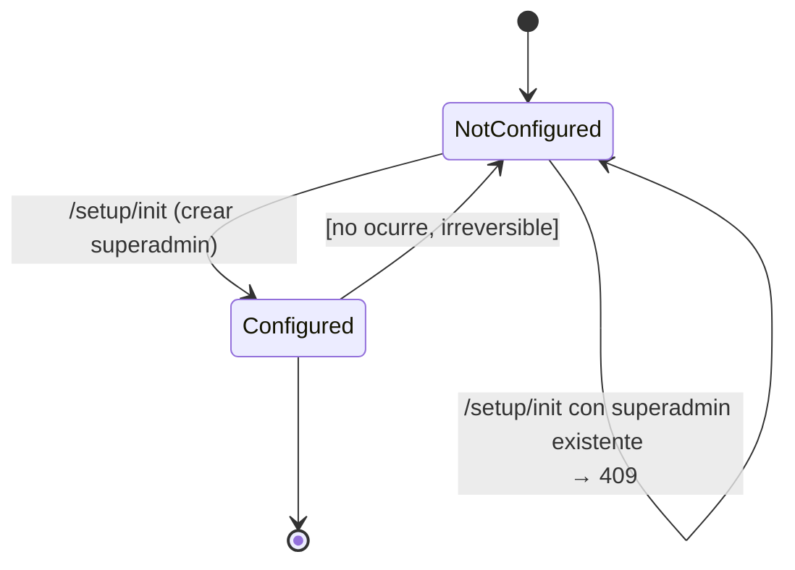
```mermaid
stateDiagram-v2
    [*] --> NotConfigured
    NotConfigured --> Configured: /setup/init (crear superadmin)
    Configured --> [*]
    Configured --> NotConfigured: [no ocurre, irreversible]
    NotConfigured --> NotConfigured: /setup/init con superadmin existente <br/> → 409
```

---

## Caso de Uso 2: Inicio de sesión (login)

| Campo                   | Detalle                                                                                                                                                                                                                                                                                                                                                                                                                                                                                                                                                                                                                                                                                                                                                                                                               |
| :---------------------- | :-------------------------------------------------------------------------------------------------------------------------------------------------------------------------------------------------------------------------------------------------------------------------------------------------------------------------------------------------------------------------------------------------------------------------------------------------------------------------------------------------------------------------------------------------------------------------------------------------------------------------------------------------------------------------------------------------------------------------------------------------------------------------------------------------------------------- |
| **Nombre**              | Inicio de sesión (login)                                                                                                                                                                                                                                                                                                                                                                                                                                                                                                                                                                                                                                                                                                                                                                                              |
| **Actor Principal**     | Administrador de tenant, Usuario de tenant o Superadmin                                                                                                                                                                                                                                                                                                                                                                                                                                                                                                                                                                                                                                                                                                                                                               |
| **Precondiciones**      | El usuario está registrado en el sistema (existencia en `users`).                                                                                                                                                                                                                                                                                                                                                                                                                                                                                                                                                                                                                                                                                                                                                     |
| **Flujo Principal**     | 1. El actor envía `POST /api/v1/auth/login` con `email` y `password`. 2. El sistema verifica si la cuenta está bloqueada (`locked_until > NOW()`). Si bloqueada, responde `429` con `Retry-After: 900`. 3. Busca el usuario por `email`. Si no existe, registra un `security_event` de tipo `login_failed` y responde `401`. 4. Verifica `password_hash` contra Argon2id. 5. Si la contraseña es inválida, incrementa `login_attempts`. Si `login_attempts >= 5`, bloquea la cuenta por 15 minutos y registra `security_event` `account_locked`. 6. Si es válida, resetea `login_attempts=0`, genera un JWT RS256 (access token, 15 min) y un refresh token (7 días), almacena el hash SHA-256 del refresh en `sessions`. 7. Responde `200` con `accessToken`, `refreshToken`, `expiresIn`, `user`. |
| **Flujos Alternativos** | **A1: Cuenta bloqueada.** Se responde `429` con mensaje de bloqueo. **A2: Credenciales inválidas (primeros 4 intentos).** Se incrementa `login_attempts`, se registra `security_event` y se responde `401`. **A3: Quinto intento fallido.** Se bloquea la cuenta (15 min), se registra evento crítico y se responde `401` con indicación de bloqueo.                                                                                                                                                                                                                                                                                                                                                                                                                                                            |
| **Postcondiciones**     | Sesión iniciada. `sessions` contiene un registro con `refresh_token_hash`.                                                                                                                                                                                                                                                                                                                                                                                                                                                                                                                                                                                                                                                                                                                                            |
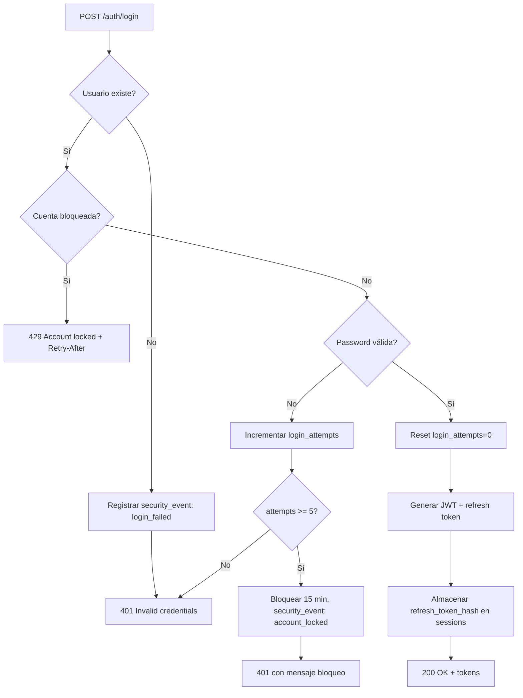
```mermaid
flowchart TD
    A[POST /auth/login] --> B{Usuario existe?}
    B -->|No| C[Registrar security_event: login_failed]
    C --> D[401 Invalid credentials]
    B -->|Sí| E{Cuenta bloqueada?}
    E -->|Sí| F[429 Account locked + Retry-After]
    E -->|No| G{Password válida?}
    G -->|No| H[Incrementar login_attempts]
    H --> I{attempts >= 5?}
    I -->|Sí| J[Bloquear 15 min, security_event: account_locked]
    J --> K[401 con mensaje bloqueo]
    I -->|No| D
    G -->|Sí| L[Reset login_attempts=0]
    L --> M[Generar JWT + refresh token]
    M --> N[Almacenar refresh_token_hash en sessions]
    N --> O[200 OK + tokens]
```

---

## Caso de Uso 3: Renovación de token (refresh) con rotación y detección de robo

| Campo                   | Detalle                                                                                                                                                                                                                                                                                                                                                                                                       |
| :---------------------- | :------------------------------------------------------------------------------------------------------------------------------------------------------------------------------------------------------------------------------------------------------------------------------------------------------------------------------------------------------------------------------------------------------------ |
| **Nombre**              | Renovación de token (refresh)                                                                                                                                                                                                                                                                                                                                                                                 |
| **Actor Principal**     | Administrador de tenant, Usuario de tenant o Superadmin                                                                                                                                                                                                                                                                                                                                                       |
| **Precondiciones**      | El actor posee un refresh token activo almacenado en `sessions`.                                                                                                                                                                                                                                                                                                                                              |
| **Flujo Principal**     | 1. El actor envía `POST /api/v1/auth/refresh` con `refreshToken`. 2. El sistema calcula el hash SHA-256 del token recibido y lo busca en `sessions`. 3. Si el token existe y no ha expirado, lo elimina de la base de datos (rotación). 4. Genera un nuevo par (access token + refresh token). 5. Almacena el nuevo refresh token hash en `sessions`. 6. Responde `200` con los nuevos tokens. |
| **Flujos Alternativos** | **A1: Token inválido o expirado.** No se encuentra el hash → `401`. **A2: Reutilización de token ya rotado (posible robo).** El hash se encuentra pero ya fue eliminado (por rotación anterior). El sistema invalida **todas** las sesiones del usuario, registra un `security_event` de severidad `critical` y responde `409` con `TOKEN_REUSE_DETECTED`.                                                 |
| **Postcondiciones**     | Nuevos tokens emitidos. El refresh token anterior queda invalidado. En caso de robo, todas las sesiones del usuario se eliminan.                                                                                                                                                                                                                                                                              |
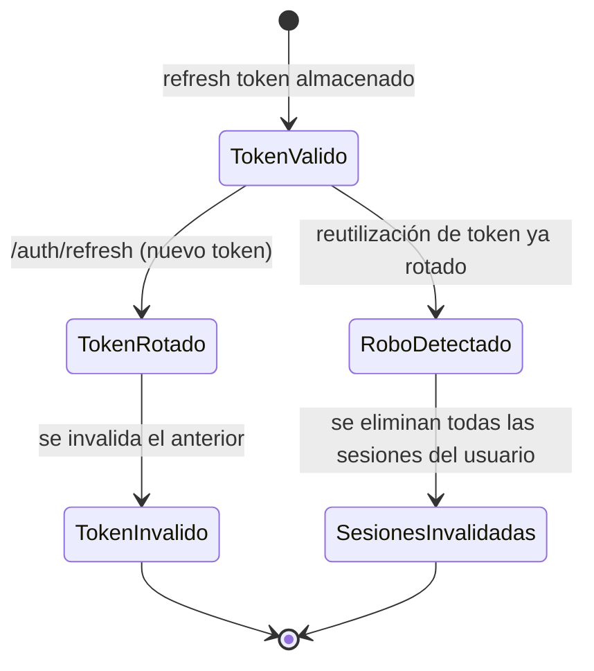
```mermaid
stateDiagram-v2
    [*] --> TokenValido: refresh token almacenado
    TokenValido --> TokenRotado: /auth/refresh (nuevo token)
    TokenRotado --> TokenInvalido: se invalida el anterior
    TokenValido --> RoboDetectado: reutilización de token ya rotado
    RoboDetectado --> SesionesInvalidadas: se eliminan todas las sesiones del usuario
    TokenInvalido --> [*]
    SesionesInvalidadas --> [*]
```

---

## Caso de Uso 4: Cierre de sesión (logout)

| Campo                   | Detalle                                                                                                                                                                                           |
| :---------------------- | :------------------------------------------------------------------------------------------------------------------------------------------------------------------------------------------------ |
| **Nombre**              | Cierre de sesión                                                                                                                                                                                  |
| **Actor Principal**     | Administrador de tenant, Usuario de tenant o Superadmin                                                                                                                                           |
| **Precondiciones**      | El actor tiene una sesión activa (refresh token almacenado).                                                                                                                                      |
| **Flujo Principal**     | 1. El actor envía `POST /api/v1/auth/logout` con `refreshToken`. 2. El sistema calcula el hash y elimina el registro correspondiente en `sessions`. 3. Responde `200` con mensaje de éxito. |
| **Flujos Alternativos** | No aplica (el endpoint es idempotente; si el token no existe, igual responde éxito).                                                                                                              |
| **Postcondiciones**     | La sesión se elimina. El refresh token ya no es válido.                                                                                                                                           |
```mermaid
sequenceDiagram
    participant Actor as Actor (Usuario)
    participant API as API /auth
    participant DB as PostgreSQL (sessions)
    Actor->>API: POST /auth/logout (refreshToken)
    API->>DB: DELETE FROM sessions WHERE refresh_token_hash = ?
    DB-->>API: OK
    API-->>Actor: 200 {"message": "Logged out successfully"}
```

---

## Caso de Uso 5: Creación de tenant (superadmin)

| Campo                   | Detalle                                                                                                                                                                                                                                                                                                                                                                                                                                                                                                      |
| :---------------------- | :----------------------------------------------------------------------------------------------------------------------------------------------------------------------------------------------------------------------------------------------------------------------------------------------------------------------------------------------------------------------------------------------------------------------------------------------------------------------------------------------------------- |
| **Nombre**              | Creación de tenant                                                                                                                                                                                                                                                                                                                                                                                                                                                                                           |
| **Actor Principal**     | Superadmin                                                                                                                                                                                                                                                                                                                                                                                                                                                                                                   |
| **Precondiciones**      | El superadmin está autenticado con JWT válido y rol `superadmin`.                                                                                                                                                                                                                                                                                                                                                                                                                                            |
| **Flujo Principal**     | 1. El superadmin envía `POST /api/v1/tenants` con `name`, `slug`, `plan` y datos del admin inicial (`email`, `password`, `name`). 2. El sistema valida que el `slug` sea único. 3. Crea un registro en `tenants` con `status='active'`. 4. Crea un usuario en `users` con `tenant_id` del nuevo tenant, `role='owner'`, `is_superadmin=false` y `password_hash` Argon2id. 5. Crea un `company_profile` vacío para el tenant. 6. Responde `201` con los datos del tenant y del usuario creado. |
| **Flujos Alternativos** | **A1: Slug duplicado.** Si el `slug` ya existe, responde `409 Conflict`. **A2: Plan inválido.** Si el `plan` no está en la lista permitida, responde `400`.                                                                                                                                                                                                                                                                                                                                               |
| **Postcondiciones**     | Nuevo tenant activo, con un administrador asociado y perfil de empresa pendiente.                                                                                                                                                                                                                                                                                                                                                                                                                            |
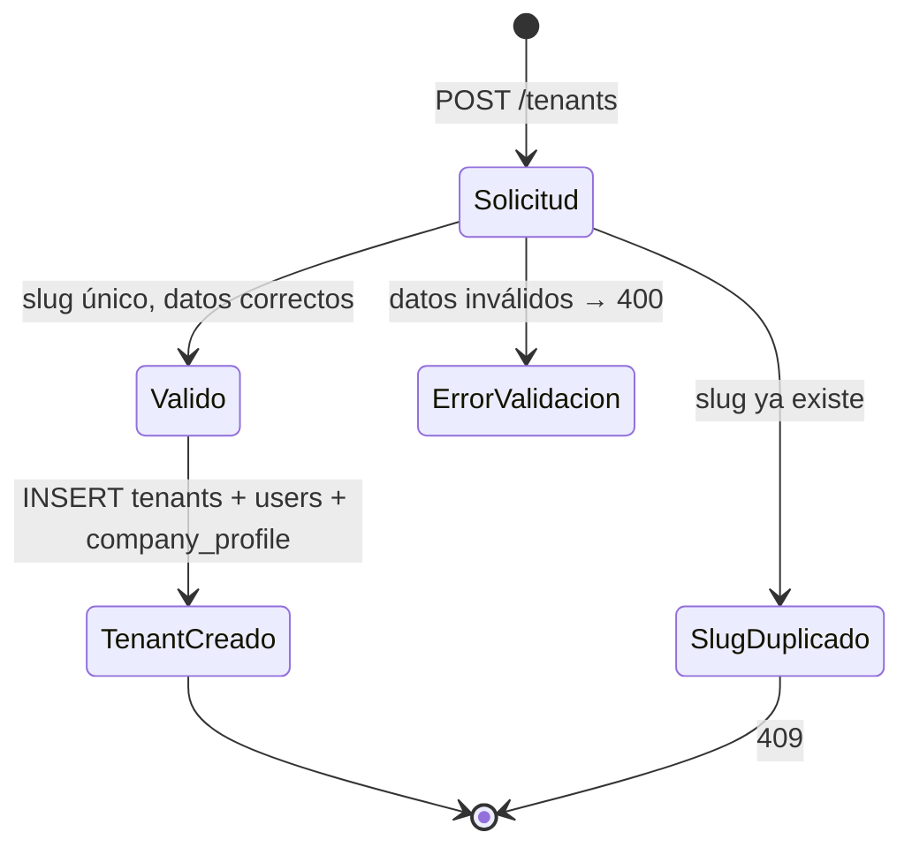
```mermaid
stateDiagram-v2
    [*] --> Solicitud: POST /tenants
    Solicitud --> Valido: slug único, datos correctos
    Valido --> TenantCreado: INSERT tenants + users + company_profile
    TenantCreado --> [*]
    Solicitud --> SlugDuplicado: slug ya existe
    SlugDuplicado --> [*]: 409
    Solicitud --> ErrorValidacion: datos inválidos → 400
```

---

## Caso de Uso 6: Configuración de dominio personalizado

| Campo                   | Detalle                                                                                                                                                                                                                                                                                                                                                                                                                                                                                                                                                                                                                                                                                                                                                                                                                    |
| :---------------------- | :------------------------------------------------------------------------------------------------------------------------------------------------------------------------------------------------------------------------------------------------------------------------------------------------------------------------------------------------------------------------------------------------------------------------------------------------------------------------------------------------------------------------------------------------------------------------------------------------------------------------------------------------------------------------------------------------------------------------------------------------------------------------------------------------------------------------- |
| **Nombre**              | Configuración de dominio personalizado                                                                                                                                                                                                                                                                                                                                                                                                                                                                                                                                                                                                                                                                                                                                                                                     |
| **Actor Principal**     | Administrador de tenant                                                                                                                                                                                                                                                                                                                                                                                                                                                                                                                                                                                                                                                                                                                                                                                                    |
| **Precondiciones**      | Tenant activo. No existe otro dominio con el mismo nombre.                                                                                                                                                                                                                                                                                                                                                                                                                                                                                                                                                                                                                                                                                                                                                                 |
| **Flujo Principal**     | 1. El admin envía `POST /api/v1/domains` con `domain` (ej. `marketing.miempresa.com`). 2. El sistema valida el formato de dominio, genera un `verification_token` y un valor CNAME a apuntar. 3. Almacena el dominio en `custom_domains` con `verification_status='pending'`, `ssl_status='pending'`. 4. Responde con los detalles de verificación (valor CNAME, token). 5. El admin configura el registro CNAME en su DNS. 6. El admin envía `POST /api/v1/domains/:id/verify-dns`. 7. El sistema verifica la existencia del registro CNAME mediante consulta DNS (TXT o CNAME). Si es correcto, actualiza `verification_status='verified'`. 8. El sistema solicita un certificado SSL a Let's Encrypt (ACME). Si tiene éxito, marca `ssl_status='active'` y `is_active=true`. 9. Responde éxito. |
| **Flujos Alternativos** | **A1: Verificación DNS falla.** La consulta DNS no coincide con el token → responde `400`; el admin puede reintentar. **A2: Emisión SSL falla.** Let's Encrypt no puede emitir el certificado → `ssl_status='failed'`. Se reintenta automáticamente más tarde. **A3: Dominio ya registrado por otro tenant.** Responde `409`.                                                                                                                                                                                                                                                                                                                                                                                                                                                                                        |
| **Postcondiciones**     | Dominio verificado, SSL activo, el tenant puede acceder mediante su dominio personalizado.                                                                                                                                                                                                                                                                                                                                                                                                                                                                                                                                                                                                                                                                                                                                 |
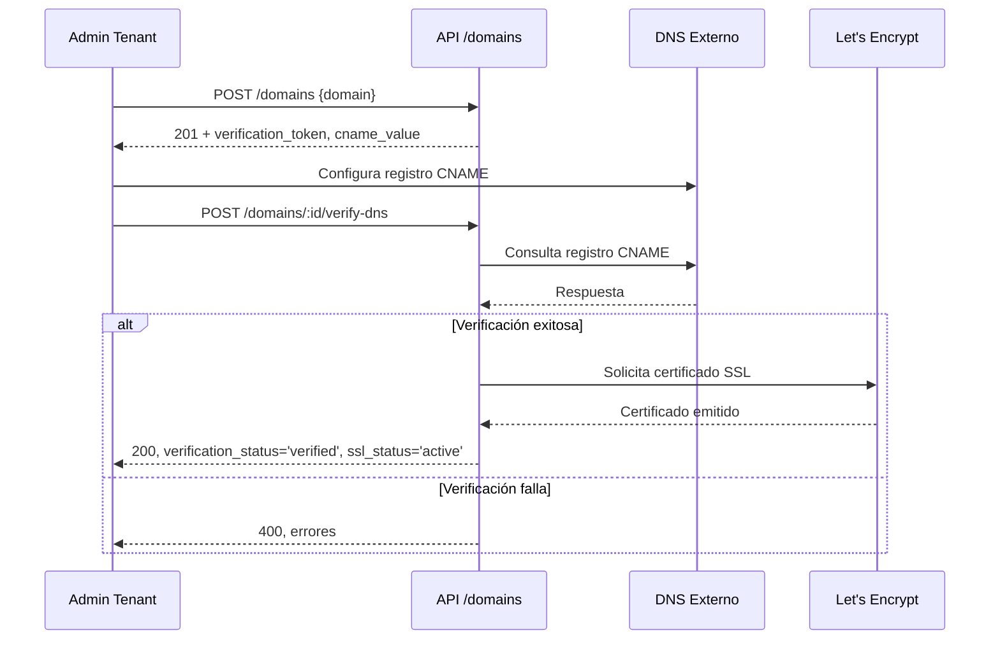
```mermaid
sequenceDiagram
    participant Admin as Admin Tenant
    participant API as API /domains
    participant DNS as DNS Externo
    participant LE as Let's Encrypt
    Admin->>API: POST /domains {domain}
    API-->>Admin: 201 + verification_token, cname_value
    Admin->>DNS: Configura registro CNAME
    Admin->>API: POST /domains/:id/verify-dns
    API->>DNS: Consulta registro CNAME
    DNS-->>API: Respuesta
    alt Verificación exitosa
        API->>LE: Solicita certificado SSL
        LE-->>API: Certificado emitido
        API-->>Admin: 200, verification_status='verified', ssl_status='active'
    else Verificación falla
        API-->>Admin: 400, errores
    end
```

---

## Caso de Uso 7: Onboarding progresivo del perfil de empresa

| Campo                   | Detalle                                                                                                                                                                                                                                                                                                                                                                                                                                                                                                                                                                                   |
| :---------------------- | :---------------------------------------------------------------------------------------------------------------------------------------------------------------------------------------------------------------------------------------------------------------------------------------------------------------------------------------------------------------------------------------------------------------------------------------------------------------------------------------------------------------------------------------------------------------------------------------- |
| **Nombre**              | Onboarding progresivo del perfil de empresa                                                                                                                                                                                                                                                                                                                                                                                                                                                                                                                                               |
| **Actor Principal**     | Administrador de tenant                                                                                                                                                                                                                                                                                                                                                                                                                                                                                                                                                                   |
| **Precondiciones**      | Tenant creado, `company_profiles` existe con `status='pending'`.                                                                                                                                                                                                                                                                                                                                                                                                                                                                                                                          |
| **Flujo Principal**     | 1. El admin accede al cuestionario (`GET /api/v1/company-profile/sections`) y ve las secciones disponibles. 2. El admin completa una sección enviando `PATCH /api/v1/company-profile/sections/:key` con los datos rellenados. 3. El sistema calcula `completion_percentage = (secciones_obligatorias_completadas / total_obligatorias) * 100`. 4. Si `completion_percentage >= 80` y antes era menor, el sistema marca `company_profiles.status='completed'` y emite un evento `ProfileCompleted` en el outbox. 5. Responde con la sección actualizada y el nuevo porcentaje. |
| **Flujos Alternativos** | **A1: Solicitar sugerencia IA para una sección.** El admin envía `POST /api/v1/company-profile/sections/:key/suggest`. El sistema encola una tarea para el agente IA, que genera una sugerencia basada en datos públicos de la empresa. El admin puede aceptarla, modificarla o rechazarla. **A2: Onboarding en múltiples sesiones.** El admin cierra sesión y retoma más tarde; el progreso se conserva en `company_profile_sections`.                                                                                                                                                |
| **Postcondiciones**     | El perfil de empresa puede alcanzar `status='completed'`. Los agentes IA utilizan los datos del perfil inmediatamente después de completado.                                                                                                                                                                                                                                                                                                                                                                                                                                              |
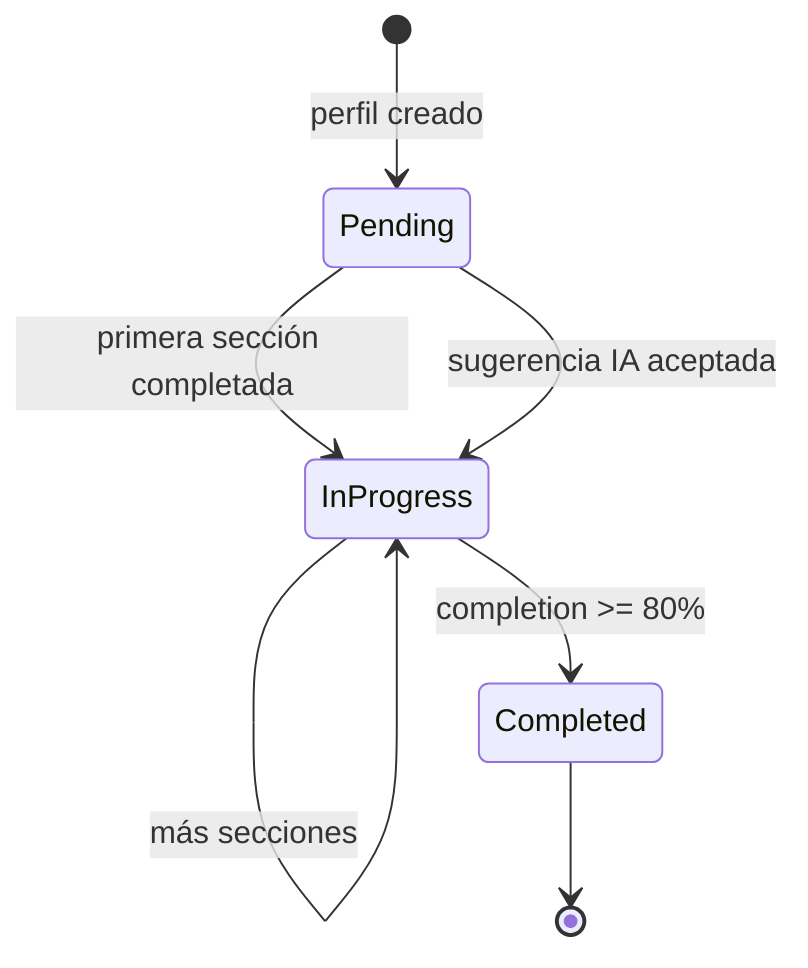
```mermaid
stateDiagram-v2
    [*] --> Pending: perfil creado
    Pending --> InProgress: primera sección completada
    InProgress --> InProgress: más secciones
    InProgress --> Completed: completion >= 80%
    Completed --> [*]
    Pending --> InProgress: sugerencia IA aceptada
```

---

## Caso de Uso 8: Creación de campaña multicanal con generación de estrategia y presupuesto por IA

| Campo                   | Detalle                                                                                                                                                                                                                                                                                                                                                                                                                                                                                                                                                                                                                                                                                                                                                 |
| :---------------------- | :------------------------------------------------------------------------------------------------------------------------------------------------------------------------------------------------------------------------------------------------------------------------------------------------------------------------------------------------------------------------------------------------------------------------------------------------------------------------------------------------------------------------------------------------------------------------------------------------------------------------------------------------------------------------------------------------------------------------------------------------------ |
| **Nombre**              | Creación de campaña multicanal con estrategia IA                                                                                                                                                                                                                                                                                                                                                                                                                                                                                                                                                                                                                                                                                                        |
| **Actor Principal**     | Administrador de tenant                                                                                                                                                                                                                                                                                                                                                                                                                                                                                                                                                                                                                                                                                                                                 |
| **Precondiciones**      | Perfil de empresa completado (`completion_percentage >= 80`) o datos suficientes. Existen plantillas de campaña predefinidas.                                                                                                                                                                                                                                                                                                                                                                                                                                                                                                                                                                                                                           |
| **Flujo Principal**     | 1. El admin selecciona una plantilla de campaña (`GET /campaign-templates`) o decide crear desde cero. 2. Envía `POST /api/v1/campaigns` con `template_id` (opcional), `name`, `objective`, `platforms`. 3. El sistema crea la campaña en estado `draft` y encola el comando `GenerateStrategyCommand` en el outbox. 4. Un worker IA procesa el comando: genera una estrategia (texto), calcula presupuestos por plataforma (daily_budget, total_budget) y los almacena en `budgets` con `proposed_by_ai=true`. 5. El admin puede consultar la estrategia y los presupuestos (`GET /campaigns/:id/budgets`). 6. El admin aprueba o rechaza cada presupuesto mediante `PATCH /campaigns/:id/budgets/:budgetId` con `approved=true/false`. |
| **Flujos Alternativos** | **A1: Generación IA falla.** El worker registra el error en el outbox (`status=failed`). Se reintenta hasta 3 veces con backoff exponencial. Si persiste, se notifica al admin para intervención manual. **A2: Admin rechaza presupuesto.** El presupuesto queda como `approved=false`. El admin puede ajustar valores manualmente y volver a enviar a IA para recalcular. **A3: Admin crea desde cero sin plantilla.** Debe definir él mismo la estrategia y presupuestos manualmente, sin intervención IA.                                                                                                                                                                                                                                      |
| **Postcondiciones**     | Campaña en estado `draft` con presupuestos (algunos aprobados, otros no). La estrategia está disponible en `campaigns.strategy`.                                                                                                                                                                                                                                                                                                                                                                                                                                                                                                                                                                                                                        |
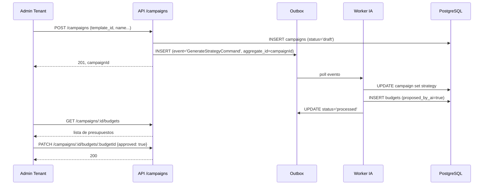
```mermaid
sequenceDiagram
    participant Admin as Admin Tenant
    participant API as API /campaigns
    participant Outbox as Outbox
    participant Worker as Worker IA
    participant BD as PostgreSQL
    Admin->>API: POST /campaigns (template_id, name...)
    API->>BD: INSERT campaigns (status='draft')
    API->>Outbox: INSERT (event='GenerateStrategyCommand', aggregate_id=campaignId)
    API-->>Admin: 201, campaignId
    Outbox->>Worker: poll evento
    Worker->>BD: UPDATE campaign set strategy
    Worker->>BD: INSERT budgets (proposed_by_ai=true)
    Worker->>Outbox: UPDATE status='processed'
    Admin->>API: GET /campaigns/:id/budgets
    API-->>Admin: lista de presupuestos
    Admin->>API: PATCH /campaigns/:id/budgets/:budgetId {approved: true}
    API-->>Admin: 200
```

---

## Caso de Uso 9: Aprobación de contenido con firma digital (Kill Switch)

| Campo                   | Detalle                                                                                                                                                                                                                                                                                                                                                                                                                     |
| :---------------------- | :-------------------------------------------------------------------------------------------------------------------------------------------------------------------------------------------------------------------------------------------------------------------------------------------------------------------------------------------------------------------------------------------------------------------------- |
| **Nombre**              | Aprobación de contenido con firma digital SHA-256                                                                                                                                                                                                                                                                                                                                                                           |
| **Actor Principal**     | Administrador de tenant (el dueño del negocio)                                                                                                                                                                                                                                                                                                                                                                              |
| **Precondiciones**      | Existe una versión de contenido (`content_versions`) en estado `draft` o `in_review`. El usuario es owner del tenant o superadmin impersonando.                                                                                                                                                                                                                                                                             |
| **Flujo Principal**     | 1. El admin revisa la versión de contenido (previsualización en Detalle del Día). 2. Envía `POST /api/v1/contents/:id/versions/:vid/approve` con `feedback` opcional. 3. El sistema verifica que la versión no esté ya aprobada (`status != 'approved'`). 4. Calcula el hash SHA-256: `SHA-256(body + "                                                                                                            |
| **Flujos Alternativos** | **A1: Versión ya aprobada.** Si `status='approved'`, responde `409` con mensaje `ALREADY_APPROVED`. **A2: Admin rechaza versión.** Envía `POST /contents/:id/versions/:vid/reject` con feedback. La versión queda en estado `rejected`, el contenido vuelve a `draft` para corrección. **A3: Admin solicita cambios.** Envía `POST /contents/:id/versions/:vid/request-changes`. Se crea una tarea para el agente IA. |
| **Postcondiciones**     | Contenido aprobado y congelado. Kit de descarga liberado. El contenido es inmutable en esa versión.                                                                                                                                                                                                                                                                                                                         |
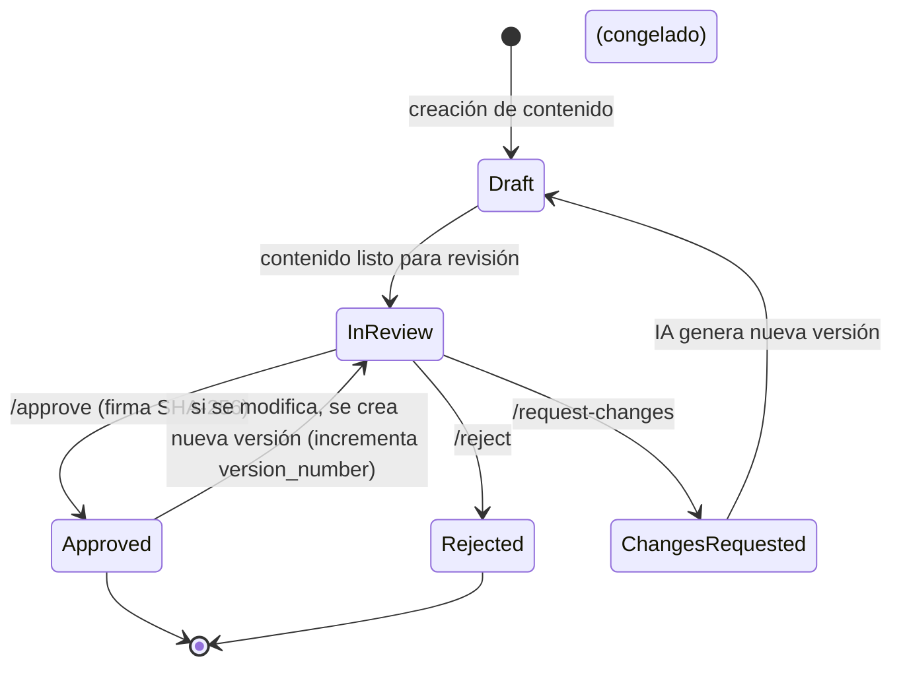
```mermaid
stateDiagram-v2
    [*] --> Draft: creación de contenido
    Draft --> InReview: contenido listo para revisión
    InReview --> Approved: /approve (firma SHA-256)
    InReview --> Rejected: /reject
    InReview --> ChangesRequested: /request-changes
    ChangesRequested --> Draft: IA genera nueva versión
    Approved --> [*] (congelado)
    Approved --> InReview: si se modifica, se crea nueva versión (incrementa version_number)
    Rejected --> [*]
```

---

## Caso de Uso 10: Visualización del Calendario Editorial y Detalle del Día

| Campo                   | Detalle                                                                                                                                                                                                                                                                                                                                                                                                                                                                                                                                                                                                                                                                                                       |
| :---------------------- | :------------------------------------------------------------------------------------------------------------------------------------------------------------------------------------------------------------------------------------------------------------------------------------------------------------------------------------------------------------------------------------------------------------------------------------------------------------------------------------------------------------------------------------------------------------------------------------------------------------------------------------------------------------------------------------------------------------ |
| **Nombre**              | Visualización del Calendario Editorial y Detalle del Día                                                                                                                                                                                                                                                                                                                                                                                                                                                                                                                                                                                                                                                      |
| **Actor Principal**     | Administrador de tenant                                                                                                                                                                                                                                                                                                                                                                                                                                                                                                                                                                                                                                                                                       |
| **Precondiciones**      | Existen contenidos programados en el calendario (con `campaigns` y fechas asociadas).                                                                                                                                                                                                                                                                                                                                                                                                                                                                                                                                                                                                                         |
| **Flujo Principal**     | 1. El admin accede a `GET /api/v1/calendar?month=&year=`. 2. El sistema devuelve una lista de contenidos agrupados por día del mes, cada uno con `status`, `title`, `type`, `platform`. 3. El Calendario se renderiza en el frontend con colores: verde (aprobado), amarillo (borrador), rojo (bloqueado/rechazado). 4. El admin selecciona un día específico → `GET /api/v1/calendar/:date`. 5. El sistema devuelve el Detalle del Día con todas las piezas programadas para esa fecha, incluyendo previsualizaciones limpias (sin jerga técnica). 6. Desde el Detalle del Día, el admin puede aprobar, rechazar o solicitar cambios sobre cada pieza (invocando los endpoints de contenido). |
| **Flujos Alternativos** | **A1: Día sin contenido.** El endpoint `/calendar/:date` devuelve una lista vacía. **A2: Contenido bloqueado.** Si el contenido está en estado `blocked` (ej. por edición concurrente), se muestra en rojo y no permite acciones hasta que se resuelva.                                                                                                                                                                                                                                                                                                                                                                                                                                                    |
| **Postcondiciones**     | El admin visualiza el calendario y puede actuar sobre el contenido.                                                                                                                                                                                                                                                                                                                                                                                                                                                                                                                                                                                                                                           |
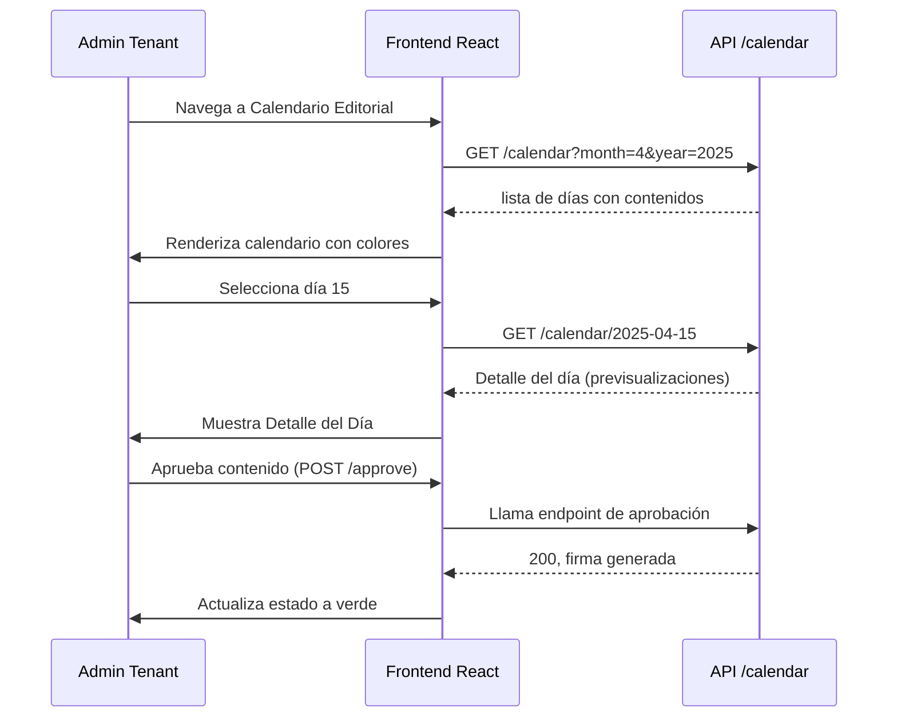
```mermaid
sequenceDiagram
    participant Admin as Admin Tenant
    participant Frontend as Frontend React
    participant API as API /calendar
    Admin->>Frontend: Navega a Calendario Editorial
    Frontend->>API: GET /calendar?month=4&year=2025
    API-->>Frontend: lista de días con contenidos
    Frontend->>Admin: Renderiza calendario con colores
    Admin->>Frontend: Selecciona día 15
    Frontend->>API: GET /calendar/2025-04-15
    API-->>Frontend: Detalle del día (previsualizaciones)
    Frontend->>Admin: Muestra Detalle del Día
    Admin->>Frontend: Aprueba contenido (POST /approve)
    Frontend->>API: Llama endpoint de aprobación
    API-->>Frontend: 200, firma generada
    Frontend->>Admin: Actualiza estado a verde
```

---

## Caso de Uso 11: Reversión de versión de contenido

| Campo                   | Detalle                                                                                                                                                                                                                                                                                                                                                                                                                                                                                                                                                                                                                                                       |
| :---------------------- | :------------------------------------------------------------------------------------------------------------------------------------------------------------------------------------------------------------------------------------------------------------------------------------------------------------------------------------------------------------------------------------------------------------------------------------------------------------------------------------------------------------------------------------------------------------------------------------------------------------------------------------------------------------ |
| **Nombre**              | Reversión a versión anterior de contenido                                                                                                                                                                                                                                                                                                                                                                                                                                                                                                                                                                                                                     |
| **Actor Principal**     | Administrador de tenant                                                                                                                                                                                                                                                                                                                                                                                                                                                                                                                                                                                                                                       |
| **Precondiciones**      | El contenido tiene al menos 2 versiones en `content_versions`.                                                                                                                                                                                                                                                                                                                                                                                                                                                                                                                                                                                                |
| **Flujo Principal**     | 1. El admin accede al historial de versiones (`GET /contents/:id/versions`). 2. Revisa las versiones anteriores (cada una con `version_number`, `title`, `body`, `change_summary`, `signature_hash` si aplica). 3. Envía `POST /api/v1/contents/:id/revert/:vid` donde `:vid` es el ID de la versión a la que se quiere revertir. 4. El sistema crea una **nueva versión** (con `version_number = max(version_number)+1`) cuyo contenido es una copia de la versión indicada. 5. La nueva versión queda sin firmar. El contenido pasa a estado `draft` o `in_changes` según corresponda. 6. Responde con los datos de la nueva versión creada. |
| **Flujos Alternativos** | **A1: Versión solicitada no existe.** Si `:vid` no pertenece al contenido, responde `404`. **A2: Intento de revertir a la versión actual.** Si `:vid` es la versión actual, el sistema responde `409` (no tiene sentido revertir a sí mismo).                                                                                                                                                                                                                                                                                                                                                                                                              |
| **Postcondiciones**     | Una nueva versión (sin firmar) contiene el contenido de la versión anterior. Se requiere nueva aprobación para liberar.                                                                                                                                                                                                                                                                                                                                                                                                                                                                                                                                       |
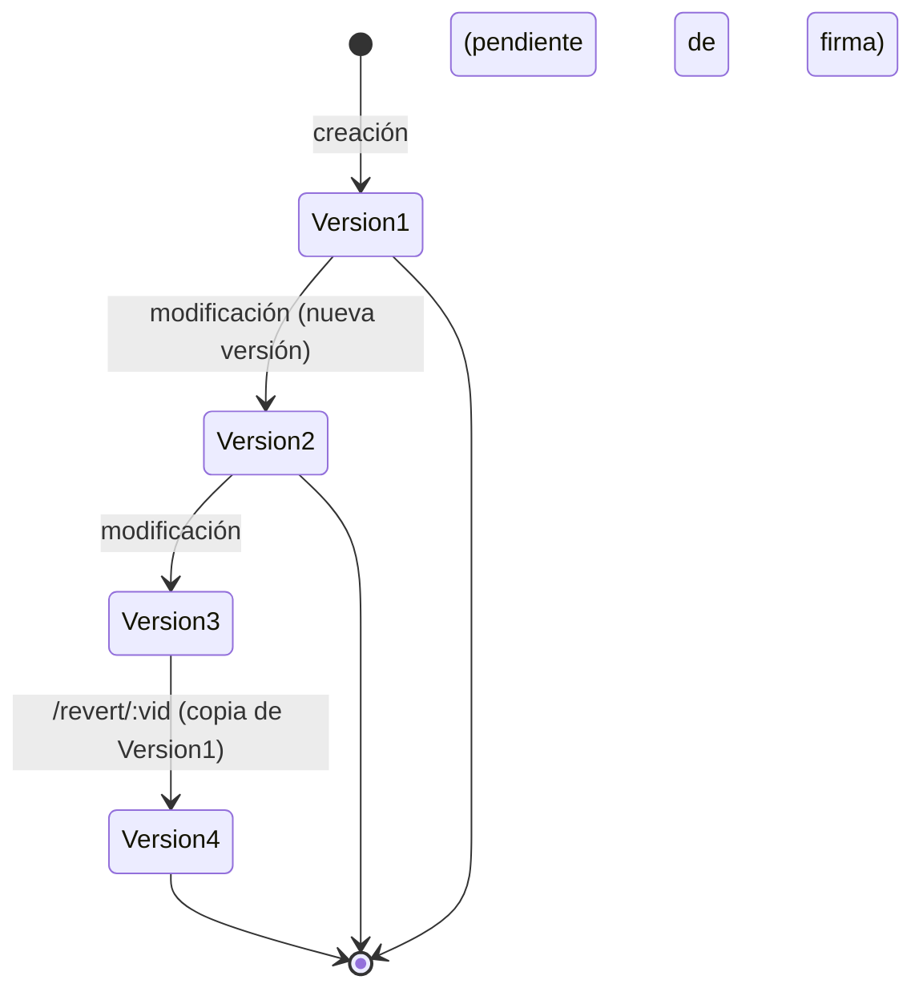
```mermaid
stateDiagram-v2
    [*] --> Version1: creación
    Version1 --> Version2: modificación (nueva versión)
    Version2 --> Version3: modificación
    Version3 --> Version4: /revert/:vid (copia de Version1)
    Version4 --> [*] (pendiente de firma)
    Version1 --> [*]
    Version2 --> [*]
```

---

## Caso de Uso 12: Subida de asset a librería multimedia

| Campo                   | Detalle                                                                                                                                                                                                                                                                                                                                                                                                                                                                                                                                             |
| :---------------------- | :-------------------------------------------------------------------------------------------------------------------------------------------------------------------------------------------------------------------------------------------------------------------------------------------------------------------------------------------------------------------------------------------------------------------------------------------------------------------------------------------------------------------------------------------------- |
| **Nombre**              | Subida de asset a librería multimedia                                                                                                                                                                                                                                                                                                                                                                                                                                                                                                               |
| **Actor Principal**     | Administrador de tenant                                                                                                                                                                                                                                                                                                                                                                                                                                                                                                                             |
| **Precondiciones**      | Espacio de almacenamiento disponible según el plan (`max_assets_size`).                                                                                                                                                                                                                                                                                                                                                                                                                                                                             |
| **Flujo Principal**     | 1. El admin envía una petición `POST /api/v1/assets/upload` con multipart/form-data incluyendo el archivo, `name`, `folder_id` (opcional). 2. El sistema valida el tamaño del archivo contra el límite del plan y la cuota total usada. 3. Genera una URL firmada para S3 (validez 1 hora). 4. Sube el archivo al bucket S3-compatible. 5. Crea un registro en `assets` con `file_key`, `file_size`, `mime_type`, `url` (la URL firmada), `metadata` (como dimensiones si es imagen). 6. Responde `201` con los metadatos del asset. |
| **Flujos Alternativos** | **A1: Archivo excede tamaño máximo del plan.** Responde `413`. **A2: Cuota de almacenamiento excedida.** El `SUM(file_size)` de todos los assets del tenant supera `max_assets_size`. Responde `413`. **A3: Error de conexión con S3.** Se reintenta hasta 3 veces. Si falla, responde `503` y registra el error.                                                                                                                                                                                                                             |
| **Postcondiciones**     | Asset almacenado en S3 y registrado en `assets`. Se incrementa el contador de almacenamiento usado del tenant.                                                                                                                                                                                                                                                                                                                                                                                                                                      |
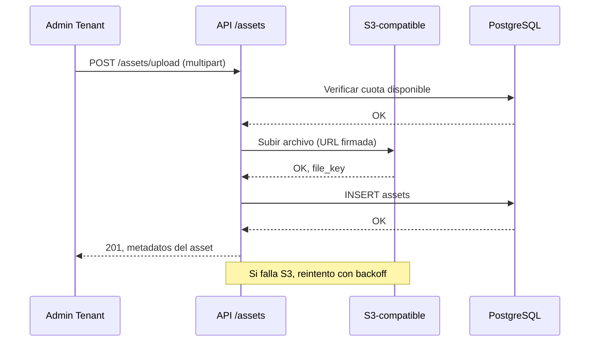
```mermaid
sequenceDiagram
    participant Admin as Admin Tenant
    participant API as API /assets
    participant S3 as S3-compatible
    participant BD as PostgreSQL
    Admin->>API: POST /assets/upload (multipart)
    API->>BD: Verificar cuota disponible
    BD-->>API: OK
    API->>S3: Subir archivo (URL firmada)
    S3-->>API: OK, file_key
    API->>BD: INSERT assets
    BD-->>API: OK
    API-->>Admin: 201, metadatos del asset
    Note over API,S3: Si falla S3, reintento con backoff
```

---

## Caso de Uso 13: Eliminación de asset con protección de referencias

| Campo                   | Detalle                                                                                                                                                                                                                                                                                                                                                                                 |
| :---------------------- | :-------------------------------------------------------------------------------------------------------------------------------------------------------------------------------------------------------------------------------------------------------------------------------------------------------------------------------------------------------------------------------------- |
| **Nombre**              | Eliminación de asset (con verificación de referencias)                                                                                                                                                                                                                                                                                                                                  |
| **Actor Principal**     | Administrador de tenant                                                                                                                                                                                                                                                                                                                                                                 |
| **Precondiciones**      | El asset existe y pertenece al tenant.                                                                                                                                                                                                                                                                                                                                                  |
| **Flujo Principal**     | 1. El admin envía `DELETE /api/v1/assets/:id`. 2. El sistema verifica `is_in_use` y `reference_count`. Si `is_in_use = true` o `reference_count > 0`, responde `409 Conflict` con mensaje de que el asset está referenciado. 3. Si el asset no está en uso, elimina el registro de `assets` y elimina el archivo del bucket S3. 4. Responde `200` con mensaje de confirmación. |
| **Flujos Alternativos** | **A1: Asset referenciado en contenido aprobado.** `reference_count > 0` → `409`. El admin debe archivar o reemplazar las referencias primero. **A2: Asset no encontrado.** Responde `404`.                                                                                                                                                                                           |
| **Postcondiciones**     | Asset eliminado de BD y de S3. Las referencias a este asset en contenidos aprobados quedan huérfanas (manejo a nivel de UI: mostrar marcador de "asset eliminado").                                                                                                                                                                                                                     |
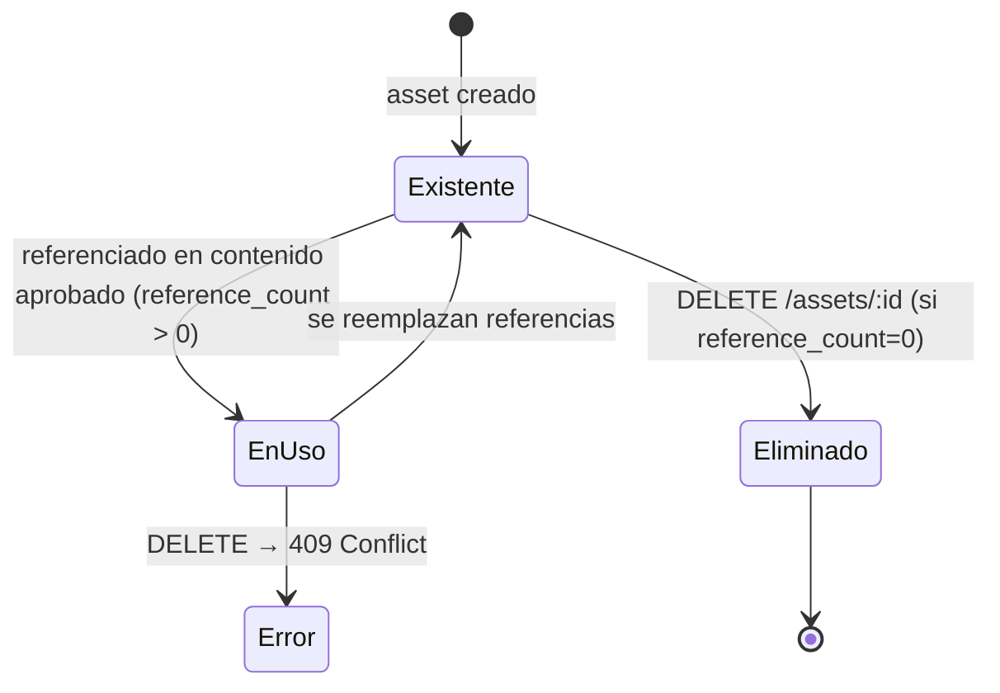
```mermaid
stateDiagram-v2
    [*] --> Existente: asset creado
    Existente --> EnUso: referenciado en contenido aprobado (reference_count > 0)
    EnUso --> Existente: se reemplazan referencias
    Existente --> Eliminado: DELETE /assets/:id (si reference_count=0)
    Eliminado --> [*]
    EnUso --> Error: DELETE → 409 Conflict
```

---

## Caso de Uso 14: Creación y embebido de formulario

| Campo                   | Detalle                                                                                                                                                                                                                                                                                                                                                                                                                                        |
| :---------------------- | :--------------------------------------------------------------------------------------------------------------------------------------------------------------------------------------------------------------------------------------------------------------------------------------------------------------------------------------------------------------------------------------------------------------------------------------------- |
| **Nombre**              | Creación y embebido de formulario para captura de leads                                                                                                                                                                                                                                                                                                                                                                                        |
| **Actor Principal**     | Administrador de tenant                                                                                                                                                                                                                                                                                                                                                                                                                        |
| **Precondiciones**      | Tenant activo.                                                                                                                                                                                                                                                                                                                                                                                                                                 |
| **Flujo Principal**     | 1. El admin envía `POST /api/v1/forms` con `name`, `fields` (array de objetos: label, type, required), `style` (JSON con colores, fuentes). 2. El sistema crea el formulario en `forms` y genera un snippet JavaScript embebible (también disponible en `GET /forms/:id/snippet`). 3. Responde `201` con los datos del formulario y el snippet. 4. El admin copia el snippet y lo inserta en su sitio web (o lo utiliza como iframe). |
| **Flujos Alternativos** | **A1: Nombre duplicado.** Si ya existe un formulario con el mismo nombre para el tenant, responde `409`. **A2: Campos inválidos.** Si la estructura de `fields` no es válida (ej. falta `type`), responde `400`.                                                                                                                                                                                                                            |
| **Postcondiciones**     | Formulario activo. El snippet JS está listo para ser insertado en sitios externos.                                                                                                                                                                                                                                                                                                                                                             |
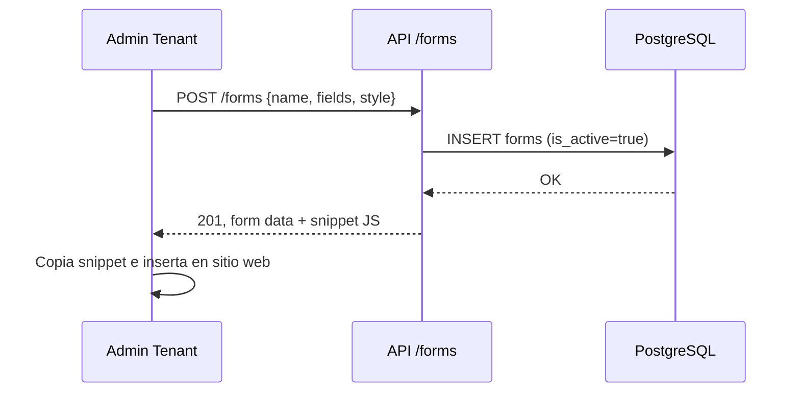
```mermaid
sequenceDiagram
    participant Admin as Admin Tenant
    participant API as API /forms
    participant BD as PostgreSQL
    Admin->>API: POST /forms {name, fields, style}
    API->>BD: INSERT forms (is_active=true)
    BD-->>API: OK
    API-->>Admin: 201, form data + snippet JS
    Admin->>Admin: Copia snippet e inserta en sitio web
```

---

## Caso de Uso 15: Captura de lead desde formulario público

| Campo                   | Detalle                                                                                                                                                                                                                                                                                                                                                                                                                                                                                      |
| :---------------------- | :------------------------------------------------------------------------------------------------------------------------------------------------------------------------------------------------------------------------------------------------------------------------------------------------------------------------------------------------------------------------------------------------------------------------------------------------------------------------------------------- |
| **Nombre**              | Captura de lead desde formulario embebido                                                                                                                                                                                                                                                                                                                                                                                                                                                    |
| **Actor Principal**     | Visitante (externo)                                                                                                                                                                                                                                                                                                                                                                                                                                                                          |
| **Precondiciones**      | El formulario está activo (`is_active=true`).                                                                                                                                                                                                                                                                                                                                                                                                                                                |
| **Flujo Principal**     | 1. El visitante completa los campos del formulario y lo envía (`POST /api/v1/forms/:id/submit`). 2. El sistema valida los campos requeridos y el formato del email. 3. Crea un `form_submission` con los datos enviados. 4. Crea un `lead` en el tenant asociado al formulario, con `stage='prospect'`, `score=0` (inicial). 5. Encola un evento `LeadCaptured` en el outbox para que un worker calcule el score IA de forma asíncrona. 6. Responde `201` con `submissionId`. |
| **Flujos Alternativos** | **A1: Validación de datos falla.** Si el email es inválido o falta un campo requerido, responde `400`. **A2: Formulario inactivo.** Si `is_active=false`, responde `404` (no se revela la existencia del formulario). **A3: Score IA calculado asíncronamente.** El worker actualiza `leads.score` en función de interacciones, datos demográficos y origen.                                                                                                                           |
| **Postcondiciones**     | Lead creado en el pipeline del tenant con score inicial 0. El admin puede verlo en CRM.                                                                                                                                                                                                                                                                                                                                                                                                      |
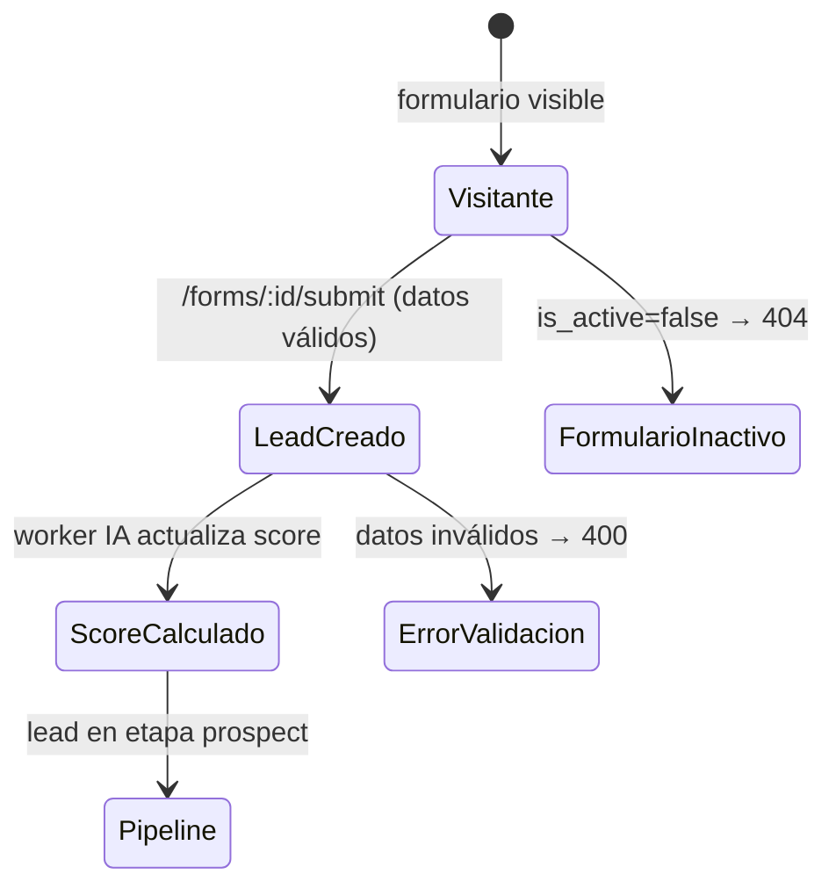
```mermaid
stateDiagram-v2
    [*] --> Visitante: formulario visible
    Visitante --> LeadCreado: /forms/:id/submit (datos válidos)
    LeadCreado --> ScoreCalculado: worker IA actualiza score
    ScoreCalculado --> Pipeline: lead en etapa prospect
    LeadCreado --> ErrorValidacion: datos inválidos → 400
    Visitante --> FormularioInactivo: is_active=false → 404
```

---

## Caso de Uso 16: Cambio de etapa de lead en pipeline CRM

| Campo                   | Detalle                                                                                                                                                                                                                                                                                                                                                                                                                                                                                                                        |
| :---------------------- | :----------------------------------------------------------------------------------------------------------------------------------------------------------------------------------------------------------------------------------------------------------------------------------------------------------------------------------------------------------------------------------------------------------------------------------------------------------------------------------------------------------------------------- |
| **Nombre**              | Avance/retroceso de etapa de lead en CRM                                                                                                                                                                                                                                                                                                                                                                                                                                                                                       |
| **Actor Principal**     | Administrador de tenant                                                                                                                                                                                                                                                                                                                                                                                                                                                                                                        |
| **Precondiciones**      | Lead existe y pertenece al tenant.                                                                                                                                                                                                                                                                                                                                                                                                                                                                                             |
| **Flujo Principal**     | 1. El admin visualiza el pipeline de leads (`GET /leads`) y selecciona un lead. 2. Envía `PATCH /api/v1/leads/:id/stage` con `stage` (nueva etapa, ej. 'qualified', 'opportunity', 'customer'). 3. El sistema actualiza `leads.stage` y registra una interacción en `lead_interactions` con `type='stage_change'` y `description` de la transición. 4. Si la nueva etapa es 'customer', el sistema verifica si el lead tiene propuestas firmadas; si no, puede avanzar igual. 5. Responde con el lead actualizado. |
| **Flujos Alternativos** | **A1: Etapa inválida.** Si `stage` no está en el conjunto permitido, responde `400`. **A2: Intento de eliminar lead en etapa 'customer' con propuestas firmadas.** El endpoint `DELETE /leads/:id` verifica si hay propuestas firmadas asociadas; si las hay, responde `409`. Se recomienda archivar (borrado lógico) en lugar de eliminar.                                                                                                                                                                                 |
| **Postcondiciones**     | Lead cambiado de etapa. Se registra interacción.                                                                                                                                                                                                                                                                                                                                                                                                                                                                               |
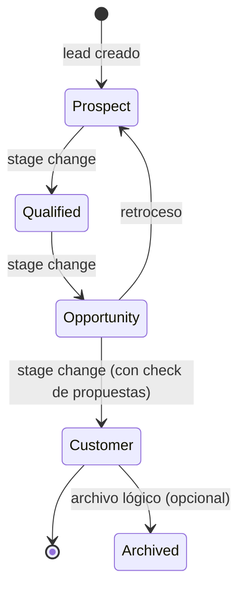
```mermaid
stateDiagram-v2
    [*] --> Prospect: lead creado
    Prospect --> Qualified: stage change
    Qualified --> Opportunity: stage change
    Opportunity --> Customer: stage change (con check de propuestas)
    Customer --> [*]
    Opportunity --> Prospect: retroceso
    Customer --> Archived: archivo lógico (opcional)
```

---

## Caso de Uso 17: Impersonalización de superadmin

| Campo                   | Detalle                                                                                                                                                                                                                                                                                                                                                                                                                                                                                                                                                                                                                                                                                                                                                          |
| :---------------------- | :--------------------------------------------------------------------------------------------------------------------------------------------------------------------------------------------------------------------------------------------------------------------------------------------------------------------------------------------------------------------------------------------------------------------------------------------------------------------------------------------------------------------------------------------------------------------------------------------------------------------------------------------------------------------------------------------------------------------------------------------------------------- |
| **Nombre**              | Impersonalización de superadmin                                                                                                                                                                                                                                                                                                                                                                                                                                                                                                                                                                                                                                                                                                                                  |
| **Actor Principal**     | Superadmin                                                                                                                                                                                                                                                                                                                                                                                                                                                                                                                                                                                                                                                                                                                                                       |
| **Precondiciones**      | Superadmin autenticado con JWT válido y rol `superadmin`. No está impersonando actualmente.                                                                                                                                                                                                                                                                                                                                                                                                                                                                                                                                                                                                                                                                      |
| **Flujo Principal**     | 1. El superadmin envía `POST /api/v1/superadmin/impersonate` con `tenantId` y `userId` (del usuario del tenant a impersonar). 2. El sistema verifica que el superadmin no tenga ya una impersonalización activa. 3. Genera un token JWT temporal (expira en 1 hora) con los claims del usuario impersonado más un flag `isImpersonating=true` y el `superadmin_id` original. 4. Almacena el estado de impersonación en sesión (opcional). 5. Responde `200` con el token temporal, datos del tenant y del usuario, y una nota de auditoría: "All actions are logged. Destructive actions are prohibited." 6. A partir de ese momento, todas las acciones del superadmin (como el usuario impersonado) quedan registradas en `impersonation_logs`. |
| **Flujos Alternativos** | **A1: Superadmin ya impersonando.** El sistema detecta un token de impersonación activo → responde `409`. **A2: Tenant o usuario no existen.** Responde `404`.                                                                                                                                                                                                                                                                                                                                                                                                                                                                                                                                                                                                |
| **Postcondiciones**     | Superadmin puede actuar dentro del tenant con las credenciales del usuario impersonado. Cada acción es auditada.                                                                                                                                                                                                                                                                                                                                                                                                                                                                                                                                                                                                                                                 |
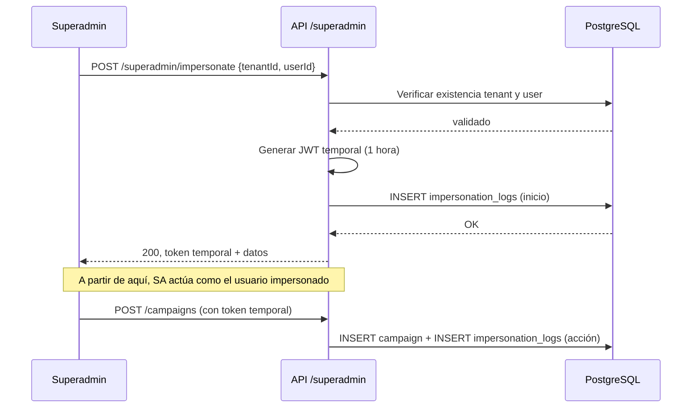
```mermaid
sequenceDiagram
    participant SA as Superadmin
    participant API as API /superadmin
    participant BD as PostgreSQL
    SA->>API: POST /superadmin/impersonate {tenantId, userId}
    API->>BD: Verificar existencia tenant y user
    BD-->>API: validado
    API->>API: Generar JWT temporal (1 hora)
    API->>BD: INSERT impersonation_logs (inicio)
    BD-->>API: OK
    API-->>SA: 200, token temporal + datos
    Note over SA,API: A partir de aquí, SA actúa como el usuario impersonado
    SA->>API: POST /campaigns (con token temporal)
    API->>BD: INSERT campaign + INSERT impersonation_logs (acción)
```

---

## Caso de Uso 18: Finalización de impersonalización

| Campo                   | Detalle                                                                                                                                                                                                                                                                                                                                                                                                                   |
| :---------------------- | :------------------------------------------------------------------------------------------------------------------------------------------------------------------------------------------------------------------------------------------------------------------------------------------------------------------------------------------------------------------------------------------------------------------------ |
| **Nombre**              | Finalización de impersonalización                                                                                                                                                                                                                                                                                                                                                                                         |
| **Actor Principal**     | Superadmin (en modo impersonación)                                                                                                                                                                                                                                                                                                                                                                                        |
| **Precondiciones**      | El superadmin tiene un token de impersonalización activo.                                                                                                                                                                                                                                                                                                                                                                 |
| **Flujo Principal**     | 1. El superadmin envía `DELETE /api/v1/superadmin/impersonate` (sin cuerpo). 2. El sistema invalida el token de impersonación (lo elimina de la sesión o lo marca como expirado). 3. Restaura el token JWT original del superadmin (o emite uno nuevo). 4. Registra un evento de fin en `impersonation_logs` con `action='impersonation_end'`. 5. Responde `200` con el nuevo token de sesión del superadmin. |
| **Flujos Alternativos** | **A1: Superadmin no impersonando.** Si el usuario no tiene un token de impersonación activo, responde `400`.                                                                                                                                                                                                                                                                                                              |
| **Postcondiciones**     | Superadmin vuelve a su sesión original. La impersonalización queda registrada en logs.                                                                                                                                                                                                                                                                                                                                    |
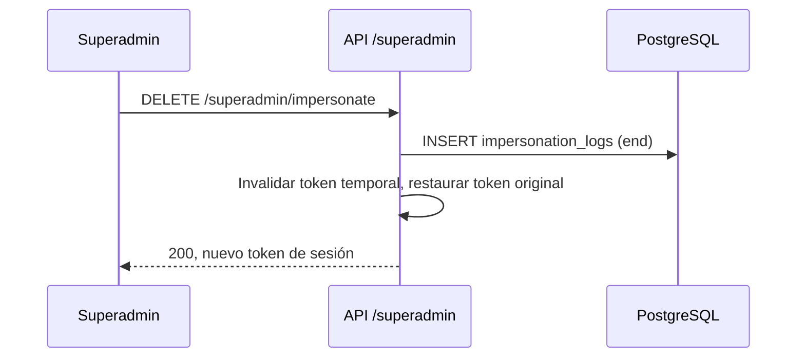
```mermaid
sequenceDiagram
    participant SA as Superadmin
    participant API as API /superadmin
    participant BD as PostgreSQL
    SA->>API: DELETE /superadmin/impersonate
    API->>BD: INSERT impersonation_logs (end)
    API->>API: Invalidar token temporal, restaurar token original
    API-->>SA: 200, nuevo token de sesión
```

---

## Caso de Uso 19: Firma digital de propuesta comercial

| Campo                   | Detalle                                                                                                                                                                                                                                                                                                                                                                                                                                                                |
| :---------------------- | :--------------------------------------------------------------------------------------------------------------------------------------------------------------------------------------------------------------------------------------------------------------------------------------------------------------------------------------------------------------------------------------------------------------------------------------------------------------------- |
| **Nombre**              | Firma digital de propuesta comercial                                                                                                                                                                                                                                                                                                                                                                                                                                   |
| **Actor Principal**     | Administrador de tenant                                                                                                                                                                                                                                                                                                                                                                                                                                                |
| **Precondiciones**      | Propuesta en estado `draft` o `reviewing`, perteneciente al tenant.                                                                                                                                                                                                                                                                                                                                                                                                    |
| **Flujo Principal**     | 1. El admin revisa la propuesta (`GET /proposals/:id`) y decide firmarla. 2. Envía `POST /api/v1/proposals/:id/sign`. 3. El sistema calcula el hash SHA-256 sobre el contenido de `proposals.content` (JSON serializado) más `proposal_id`. 4. Almacena `signature_hash`, `signed_by` (userId), `signed_at` (now), y cambia `status='accepted'`. 5. Inserta un evento `ProposalSigned` en el outbox. 6. Responde con los datos de la propuesta firmada. |
| **Flujos Alternativos** | **A1: Propuesta ya firmada.** Si `status='accepted'`, responde `409`. **A2: Admin rechaza propuesta.** Envía `POST /proposals/:id/reject` → `status='rejected'`.                                                                                                                                                                                                                                                                                                    |
| **Postcondiciones**     | Propuesta firmada y congelada. Se puede usar como documento legal.                                                                                                                                                                                                                                                                                                                                                                                                     |
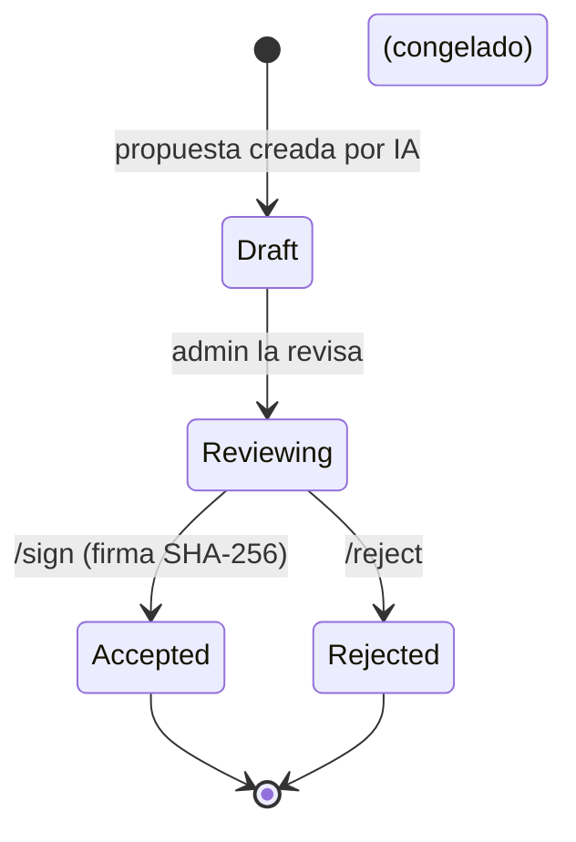
```mermaid
stateDiagram-v2
    [*] --> Draft: propuesta creada por IA
    Draft --> Reviewing: admin la revisa
    Reviewing --> Accepted: /sign (firma SHA-256)
    Reviewing --> Rejected: /reject
    Accepted --> [*] (congelado)
    Rejected --> [*]
```

---

## Caso de Uso 20: Solicitud de reporte generado por IA

| Campo                   | Detalle                                                                                                                                                                                                                                                                                                                                                                                                                                                                                                                                                             |
| :---------------------- | :------------------------------------------------------------------------------------------------------------------------------------------------------------------------------------------------------------------------------------------------------------------------------------------------------------------------------------------------------------------------------------------------------------------------------------------------------------------------------------------------------------------------------------------------------------------ |
| **Nombre**              | Solicitud de reporte generado por IA                                                                                                                                                                                                                                                                                                                                                                                                                                                                                                                                |
| **Actor Principal**     | Administrador de tenant                                                                                                                                                                                                                                                                                                                                                                                                                                                                                                                                             |
| **Precondiciones**      | Existen datos en el tenant (campañas, leads, contenido).                                                                                                                                                                                                                                                                                                                                                                                                                                                                                                            |
| **Flujo Principal**     | 1. El admin envía `POST /api/v1/reports` con `type` (ej. `'campaign_performance'`, `'lead_analytics'`) y `config` (filtros, fechas). 2. El sistema crea un reporte en `reports` con `status='draft'` y encola el comando `GenerateReportCommand` en el outbox. 3. Un worker IA procesa el comando: consulta datos agregados de campañas, leads, contenidos y genera un JSON con análisis y recomendaciones. 4. Actualiza `reports.data` y cambia `status='completed'`. 5. El admin puede consultar `GET /reports/:id` para obtener los datos generados. |
| **Flujos Alternativos** | **A1: Generación falla.** El worker registra `status='failed'`. Se reintenta hasta 3 veces. **A2: Tipo de reporte no soportado.** Si `type` no está en la lista de reportes disponibles, responde `400`.                                                                                                                                                                                                                                                                                                                                                         |
| **Postcondiciones**     | Reporte generado y disponible para consulta.                                                                                                                                                                                                                                                                                                                                                                                                                                                                                                                        |
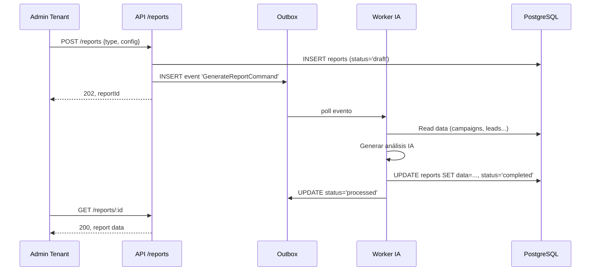
```mermaid
sequenceDiagram
    participant Admin as Admin Tenant
    participant API as API /reports
    participant Outbox as Outbox
    participant Worker as Worker IA
    participant BD as PostgreSQL
    Admin->>API: POST /reports {type, config}
    API->>BD: INSERT reports (status='draft')
    API->>Outbox: INSERT event 'GenerateReportCommand'
    API-->>Admin: 202, reportId
    Outbox->>Worker: poll evento
    Worker->>BD: Read data (campaigns, leads...)
    Worker->>Worker: Generar análisis IA
    Worker->>BD: UPDATE reports SET data=..., status='completed'
    Worker->>Outbox: UPDATE status='processed'
    Admin->>API: GET /reports/:id
    API-->>Admin: 200, report data
```

---

## Caso de Uso 21: Listado de logs de auditoría (superadmin)

| Campo                   | Detalle                                                                                                                                                                                                                                                                                          |
| :---------------------- | :----------------------------------------------------------------------------------------------------------------------------------------------------------------------------------------------------------------------------------------------------------------------------------------------- |
| **Nombre**              | Listado de logs de auditoría                                                                                                                                                                                                                                                                     |
| **Actor Principal**     | Superadmin                                                                                                                                                                                                                                                                                       |
| **Precondiciones**      | Superadmin autenticado.                                                                                                                                                                                                                                                                          |
| **Flujo Principal**     | 1. El superadmin envía `GET /api/v1/audit-logs` con filtros opcionales (query params: `tenantId`, `action`, `from`, `to`, `page`, `limit`). 2. El sistema consulta la tabla `audit_logs` aplicando filtros y paginación. 3. Responde con `data` (array de logs), `total`, `page`, `limit`. |
| **Flujos Alternativos** | **A1: Sin resultados.** Devuelve `data` vacío.                                                                                                                                                                                                                                                   |
| **Postcondiciones**     | El superadmin visualiza los logs de auditoría.                                                                                                                                                                                                                                                   |
```mermaid
sequenceDiagram
    participant SA as Superadmin
    participant API as API /audit-logs
    participant BD as PostgreSQL
    SA->>API: GET /audit-logs?tenantId=...&page=1&limit=50
    API->>BD: SELECT * FROM audit_logs WHERE tenant_id=? ORDER BY created_at DESC
    BD-->>API: data + count
    API-->>SA: 200, {data, total, page, limit}
```

---

## Caso de Uso 22: Invalidación de sesiones de un usuario (superadmin)

| Campo                   | Detalle                                                                                                                                                                                                                                     |
| :---------------------- | :------------------------------------------------------------------------------------------------------------------------------------------------------------------------------------------------------------------------------------------ |
| **Nombre**              | Invalidación de sesiones de un usuario                                                                                                                                                                                                      |
| **Actor Principal**     | Superadmin                                                                                                                                                                                                                                  |
| **Precondiciones**      | Superadmin autenticado. El usuario objetivo existe.                                                                                                                                                                                         |
| **Flujo Principal**     | 1. El superadmin envía `POST /api/v1/admin/sessions/invalidate` con `userId`. 2. El sistema elimina todas las filas de `sessions` donde `user_id = userId`. 3. Responde `200` con `invalidatedCount` (número de sesiones eliminadas). |
| **Flujos Alternativos** | **A1: Usuario no existe.** Responde `404`. **A2: Intento de invalidar sesiones del último superadmin.** Se valida que no sea el último superadmin, en cuyo caso se bloquea con `409`.                                                    |
| **Postcondiciones**     | El usuario objetivo es forzado a iniciar sesión nuevamente.                                                                                                                                                                                 |
```mermaid
sequenceDiagram
    participant SA as Superadmin
    participant API as API /admin/sessions
    participant BD as PostgreSQL
    SA->>API: POST /admin/sessions/invalidate {userId}
    API->>BD: DELETE FROM sessions WHERE user_id=?
    BD-->>API: rows deleted
    API-->>SA: 200, {invalidatedCount: N}
```

---

## Caso de Uso 23: Bloqueo de cuenta por intentos fallidos (automático)

| Campo                   | Detalle                                                                                                                                                                                                                                                                                                                                                                                                                                          |
| :---------------------- | :----------------------------------------------------------------------------------------------------------------------------------------------------------------------------------------------------------------------------------------------------------------------------------------------------------------------------------------------------------------------------------------------------------------------------------------------- |
| **Nombre**              | Bloqueo de cuenta por intentos fallidos                                                                                                                                                                                                                                                                                                                                                                                                          |
| **Actor Principal**     | Sistema (automático)                                                                                                                                                                                                                                                                                                                                                                                                                             |
| **Precondiciones**      | Un usuario ha realizado 5 intentos fallidos de login consecutivos.                                                                                                                                                                                                                                                                                                                                                                               |
| **Flujo Principal**     | 1. Durante el flujo de login (CU 2), tras el quinto fallo, el sistema ejecuta:    - `UPDATE users SET locked_until = NOW() + INTERVAL '15 minutes', login_attempts = 0 WHERE id = userId`.    - `INSERT INTO security_events (event_type='account_locked', severity='medium', user_id=?, metadata, ip_address, created_at)`. 2. El sistema responde `401` al cliente (no revela que la cuenta se bloqueó, solo credenciales inválidas). |
| **Flujos Alternativos** | No aplica (es parte de CU 2).                                                                                                                                                                                                                                                                                                                                                                                                                    |
| **Postcondiciones**     | Cuenta bloqueada por 15 minutos. Cualquier intento de login durante ese período recibe `429`.                                                                                                                                                                                                                                                                                                                                                    |
```mermaid
stateDiagram-v2
    [*] --> Active: cuenta activa
    Active --> Locked: 5 intentos fallidos consecutivos
    Locked --> Active: después de 15 minutos (automático)
    Locked --> Locked: intentos durante bloqueo → 429
```

---

## Caso de Uso 24: Detección de robo de refresh token

| Campo                   | Detalle                                                                                                                                                                                                                                                                                                                                                                                                                                                                                                                                                                                                                        |
| :---------------------- | :----------------------------------------------------------------------------------------------------------------------------------------------------------------------------------------------------------------------------------------------------------------------------------------------------------------------------------------------------------------------------------------------------------------------------------------------------------------------------------------------------------------------------------------------------------------------------------------------------------------------------- |
| **Nombre**              | Detección de robo de refresh token                                                                                                                                                                                                                                                                                                                                                                                                                                                                                                                                                                                             |
| **Actor Principal**     | Sistema                                                                                                                                                                                                                                                                                                                                                                                                                                                                                                                                                                                                                        |
| **Precondiciones**      | Un refresh token ha sido rotado (usado en `/auth/refresh`). Alguien intenta reutilizar el token antiguo.                                                                                                                                                                                                                                                                                                                                                                                                                                                                                                                       |
| **Flujo Principal**     | 1. El sistema recibe `POST /auth/refresh` con un refresh token cuyo hash ya fue eliminado de `sessions` (por rotación previa). 2. Detecta que existe un registro histórico del token (opcional: se puede mantener una tabla de tokens invalidados, o simplemente notar que el hash no existe). 3. El sistema asume robo de token. Invalida **todas** las sesiones del usuario asociado (`DELETE FROM sessions WHERE user_id = ?`). 4. Registra un `security_event` con `event_type='token_reuse'`, `severity='critical'` y los metadatos relevantes (IP, timestamp). 5. Responde `409` con `TOKEN_REUSE_DETECTED`. |
| **Flujos Alternativos** | **A1: Token simplemente expirado.** Si el token ya expiró, no se considera robo; se responde `401`.                                                                                                                                                                                                                                                                                                                                                                                                                                                                                                                            |
| **Postcondiciones**     | Todas las sesiones del usuario son eliminadas. El usuario debe iniciar sesión nuevamente. Un evento crítico queda registrado.                                                                                                                                                                                                                                                                                                                                                                                                                                                                                                  |
```mermaid
stateDiagram-v2
    [*] --> TokenValido: refresh token activo
    TokenValido --> TokenUsado: /auth/refresh exitoso (rotación)
    TokenUsado --> TokenInvalido: se elimina de sessions
    TokenUsado --> RoboDetectado: reutilización del token antiguo
    RoboDetectado --> SesionesInvalidadas: se eliminan todas las sesiones del usuario
    SesionesInvalidadas --> [*]
    TokenInvalido --> [*]
```

---

## Caso de Uso 25: Monitoreo de competencia (registro y visualización de menciones)

| Campo                   | Detalle                                                                                                                                                                                                                                                                                                                                                                                                                                                                                                                                                                                                               |
| :---------------------- | :-------------------------------------------------------------------------------------------------------------------------------------------------------------------------------------------------------------------------------------------------------------------------------------------------------------------------------------------------------------------------------------------------------------------------------------------------------------------------------------------------------------------------------------------------------------------------------------------------------------------- |
| **Nombre**              | Monitoreo de competencia                                                                                                                                                                                                                                                                                                                                                                                                                                                                                                                                                                                              |
| **Actor Principal**     | Administrador de tenant                                                                                                                                                                                                                                                                                                                                                                                                                                                                                                                                                                                               |
| **Precondiciones**      | Tenant activo.                                                                                                                                                                                                                                                                                                                                                                                                                                                                                                                                                                                                        |
| **Flujo Principal**     | 1. El admin registra un competidor mediante `POST /api/v1/competitors` con `name`, `website` (opcional), `industry` (opcional). 2. El sistema almacena el competidor en `competitors` con `created_at` y `updated_at`. 3. Periódicamente, un agente IA (worker) busca menciones del competidor en fuentes públicas (si está configurado) y las registra en `competitor_mentions` con `source`, `content`, `sentiment` (positivo, negativo, neutral). 4. El admin puede consultar las menciones de un competidor mediante `GET /api/v1/competitors/:id/mentions`, que devuelve el listado ordenado por fecha. |
| **Flujos Alternativos** | **A1: Eliminación de competidor.** El admin puede eliminar un competidor con `DELETE /competitors/:id`. Esto elimina en cascada sus menciones. **A2: Sin menciones aún.** El endpoint devuelve lista vacía.                                                                                                                                                                                                                                                                                                                                                                                                        |
| **Postcondiciones**     | Competidores registrados. Menciones disponibles (eventualmente).                                                                                                                                                                                                                                                                                                                                                                                                                                                                                                                                                      |
```mermaid
sequenceDiagram
    participant Admin as Admin Tenant
    participant API as API /competitors
    participant Worker as Worker IA
    participant BD as PostgreSQL
    Admin->>API: POST /competitors {name, website}
    API->>BD: INSERT competitors
    API-->>Admin: 201
    Note over Worker,BD: (worker programado)
    Worker->>BD: SELECT competitors
    Worker->>Worker: Buscar menciones en fuentes externas
    Worker->>BD: INSERT competitor_mentions
    Admin->>API: GET /competitors/:id/mentions
    API-->>Admin: 200, lista de menciones
```

---

## Caso de Uso 26: Generación de propuesta comercial por IA

| Campo                   | Detalle                                                                                                                                                                                                                                                                                                                                                                                                                                                                                                                                                                                                                                            |
| :---------------------- | :------------------------------------------------------------------------------------------------------------------------------------------------------------------------------------------------------------------------------------------------------------------------------------------------------------------------------------------------------------------------------------------------------------------------------------------------------------------------------------------------------------------------------------------------------------------------------------------------------------------------------------------------- |
| **Nombre**              | Generación de propuesta comercial por IA                                                                                                                                                                                                                                                                                                                                                                                                                                                                                                                                                                                                           |
| **Actor Principal**     | Administrador de tenant                                                                                                                                                                                                                                                                                                                                                                                                                                                                                                                                                                                                                            |
| **Precondiciones**      | Existe una campaña activa o datos de perfil de empresa completados.                                                                                                                                                                                                                                                                                                                                                                                                                                                                                                                                                                                |
| **Flujo Principal**     | 1. El admin solicita una propuesta comercial enviando `POST /api/v1/proposals` con `campaign_id` (opcional) y `title`. 2. El sistema crea la propuesta en `proposals` con `status='draft'` y encola un comando `GenerateProposalCommand` en el outbox. 3. Un worker IA procesa el comando: utiliza los datos de la campaña (si se proporciona) y el perfil de empresa para generar contenido de propuesta (objetivos, estrategia, presupuesto, cronograma, etc.). 4. Almacena el contenido generado en `proposals.content` y cambia `status='draft'` (listo para revisión). 5. El admin puede revisar la propuesta y firmarla (CU 19). |
| **Flujos Alternativos** | **A1: Generación falla.** Worker registra error, propuesta queda en `status='draft'` sin contenido. Se reintenta. **A2: Admin rechaza antes de firmar.** Puede eliminar la propuesta (`DELETE /proposals/:id?` no listado, pero se asume posible).                                                                                                                                                                                                                                                                                                                                                                                              |
| **Postcondiciones**     | Propuesta generada por IA, lista para revisión y firma.                                                                                                                                                                                                                                                                                                                                                                                                                                                                                                                                                                                            |
```mermaid
sequenceDiagram
    participant Admin as Admin Tenant
    participant API as API /proposals
    participant Outbox as Outbox
    participant Worker as Worker IA
    participant BD as PostgreSQL
    Admin->>API: POST /proposals {campaign_id, title}
    API->>BD: INSERT proposals (status='draft')
    API->>Outbox: INSERT event 'GenerateProposalCommand'
    API-->>Admin: 202, proposalId
    Outbox->>Worker: poll evento
    Worker->>BD: Read campaign, company_profile
    Worker->>Worker: Generar contenido propuesta
    Worker->>BD: UPDATE proposals SET content=...
    Worker->>Outbox: UPDATE status='processed'
    Admin->>API: GET /proposals/:id
    API-->>Admin: 200, contenido listo para revisar
```

---

## Matriz de trazabilidad

| Origen (capacidad/UAT/actor/API)                              | CU # | Actor Principal          | Estado   |
| :------------------------------------------------------------ | :--- | :----------------------- | :------- |
| §1 – Bootstrap del sistema (setup)                            | 1    | Superadmin               | Cubierto |
| §1 – Autenticación (login)                                    | 2    | Administrador/Superadmin | Cubierto |
| §1 – Renovación de token / §5.5 (robo)                        | 3    | Administrador/Superadmin | Cubierto |
| §1 – Cierre de sesión                                         | 4    | Administrador/Superadmin | Cubierto |
| §1 – Gestión multi-tenant (creación de tenant)                | 5    | Superadmin               | Cubierto |
| §1 – Dominio personalizado / UAT implícito                    | 6    | Administrador de tenant  | Cubierto |
| §1 – Onboarding progresivo / UAT 4                            | 7    | Administrador de tenant  | Cubierto |
| §1 – Creación de campaña multicanal / UAT 1                   | 8    | Administrador de tenant  | Cubierto |
| §1 – Aprobación de contenido (Kill Switch) / UAT 2            | 9    | Administrador de tenant  | Cubierto |
| §1 – Calendario Editorial / UAT 2                             | 10   | Administrador de tenant  | Cubierto |
| §1 – Versionado inmutable y reversión / UAT 6                 | 11   | Administrador de tenant  | Cubierto |
| §1 – Librería de activos (subida)                             | 12   | Administrador de tenant  | Cubierto |
| §1 – Librería de activos (eliminación con protección) / UAT 7 | 13   | Administrador de tenant  | Cubierto |
| §1 – Formularios embebidos                                    | 14   | Administrador de tenant  | Cubierto |
| §1 – CRM captura lead / UAT 3                                 | 15   | Visitante (externo)      | Cubierto |
| §1 – CRM pipeline (cambio de etapa)                           | 16   | Administrador de tenant  | Cubierto |
| §1 – Impersonalización de superadmin / UAT 5                  | 17   | Superadmin               | Cubierto |
| §1 – Finalización de impersonalización                        | 18   | Superadmin               | Cubierto |
| §1 – Propuestas comerciales (firma)                           | 19   | Administrador de tenant  | Cubierto |
| §1 – Informes (reportes IA)                                   | 20   | Administrador de tenant  | Cubierto |
| §1 – Logs de auditoría (superadmin)                           | 21   | Superadmin               | Cubierto |
| §1 – Invalidación de sesiones (superadmin)                    | 22   | Superadmin               | Cubierto |
| §5 – Bloqueo por intentos fallidos / UAT 8                    | 23   | Sistema (automático)     | Cubierto |
| §5 – Detección de robo de refresh token / UAT 9               | 24   | Sistema                  | Cubierto |
| §1 – Monitoreo de competencia                                 | 25   | Administrador de tenant  | Cubierto |
| §1 – Propuestas comerciales (generación IA)                   | 26   | Administrador de tenant  | Cubierto |
---

## Registro de cambios del documento

| Versión | Fecha     | Descripción del cambio                                                                                                                            |
| :------ | :-------- | :------------------------------------------------------------------------------------------------------------------------------------------------ |
| 1.0     | Mayo 2026 | Creación inicial del documento de Casos de Uso para AgenteIA, cubriendo todas las capacidades MVP, actores, criterios UAT y dominios API del MDD. |