# Modelo de datos

>
> **Corrección aplicada:** El orden de creación de tablas y las FK circulares se han resuelto con `ALTER TABLE ADD CONSTRAINT` para garantizar DDL ejecutable sin dependencias circulares.

### 3.1 Esquema PostgreSQL

```sql
-- ============================================================
-- Tablas raíz (sin dependencias externas)
-- ============================================================
CREATE TABLE tenants (
  id UUID PRIMARY KEY DEFAULT gen_random_uuid(),
  name VARCHAR(255) NOT NULL,
  slug VARCHAR(100) UNIQUE NOT NULL,
  plan VARCHAR(50) NOT NULL DEFAULT 'starter',
  status VARCHAR(50) NOT NULL DEFAULT 'active',
  settings JSONB NOT NULL DEFAULT '{}',
  max_users INTEGER NOT NULL DEFAULT 5,
  max_assets_size BIGINT NOT NULL DEFAULT 1073741824,
  created_at TIMESTAMPTZ NOT NULL DEFAULT NOW(),
  updated_at TIMESTAMPTZ NOT NULL DEFAULT NOW()
);
CREATE TABLE users (
  id UUID PRIMARY KEY DEFAULT gen_random_uuid(),
  tenant_id UUID REFERENCES tenants(id) ON DELETE CASCADE,
  email VARCHAR(255) UNIQUE NOT NULL,
  password_hash VARCHAR(255) NOT NULL,
  name VARCHAR(255) NOT NULL,
  is_superadmin BOOLEAN NOT NULL DEFAULT FALSE,
  role VARCHAR(50) NOT NULL DEFAULT 'owner',
  status VARCHAR(50) NOT NULL DEFAULT 'active',
  last_login_at TIMESTAMPTZ,
  login_attempts INTEGER NOT NULL DEFAULT 0,
  locked_until TIMESTAMPTZ,
  created_at TIMESTAMPTZ NOT NULL DEFAULT NOW(),
  updated_at TIMESTAMPTZ NOT NULL DEFAULT NOW(),
  CONSTRAINT chk_superadmin_tenant CHECK (
    (is_superadmin = TRUE AND tenant_id IS NULL)
  OR (is_superadmin = FALSE AND tenant_id IS NOT NULL)
  )
);
CREATE TABLE sessions (
  id UUID PRIMARY KEY DEFAULT gen_random_uuid(),
  user_id UUID NOT NULL REFERENCES users(id) ON DELETE CASCADE,
  refresh_token_hash VARCHAR(255) NOT NULL,
  expires_at TIMESTAMPTZ NOT NULL,
  created_at TIMESTAMPTZ NOT NULL DEFAULT NOW()
);
-- ============================================================
-- Perfil de empresa (onboarding progresivo)
-- ============================================================
CREATE TABLE company_profiles (
  id UUID PRIMARY KEY DEFAULT gen_random_uuid(),
  tenant_id UUID NOT NULL REFERENCES tenants(id) ON DELETE CASCADE,
  company_name VARCHAR(255),
  industry VARCHAR(255),
  website VARCHAR(500),
  brand_voice TEXT,
  target_audience_desc TEXT,
  competitors TEXT,
  objectives JSONB DEFAULT '[]',
  visual_preferences JSONB DEFAULT '{}',
  completion_percentage INTEGER NOT NULL DEFAULT 0,
  status VARCHAR(50) NOT NULL DEFAULT 'pending',
  created_at TIMESTAMPTZ NOT NULL DEFAULT NOW(),
  updated_at TIMESTAMPTZ NOT NULL DEFAULT NOW(),
  CONSTRAINT chk_completion CHECK (completion_percentage BETWEEN 0 AND 100)
);
CREATE TABLE company_profile_sections (
  id UUID PRIMARY KEY DEFAULT gen_random_uuid(),
  profile_id UUID NOT NULL REFERENCES company_profiles(id) ON DELETE CASCADE,
  section_key VARCHAR(100) NOT NULL,
  data JSONB NOT NULL DEFAULT '{}',
  is_completed BOOLEAN NOT NULL DEFAULT FALSE,
  created_at TIMESTAMPTZ NOT NULL DEFAULT NOW(),
  updated_at TIMESTAMPTZ NOT NULL DEFAULT NOW()
);
-- ============================================================
-- Campañas y plantillas
-- ============================================================
CREATE TABLE campaign_templates (
  id UUID PRIMARY KEY DEFAULT gen_random_uuid(),
  tenant_id UUID REFERENCES tenants(id) ON DELETE CASCADE,
  name VARCHAR(255) NOT NULL,
  description TEXT,
  objective VARCHAR(255),
  platforms JSONB NOT NULL DEFAULT '[]',
  budget_distribution JSONB NOT NULL DEFAULT '{}',
  agent_config JSONB NOT NULL DEFAULT '{}',
  is_predefined BOOLEAN NOT NULL DEFAULT FALSE,
  created_at TIMESTAMPTZ NOT NULL DEFAULT NOW(),
  updated_at TIMESTAMPTZ NOT NULL DEFAULT NOW()
);
CREATE TABLE campaigns (
  id UUID PRIMARY KEY DEFAULT gen_random_uuid(),
  tenant_id UUID NOT NULL REFERENCES tenants(id) ON DELETE CASCADE,
  template_id UUID REFERENCES campaign_templates(id) ON DELETE SET NULL,
  name VARCHAR(255) NOT NULL,
  objective VARCHAR(500),
  status VARCHAR(50) NOT NULL DEFAULT 'draft',
  total_budget DECIMAL(12,2),
  platforms JSONB NOT NULL DEFAULT '[]',
  strategy JSONB DEFAULT '{}',
  created_at TIMESTAMPTZ NOT NULL DEFAULT NOW(),
  updated_at TIMESTAMPTZ NOT NULL DEFAULT NOW()
);
CREATE TABLE budgets (
  id UUID PRIMARY KEY DEFAULT gen_random_uuid(),
  campaign_id UUID NOT NULL REFERENCES campaigns(id) ON DELETE CASCADE,
  platform VARCHAR(100) NOT NULL,
  daily_budget DECIMAL(10,2) NOT NULL,
  total_budget DECIMAL(12,2) NOT NULL,
  proposed_by_ai BOOLEAN NOT NULL DEFAULT FALSE,
  approved BOOLEAN NOT NULL DEFAULT FALSE,
  created_at TIMESTAMPTZ NOT NULL DEFAULT NOW(),
  updated_at TIMESTAMPTZ NOT NULL DEFAULT NOW()
);
CREATE TABLE audiences (
  id UUID PRIMARY KEY DEFAULT gen_random_uuid(),
  tenant_id UUID NOT NULL REFERENCES tenants(id) ON DELETE CASCADE,
  name VARCHAR(255) NOT NULL,
  description TEXT,
  criteria JSONB NOT NULL DEFAULT '{}',
  is_active BOOLEAN NOT NULL DEFAULT TRUE,
  is_immutable BOOLEAN NOT NULL DEFAULT FALSE,
  created_at TIMESTAMPTZ NOT NULL DEFAULT NOW(),
  updated_at TIMESTAMPTZ NOT NULL DEFAULT NOW()
);
-- ============================================================
-- Contenido y versionado (FK circular resuelta con ALTER TABLE)
-- NOTA: contents se crea SIN current_version_id, luego se añade
-- ============================================================
CREATE TABLE contents (
  id UUID PRIMARY KEY DEFAULT gen_random_uuid(),
  tenant_id UUID NOT NULL REFERENCES tenants(id) ON DELETE CASCADE,
  campaign_id UUID REFERENCES campaigns(id) ON DELETE SET NULL,
  title VARCHAR(500) NOT NULL,
  type VARCHAR(50) NOT NULL,
  status VARCHAR(50) NOT NULL DEFAULT 'draft',
  created_at TIMESTAMPTZ NOT NULL DEFAULT NOW(),
  updated_at TIMESTAMPTZ NOT NULL DEFAULT NOW()
);
CREATE TABLE content_versions (
  id UUID PRIMARY KEY DEFAULT gen_random_uuid(),
  content_id UUID NOT NULL REFERENCES contents(id) ON DELETE CASCADE,
  version_number INTEGER NOT NULL,
  author_id UUID NOT NULL REFERENCES users(id),
  title VARCHAR(500) NOT NULL,
  body TEXT NOT NULL,
  assets JSONB NOT NULL DEFAULT '[]',
  reason VARCHAR(500),
  change_summary TEXT,
  signature_hash VARCHAR(128),
  signed_at TIMESTAMPTZ,
  created_at TIMESTAMPTZ NOT NULL DEFAULT NOW(),
  UNIQUE(content_id, version_number)
);
-- FK circular: contents.current_version_id -> content_versions
  ALTER TABLE contents ADD COLUMN current_version_id UUID REFERENCES content_versions(id) ON DELETE SET NULL;
CREATE TABLE content_approvals (
  id UUID PRIMARY KEY DEFAULT gen_random_uuid(),
  content_version_id UUID NOT NULL REFERENCES content_versions(id) ON DELETE CASCADE,
  approved_by UUID NOT NULL REFERENCES users(id),
  signature_hash VARCHAR(128) NOT NULL,
  status VARCHAR(50) NOT NULL,
  feedback TEXT,
  created_at TIMESTAMPTZ NOT NULL DEFAULT NOW()
);
-- ============================================================
-- Anuncios y posts
-- ============================================================
CREATE TABLE ads (
  id UUID PRIMARY KEY DEFAULT gen_random_uuid(),
  tenant_id UUID NOT NULL REFERENCES tenants(id) ON DELETE CASCADE,
  campaign_id UUID NOT NULL REFERENCES campaigns(id) ON DELETE CASCADE,
  content_version_id UUID NOT NULL REFERENCES content_versions(id),
  platform VARCHAR(100) NOT NULL,
  status VARCHAR(50) NOT NULL DEFAULT 'draft',
  budget_id UUID REFERENCES budgets(id),
  created_at TIMESTAMPTZ NOT NULL DEFAULT NOW(),
  updated_at TIMESTAMPTZ NOT NULL DEFAULT NOW()
);
CREATE TABLE posts (
  id UUID PRIMARY KEY DEFAULT gen_random_uuid(),
  tenant_id UUID NOT NULL REFERENCES tenants(id) ON DELETE CASCADE,
  campaign_id UUID NOT NULL REFERENCES campaigns(id) ON DELETE CASCADE,
  content_version_id UUID NOT NULL REFERENCES content_versions(id),
  platform VARCHAR(100) NOT NULL,
  status VARCHAR(50) NOT NULL DEFAULT 'draft',
  created_at TIMESTAMPTZ NOT NULL DEFAULT NOW(),
  updated_at TIMESTAMPTZ NOT NULL DEFAULT NOW()
);
-- ============================================================
-- CRM: Formularios, leads, interacciones
-- ============================================================
CREATE TABLE forms (
  id UUID PRIMARY KEY DEFAULT gen_random_uuid(),
  tenant_id UUID NOT NULL REFERENCES tenants(id) ON DELETE CASCADE,
  name VARCHAR(255) NOT NULL,
  fields JSONB NOT NULL DEFAULT '[]',
  style JSONB DEFAULT '{}',
  snippet_js TEXT,
  is_active BOOLEAN NOT NULL DEFAULT TRUE,
  created_at TIMESTAMPTZ NOT NULL DEFAULT NOW(),
  updated_at TIMESTAMPTZ NOT NULL DEFAULT NOW()
);
CREATE TABLE form_submissions (
  id UUID PRIMARY KEY DEFAULT gen_random_uuid(),
  form_id UUID NOT NULL REFERENCES forms(id) ON DELETE CASCADE,
  lead_id UUID REFERENCES leads(id) ON DELETE SET NULL,
  data JSONB NOT NULL DEFAULT '{}',
  created_at TIMESTAMPTZ NOT NULL DEFAULT NOW()
);
CREATE TABLE leads (
  id UUID PRIMARY KEY DEFAULT gen_random_uuid(),
  tenant_id UUID NOT NULL REFERENCES tenants(id) ON DELETE CASCADE,
  form_submission_id UUID REFERENCES form_submissions(id) ON DELETE SET NULL,
  email VARCHAR(255) NOT NULL,
  name VARCHAR(255),
  phone VARCHAR(50),
  company VARCHAR(255),
  score INTEGER NOT NULL DEFAULT 0,
  stage VARCHAR(50) NOT NULL DEFAULT 'prospect',
  metadata JSONB DEFAULT '{}',
  created_at TIMESTAMPTZ NOT NULL DEFAULT NOW(),
  updated_at TIMESTAMPTZ NOT NULL DEFAULT NOW()
);
-- FK añadida después de crear leads
  ALTER TABLE form_submissions ADD CONSTRAINT fk_form_submissions_lead
  FOREIGN KEY (lead_id) REFERENCES leads(id) ON DELETE SET NULL;
CREATE TABLE lead_interactions (
  id UUID PRIMARY KEY DEFAULT gen_random_uuid(),
  lead_id UUID NOT NULL REFERENCES leads(id) ON DELETE CASCADE,
  type VARCHAR(100) NOT NULL,
  description TEXT,
  metadata JSONB DEFAULT '{}',
  created_at TIMESTAMPTZ NOT NULL DEFAULT NOW()
);
-- ============================================================
-- Librería de activos multimedia
-- ============================================================
CREATE TABLE asset_folders (
  id UUID PRIMARY KEY DEFAULT gen_random_uuid(),
  tenant_id UUID NOT NULL REFERENCES tenants(id) ON DELETE CASCADE,
  parent_id UUID REFERENCES asset_folders(id) ON DELETE CASCADE,
  name VARCHAR(255) NOT NULL,
  created_at TIMESTAMPTZ NOT NULL DEFAULT NOW(),
  updated_at TIMESTAMPTZ NOT NULL DEFAULT NOW()
);
CREATE TABLE asset_tags (
  id UUID PRIMARY KEY DEFAULT gen_random_uuid(),
  tenant_id UUID NOT NULL REFERENCES tenants(id) ON DELETE CASCADE,
  name VARCHAR(100) NOT NULL,
  created_at TIMESTAMPTZ NOT NULL DEFAULT NOW()
);
CREATE TABLE assets (
  id UUID PRIMARY KEY DEFAULT gen_random_uuid(),
  tenant_id UUID NOT NULL REFERENCES tenants(id) ON DELETE CASCADE,
  folder_id UUID REFERENCES asset_folders(id) ON DELETE SET NULL,
  name VARCHAR(255) NOT NULL,
  type VARCHAR(50) NOT NULL,
  mime_type VARCHAR(100),
  file_key VARCHAR(500) NOT NULL,
  file_size BIGINT NOT NULL,
  url VARCHAR(1000),
  metadata JSONB DEFAULT '{}',
  reference_count INTEGER NOT NULL DEFAULT 0,
  is_in_use BOOLEAN NOT NULL DEFAULT FALSE,
  created_at TIMESTAMPTZ NOT NULL DEFAULT NOW(),
  updated_at TIMESTAMPTZ NOT NULL DEFAULT NOW()
);
CREATE TABLE asset_tag_assignments (
  asset_id UUID NOT NULL REFERENCES assets(id) ON DELETE CASCADE,
  tag_id UUID NOT NULL REFERENCES asset_tags(id) ON DELETE CASCADE,
  PRIMARY KEY (asset_id, tag_id)
);
-- ============================================================
-- Competidores y menciones
-- ============================================================
CREATE TABLE competitors (
  id UUID PRIMARY KEY DEFAULT gen_random_uuid(),
  tenant_id UUID NOT NULL REFERENCES tenants(id) ON DELETE CASCADE,
  name VARCHAR(255) NOT NULL,
  website VARCHAR(500),
  industry VARCHAR(255),
  created_at TIMESTAMPTZ NOT NULL DEFAULT NOW(),
  updated_at TIMESTAMPTZ NOT NULL DEFAULT NOW()
);
CREATE TABLE competitor_mentions (
  id UUID PRIMARY KEY DEFAULT gen_random_uuid(),
  competitor_id UUID NOT NULL REFERENCES competitors(id) ON DELETE CASCADE,
  source VARCHAR(255),
  content TEXT,
  sentiment VARCHAR(50),
  mentioned_at TIMESTAMPTZ,
  created_at TIMESTAMPTZ NOT NULL DEFAULT NOW()
);
-- ============================================================
-- Agentes IA y asignaciones
-- ============================================================
CREATE TABLE ai_agents (
  id UUID PRIMARY KEY DEFAULT gen_random_uuid(),
  tenant_id UUID REFERENCES tenants(id) ON DELETE CASCADE,
  name VARCHAR(255) NOT NULL,
  role VARCHAR(100) NOT NULL,
  status VARCHAR(50) NOT NULL DEFAULT 'active',
  model_config JSONB NOT NULL DEFAULT '{}',
  created_at TIMESTAMPTZ NOT NULL DEFAULT NOW(),
  updated_at TIMESTAMPTZ NOT NULL DEFAULT NOW()
);
CREATE TABLE agent_assignments (
  id UUID PRIMARY KEY DEFAULT gen_random_uuid(),
  agent_id UUID NOT NULL REFERENCES ai_agents(id) ON DELETE CASCADE,
  campaign_id UUID REFERENCES campaigns(id) ON DELETE SET NULL,
  task_type VARCHAR(100) NOT NULL,
  status VARCHAR(50) NOT NULL DEFAULT 'pending',
  result JSONB DEFAULT '{}',
  created_at TIMESTAMPTZ NOT NULL DEFAULT NOW(),
  updated_at TIMESTAMPTZ NOT NULL DEFAULT NOW()
);
-- ============================================================
-- Propuestas comerciales
-- ============================================================
CREATE TABLE proposals (
  id UUID PRIMARY KEY DEFAULT gen_random_uuid(),
  tenant_id UUID NOT NULL REFERENCES tenants(id) ON DELETE CASCADE,
  campaign_id UUID REFERENCES campaigns(id) ON DELETE SET NULL,
  title VARCHAR(500) NOT NULL,
  content JSONB NOT NULL DEFAULT '{}',
  status VARCHAR(50) NOT NULL DEFAULT 'draft',
  signature_hash VARCHAR(128),
  signed_by UUID REFERENCES users(id),
  signed_at TIMESTAMPTZ,
  created_at TIMESTAMPTZ NOT NULL DEFAULT NOW(),
  updated_at TIMESTAMPTZ NOT NULL DEFAULT NOW()
);
-- ============================================================
-- Reportes
-- ============================================================
CREATE TABLE reports (
  id UUID PRIMARY KEY DEFAULT gen_random_uuid(),
  tenant_id UUID NOT NULL REFERENCES tenants(id) ON DELETE CASCADE,
  type VARCHAR(100) NOT NULL,
  config JSONB DEFAULT '{}',
  data JSONB DEFAULT '{}',
  generated_by UUID REFERENCES ai_agents(id),
  status VARCHAR(50) NOT NULL DEFAULT 'draft',
  created_at TIMESTAMPTZ NOT NULL DEFAULT NOW(),
  updated_at TIMESTAMPTZ NOT NULL DEFAULT NOW()
);
-- ============================================================
-- Dominios personalizados (whitelabel)
-- ============================================================
CREATE TABLE custom_domains (
  id UUID PRIMARY KEY DEFAULT gen_random_uuid(),
  tenant_id UUID NOT NULL REFERENCES tenants(id) ON DELETE CASCADE,
  domain VARCHAR(255) UNIQUE NOT NULL,
  cname_value VARCHAR(500),
  verification_token VARCHAR(255),
  verification_status VARCHAR(50) NOT NULL DEFAULT 'pending',
  ssl_status VARCHAR(50) NOT NULL DEFAULT 'pending',
  is_active BOOLEAN NOT NULL DEFAULT FALSE,
  created_at TIMESTAMPTZ NOT NULL DEFAULT NOW(),
  updated_at TIMESTAMPTZ NOT NULL DEFAULT NOW()
);
CREATE TABLE dns_verifications (
  id UUID PRIMARY KEY DEFAULT gen_random_uuid(),
  domain_id UUID NOT NULL REFERENCES custom_domains(id) ON DELETE CASCADE,
  verification_type VARCHAR(50) NOT NULL DEFAULT 'cname',
  token VARCHAR(255) NOT NULL,
  status VARCHAR(50) NOT NULL DEFAULT 'pending',
  verified_at TIMESTAMPTZ,
  created_at TIMESTAMPTZ NOT NULL DEFAULT NOW()
);
CREATE TABLE local_pages (
  id UUID PRIMARY KEY DEFAULT gen_random_uuid(),
  tenant_id UUID NOT NULL REFERENCES tenants(id) ON DELETE CASCADE,
  city VARCHAR(255) NOT NULL,
  slug VARCHAR(255) NOT NULL,
  title VARCHAR(500) NOT NULL,
  content JSONB DEFAULT '{}',
  seo_data JSONB DEFAULT '{}',
  is_active BOOLEAN NOT NULL DEFAULT TRUE,
  created_at TIMESTAMPTZ NOT NULL DEFAULT NOW(),
  updated_at TIMESTAMPTZ NOT NULL DEFAULT NOW(),
  UNIQUE(tenant_id, slug)
);
-- ============================================================
-- Auditoría, seguridad y eventos
-- ============================================================
CREATE TABLE impersonation_logs (
  id UUID PRIMARY KEY DEFAULT gen_random_uuid(),
  superadmin_id UUID NOT NULL REFERENCES users(id),
  tenant_id UUID NOT NULL REFERENCES tenants(id),
  action VARCHAR(255) NOT NULL,
  metadata JSONB DEFAULT '{}',
  created_at TIMESTAMPTZ NOT NULL DEFAULT NOW()
);
CREATE TABLE audit_logs (
  id UUID PRIMARY KEY DEFAULT gen_random_uuid(),
  tenant_id UUID REFERENCES tenants(id) ON DELETE SET NULL,
  user_id UUID REFERENCES users(id) ON DELETE SET NULL,
  action VARCHAR(255) NOT NULL,
  resource_type VARCHAR(100),
  resource_id UUID,
  details JSONB DEFAULT '{}',
  ip_address VARCHAR(45),
  created_at TIMESTAMPTZ NOT NULL DEFAULT NOW()
);
CREATE TABLE security_events (
  id UUID PRIMARY KEY DEFAULT gen_random_uuid(),
  event_type VARCHAR(100) NOT NULL,
  severity VARCHAR(20) NOT NULL DEFAULT 'medium',
  user_id UUID REFERENCES users(id) ON DELETE SET NULL,
  tenant_id UUID REFERENCES tenants(id) ON DELETE SET NULL,
  metadata JSONB DEFAULT '{}',
  ip_address VARCHAR(45),
  created_at TIMESTAMPTZ NOT NULL DEFAULT NOW()
);
-- ============================================================
-- Event Sourcing y Outbox
-- ============================================================
CREATE TABLE outbox (
  id UUID PRIMARY KEY DEFAULT gen_random_uuid(),
  aggregate_type VARCHAR(100) NOT NULL,
  aggregate_id UUID NOT NULL,
  event_type VARCHAR(255) NOT NULL,
  payload JSONB NOT NULL,
  status VARCHAR(50) NOT NULL DEFAULT 'pending',
  created_at TIMESTAMPTZ NOT NULL DEFAULT NOW(),
  processed_at TIMESTAMPTZ
);
CREATE TABLE events (
  id BIGSERIAL PRIMARY KEY,
  aggregate_type VARCHAR(100) NOT NULL,
  aggregate_id UUID NOT NULL,
  version INTEGER NOT NULL,
  event_type VARCHAR(255) NOT NULL,
  data JSONB NOT NULL,
  metadata JSONB DEFAULT '{}',
  created_at TIMESTAMPTZ NOT NULL DEFAULT NOW(),
  UNIQUE(aggregate_type, aggregate_id, version)
);
-- ============================================================
-- Índices
-- ============================================================
  CREATE INDEX idx_sessions_user_id ON sessions(user_id);
  CREATE INDEX idx_sessions_expires_at ON sessions(expires_at);
  CREATE INDEX idx_company_profile_sections_profile ON company_profile_sections(profile_id);
  CREATE INDEX idx_campaigns_tenant_status ON campaigns(tenant_id, status);
  CREATE INDEX idx_content_versions_content ON content_versions(content_id,
  version_number DESC
);
  CREATE INDEX idx_leads_tenant_stage ON leads(tenant_id, stage);
  CREATE INDEX idx_audit_logs_tenant_created ON audit_logs(tenant_id,
  created_at DESC
);
  CREATE INDEX idx_audit_logs_user ON audit_logs(user_id);
  CREATE INDEX idx_security_events_severity ON security_events(severity,
  created_at DESC
);
  CREATE INDEX idx_security_events_user ON security_events(user_id);
  CREATE INDEX idx_outbox_status ON outbox(status, created_at);
  CREATE INDEX idx_events_aggregate ON events(aggregate_type, aggregate_id, version);

```

### 3.2 TechnicalMetadata

```
---
project: AgenteIA
version: "1.0.0"
database: PostgreSQL 16
multi_tenant: true
tenant_id_column: tenant_id
soft_delete: false
audit: true (audit_logs table)
event_sourcing: true (events table, append-only)
outbox: true (outbox table)
high_security:
  - users.password_hash (Argon2id)
  - sessions.refresh_token_hash (SHA-256)
  - content_approvals.signature_hash
  - proposals.signature_hash
  - security_events
  - impersonation_logs
immutable_tables:
  - events (append-only)
  - content_versions (once created, never updated)
  - lead_interactions (append-only)
  - audit_logs (append-only)
  - security_events (append-only)
  - outbox (status transition only)
key_relationships:
  - users.tenant_id -> tenants.id (nullable for superadmin)
  - All multi-tenant tables -> tenants.id
  - contents.current_version_id -> content_versions.id (added via ALTER TABLE)
  - content_versions.content_id -> contents.id
  - security_events.user_id -> users.id
do_not_persist:
  - jwt_token (access token never stored in DB)
  - plaintext_password
  - refresh_token_plain (stored as SHA-256 hash only)
---
```

> **Nota:** El diagrama ER se genera automáticamente desde el SQL. No se incluye manualmente para evitar desviaciones.

---
```TechnicalMetadata
[high_security]
```

---
### Diagrama entidad-relación

```mermaid
erDiagram

  tenants {
    uuid id PK
    string name
    string slug
    string plan
    string status
    int max_users
    int max_assets_size
    datetime created_at
    datetime updated_at
  }
  users {
    uuid id PK
    uuid tenant_id FK
    string email
    string password_hash
    string name
    boolean is_superadmin
    string role
    string status
    datetime last_login_at
    int login_attempts
    datetime locked_until
    datetime created_at
    datetime updated_at
  }
  sessions {
    uuid id PK
    uuid user_id FK
    string refresh_token_hash
    datetime expires_at
    datetime created_at
  }
  company_profiles {
    uuid id PK
    uuid tenant_id FK
    string company_name
    string industry
    string website
    string brand_voice
    string target_audience_desc
    string competitors
    int completion_percentage
    string status
    datetime created_at
    datetime updated_at
  }
  company_profile_sections {
    uuid id PK
    uuid profile_id FK
    string section_key
    boolean is_completed
    datetime created_at
    datetime updated_at
  }
  campaign_templates {
    uuid id PK
    uuid tenant_id FK
    string name
    string description
    string objective
    boolean is_predefined
    datetime created_at
    datetime updated_at
  }
  campaigns {
    uuid id PK
    uuid tenant_id FK
    uuid template_id FK
    string name
    string objective
    string status
    float total_budget
    datetime created_at
    datetime updated_at
  }
  budgets {
    uuid id PK
    uuid campaign_id FK
    string platform
    float daily_budget
    float total_budget
    boolean proposed_by_ai
    boolean approved
    datetime created_at
    datetime updated_at
  }
  audiences {
    uuid id PK
    uuid tenant_id FK
    string name
    string description
    boolean is_active
    boolean is_immutable
    datetime created_at
    datetime updated_at
  }
  contents {
    uuid id PK
    uuid tenant_id FK
    uuid campaign_id FK
    string title
    string type
    string status
    datetime created_at
    datetime updated_at
  }
  content_versions {
    uuid id PK
    uuid content_id FK
    int version_number FK
    uuid author_id FK
    string title
    string body
    string reason
    string change_summary
    string signature_hash
    datetime signed_at
    datetime created_at
  }
  content_approvals {
    uuid id PK
    uuid content_version_id FK
    uuid approved_by FK
    string signature_hash
    string status
    string feedback
    datetime created_at
  }
  ads {
    uuid id PK
    uuid tenant_id FK
    uuid campaign_id FK
    uuid content_version_id FK
    string platform FK
    string status FK
    uuid budget_id FK
    datetime created_at
    datetime updated_at
  }
  posts {
    uuid id PK
    uuid tenant_id FK
    uuid campaign_id FK
    uuid content_version_id FK
    string platform
    string status
    datetime created_at
    datetime updated_at
  }
  forms {
    uuid id PK
    uuid tenant_id FK
    string name
    string snippet_js
    boolean is_active
    datetime created_at
    datetime updated_at
  }
  form_submissions {
    uuid id PK
    uuid form_id FK
    uuid lead_id FK
    datetime created_at
  }
  leads {
    uuid id PK
    uuid tenant_id FK
    uuid form_submission_id FK
    string email
    string name
    string phone
    string company
    int score
    string stage
    datetime created_at
    datetime updated_at
  }
  lead_interactions {
    uuid id PK
    uuid lead_id FK
    string type
    string description
    datetime created_at
  }
  asset_folders {
    uuid id PK
    uuid tenant_id FK
    uuid parent_id FK
    string name
    datetime created_at
    datetime updated_at
  }
  asset_tags {
    uuid id PK
    uuid tenant_id FK
    string name
    datetime created_at
  }
  assets {
    uuid id PK
    uuid tenant_id FK
    uuid folder_id FK
    string name
    string type
    string mime_type
    string file_key
    int file_size
    string url
    int reference_count
    boolean is_in_use
    datetime created_at
    datetime updated_at
  }
  asset_tag_assignments {
    uuid asset_id PK
    uuid tag_id PK
  }
  competitors {
    uuid id PK
    uuid tenant_id FK
    string name
    string website
    string industry
    datetime created_at
    datetime updated_at
  }
  competitor_mentions {
    uuid id PK
    uuid competitor_id FK
    string source
    string content
    string sentiment
    datetime mentioned_at
    datetime created_at
  }
  ai_agents {
    uuid id PK
    uuid tenant_id FK
    string name
    string role
    string status
    datetime created_at
    datetime updated_at
  }
  agent_assignments {
    uuid id PK
    uuid agent_id FK
    uuid campaign_id FK
    string task_type
    string status
    datetime created_at
    datetime updated_at
  }
  proposals {
    uuid id PK
    uuid tenant_id FK
    uuid campaign_id FK
    string title FK
    string status FK
    string signature_hash FK
    uuid signed_by FK
    datetime signed_at
    datetime created_at
    datetime updated_at
  }
  reports {
    uuid id PK
    uuid tenant_id FK
    string type FK
    uuid generated_by FK
    string status
    datetime created_at
    datetime updated_at
  }
  custom_domains {
    uuid id PK
    uuid tenant_id FK
    string domain
    string cname_value
    string verification_token
    string verification_status
    string ssl_status
    boolean is_active
    datetime created_at
    datetime updated_at
  }
  dns_verifications {
    uuid id PK
    uuid domain_id FK
    string verification_type
    string token
    string status
    datetime verified_at
    datetime created_at
  }
  local_pages {
    uuid id PK
    uuid tenant_id FK
    string city
    string slug
    string title
    boolean is_active
    datetime created_at
    datetime updated_at
  }
  impersonation_logs {
    uuid id PK
    uuid superadmin_id FK
    uuid tenant_id FK
    string action
    datetime created_at
  }
  audit_logs {
    uuid id PK
    uuid tenant_id FK
    uuid user_id FK
    string action
    string resource_type
    uuid resource_id
    string ip_address
    datetime created_at
  }
  security_events {
    uuid id PK
    string event_type FK
    string severity FK
    uuid user_id FK
    uuid tenant_id FK
    string ip_address
    datetime created_at
  }
  outbox {
    uuid id PK
    string aggregate_type
    uuid aggregate_id
    string event_type
    string status
    datetime created_at
    datetime processed_at
  }
  events {
    string aggregate_type
    uuid aggregate_id
    int version
    string event_type
    datetime created_at
  }

  tenants ||--o{ users : "id"
  users ||--o{ sessions : "has"
  tenants ||--o{ company_profiles : "id"
  company_profiles ||--o{ company_profile_sections : "id"
  tenants ||--o{ campaign_templates : "id"
  tenants ||--o{ campaigns : "id"
  campaign_templates ||--o{ campaigns : "template_id"
  campaigns ||--o{ budgets : "id"
  tenants ||--o{ audiences : "id"
  tenants ||--o{ contents : "id"
  campaigns ||--o{ contents : "campaign_id"
  contents ||--o{ content_versions : "id"
  users ||--o{ content_versions : "version_number"
  content_versions ||--o{ content_approvals : "id"
  users ||--o{ content_approvals : "approved_by"
  tenants ||--o{ ads : "id"
  campaigns ||--o{ ads : "campaign_id"
  content_versions ||--o{ ads : "content_version_id"
  budgets ||--o{ ads : "platform"
  tenants ||--o{ posts : "id"
  campaigns ||--o{ posts : "campaign_id"
  content_versions ||--o{ posts : "content_version_id"
  tenants ||--o{ forms : "id"
  forms ||--o{ form_submissions : "id"
  leads ||--o{ form_submissions : "lead_id"
  tenants ||--o{ leads : "id"
  form_submissions ||--o{ leads : "form_submission_id"
  leads ||--o{ lead_interactions : "id"
  tenants ||--o{ asset_folders : "id"
  asset_folders ||--o{ asset_folders : "parent_id"
  tenants ||--o{ asset_tags : "id"
  tenants ||--o{ assets : "id"
  asset_folders ||--o{ assets : "folder_id"
  assets ||--o{ asset_tag_assignments : "asset_id"
  asset_tags ||--o{ asset_tag_assignments : "tag_id"
  tenants ||--o{ competitors : "id"
  competitors ||--o{ competitor_mentions : "id"
  tenants ||--o{ ai_agents : "id"
  ai_agents ||--o{ agent_assignments : "id"
  campaigns ||--o{ agent_assignments : "campaign_id"
  tenants ||--o{ proposals : "id"
  campaigns ||--o{ proposals : "campaign_id"
  users ||--o{ proposals : "title"
  tenants ||--o{ reports : "id"
  ai_agents ||--o{ reports : "type"
  tenants ||--o{ custom_domains : "id"
  custom_domains ||--o{ dns_verifications : "id"
  tenants ||--o{ local_pages : "id"
  users ||--o{ impersonation_logs : "id"
  tenants ||--o{ impersonation_logs : "tenant_id"
  tenants ||--o{ audit_logs : "id"
  users ||--o{ audit_logs : "user_id"
  users ||--o{ security_events : "id"
  tenants ||--o{ security_events : "tenant_id"
```


